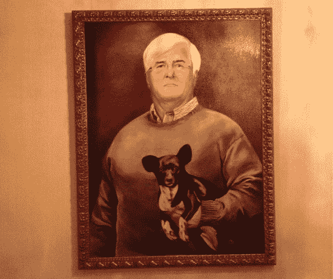
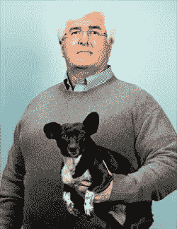
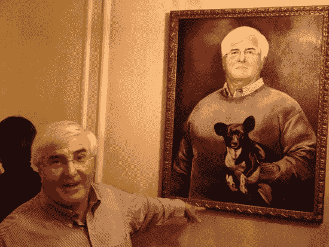

# 罗恩·康韦:绘画

> 原文：<https://web.archive.org/web/https://techcrunch.com/2012/12/14/ron-conway-the-painting/>

硅谷最知名的天使投资人罗恩·康韦 T2 今晚收到了一份厚礼。已故史蒂夫·乔布斯的妻子劳伦·乔布斯(Laurene Jobs)今晚造访了康威的年度假日派对，并为他的巨作揭幕，我只能说这是一幅史诗般的画作。它被挂在墙上，几乎所有出席的人都照了相。

这幅画是根据罗恩和他的狗可可今年早些时候为《财富》杂志的一篇文章《T4》拍摄的一张照片。

我想把它偷走，因为我觉得这幅画真的应该挂在 CrunchFund 的办公室里(作为一段对话)。安全部门认为这是个坏主意。

由于今天早些时候康涅狄格发生了可怕的枪击事件，这次聚会远没有往年那么喜庆。康威的祝酒辞主要是关于受影响的家庭。国会女议员加比·吉福兹也参加了聚会——康威理所当然地称她为美国英雄。

