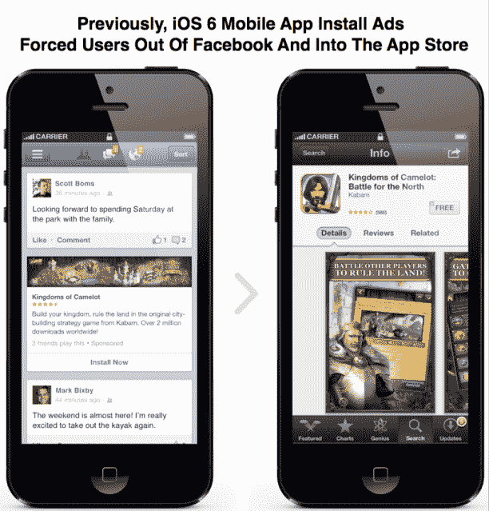
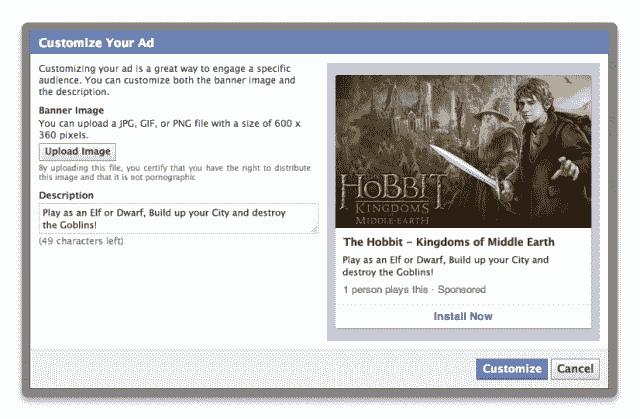
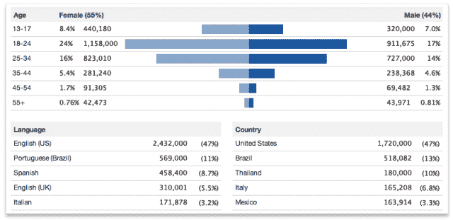

# 苹果 API 通过让你不用离开 FB 就能安装 App Store 应用来强化脸书广告

> 原文：<https://web.archive.org/web/https://techcrunch.com/2012/12/18/apple-hooks-up-facebook/>

# 苹果 API 通过让你不用离开 FB 就能为 iOS 6 安装 App Store 应用来强化脸书广告

脸书和苹果今天走得更近了，脸书 iOS 6 的移动应用安装广告现在允许用户通过弹出窗口从应用商店下载应用，而不是打断用户并迫使他们离开脸书。通过实现苹果的应用商店弹出 API，脸书可以让开发者购买更多的广告，因为他们支付的点击更有可能转化为实际下载。

今天的新闻进一步加深了脸书和苹果公司之间的关系。在冷落它而支持 iOS 5 中的 Twitter 集成之后，苹果广泛地将脸书融入 iOS 6，允许操作系统级登录脸书，这样你就可以立即通过社交集成认证进入第三方应用。还可以快速分享到脸书，联系人同步可以让你把你的脸书朋友的个人资料放到你手机的通讯录里。

现在，脸书正在利用迷你应用商店对话框来提升其最近推出的移动应用安装广告的价值。开发者可以付费在脸书新闻订阅中显示他们的应用程序的图片、描述和安装按钮。这是脸书通过控制应用商店和 Google Play 之外的发现来主导应用经济的策略的一部分。

脸书也给了开发者更多的自由来定制这些广告的创意，以及查看按人口统计的安装分析，包括年龄、性别和国家。这意味着移动应用安装广告将看起来更好，并接触到更多相关的受众，因为开发者可以根据他们成功的人口统计数据定制他们的目标。

但最吸引人的是脸书 iOS 6 的应用商店安装。任何 iOS 6 应用都可以弹出这个迷你应用商店对话框，但它对脸书特别有帮助，因为它代表付费开发者弹出这些对话框。

脸书的移动应用安装广告是按点击量付费，而不是按下载量付费。这意味着开发者可能对点击付费很谨慎，因为人们不会总是完成下载过程。一些用户会感到惊讶和不安，当他们点击“安装应用程序”时，会从脸书启动并被推送到 iOS 应用商店应用程序他们可能会立即退出，并在开始下载之前重新打开脸书。

现在，广告点击安装过程中的摩擦少了很多。短期来看，这应该会让广告对开发商更有价值，让他们把脸书作为营销支出的主要部分。从长远来看，它可以培养用户不那么害怕点击移动应用安装广告。

然而，苹果公司提供弹出式应用商店并不完全是利他的。确保其平台上的开发者实现增长和销售对于防止他们转向 Android 非常重要。在人们的 iOS 设备上获得更多的应用程序也有助于苹果将人们锁定在其操作系统上，因为他们不想切换到 Android，不得不重新下载或丢失它们。

现在的问题是，谷歌是否会效仿，让脸书和其他应用内置谷歌 Play 弹出窗口。

*更新:这篇文章被编辑以澄清脸书正在使用苹果的公共 API。*