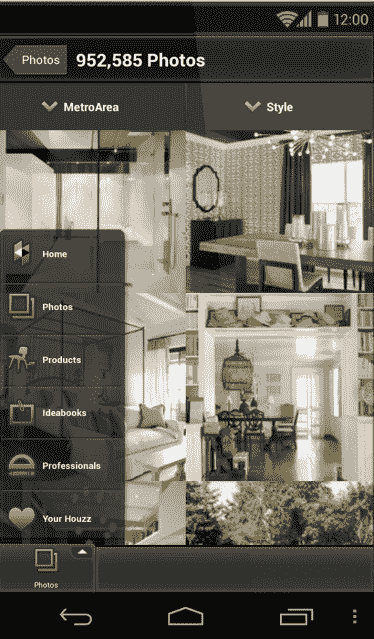
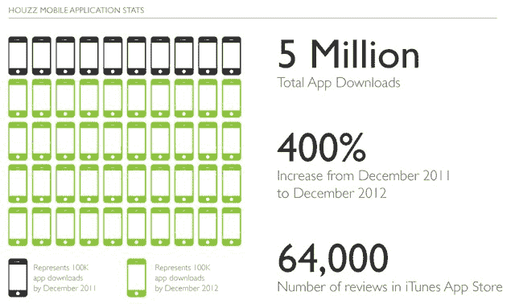

# 在 500 万次 iOS 下载后，房屋改造平台 Houzz 发布了其 Android 应用程序| TechCrunch

> 原文：<https://web.archive.org/web/https://techcrunch.com/2012/12/19/after-5m-ios-downloads-house-remodeling-platform-houzz-launches-its-android-app/>

# 在 500 万次 iOS 下载后，房屋改造平台 Houzz 发布了其 Android 应用程序

Houzz 是一个悄无声息的成功故事，有可能彻底改变他们的利基市场。该服务的核心是让你浏览按照城市区域和风格组织的房屋改造项目的美丽图片。如果你曾经需要一些灵感来改造你自己的房子，或者你觉得你应该羡慕房子，看看公司目录中的近 100 万张图片就知道了。

 除了意象，值得注意的是，Houzz 还为建筑师、设计师和承包商带来了真正的市场颠覆。很明显，他们中的许多人在服务上展示他们最好的项目，并使用它来展示他们的技能。当然，Houzz 用户社区也可以对它们进行评级。正如 Houzz 总裁兼联合创始人阿龙·科恩(Alon Cohen)本周早些时候告诉我的那样，这为使用该应用交流技能和寻找新客户的专业人士带来了许多新机会。与此同时，这也有助于设计师与他们的客户合作，相当多的展厅甚至在他们的商店里安装了 Houzz 亭。

该公司真正出色的一个领域是抢占移动市场。大约 40%的用户现在通过他们的移动设备使用这项服务。正如 Houzz Cohen 告诉我的，该公司的 iPhone 和 iPad 应用程序现已被下载超过 500 万次——与去年相比增长了 400%以上——其用户在 11 月份观看了超过 5 亿张图片。该应用在苹果应用商店中一直排名很高，并拥有完美的 5 星评级。该公司表示，Houzz 用户每月在 iOS 应用上花费超过 160 人年(高峰时间是晚上 9 点)。

从今天开始，Android 用户也可以在他们的设备上使用 Houzz 作为原生应用程序。该应用程序与 iOS 应用程序非常相似，但显然已经适应了 Android 界面。

此外，Houzz 还为这项服务增加了许多新功能，包括论坛、直接从手机相机或相机胶卷中添加照片的功能。从下个月开始，Houzz 用户还可以在本地搜索家装专业人士。

