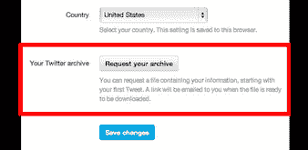
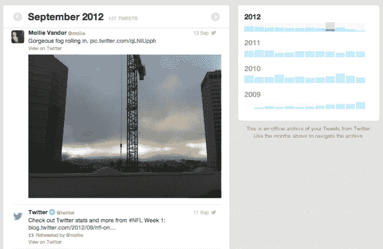

# Twitter 证实“下载你的推文档案”功能正在推出——“慢慢地”

> 原文：<https://web.archive.org/web/https://techcrunch.com/2012/12/19/twitter-confirms-download-your-tweet-archive-rollout/>

# Twitter 证实“下载你的推文档案”功能正在“慢慢”推出

Twitter 已经证实，它将推出一项备受追捧的功能，让用户下载他们的整个 Twitter 档案——也就是你发送的每条推文，从 2007 年的早餐开始——存储在你喜欢的任何地方，并在闲暇时浏览。该功能包括推文和转发，用户将能够按月查看他们的存档输出，或通过关键词、短语、标签和用户名进行搜索。

在一篇确认存档发布的博客文章中，Twitter 说:

> 今天，我们推出了下载你的 Twitter 档案的功能，这样你就可以让你所有的推文(包括转发)回到起点。一旦你有了你的 Twitter 档案，你可以按月查看你的推文，或者搜索你的档案，找到带有特定单词、短语、标签或@用户名的推文。你甚至可以像处理当前的推文一样处理你的旧推文。

Twitter 补充说，推出正在“缓慢”进行——注意到它将在世界上一些地区的 Twitter 用户面前出现“几个月”——并警告用户如果该选项今天没有出现在他们的设置中，请耐心等待。它补充说,“一小部分语言设置为英语的用户”将首先获得该功能:

> 如果你今天在“设置”中没有看到这个选项，那你要知道它正在路上！我们正在慢慢推出这一功能，从今天开始，一小部分用户的语言设置为英语。在接下来的几周和几个月里，我们将向全球所有用户提供我们提供的所有语言版本。我们真的很高兴能把这个功能带给每个人，我们感谢你的耐心。

Twitter 的博客帖子披露了在其季度[黑客周](https://web.archive.org/web/20221214154413/http://blog.twitter.com/search?q=hack+week)期间开始的存档功能工作。

那么，你如何知道自己是否是幸运儿之一呢？检查“设置”下的“请求您的 Twitter 存档”选项。“如果你看到了，就点击按钮。当你可以下载时，你会收到一封电子邮件，告诉你如何访问你的档案，”Twitter 说。

这项功能已经准备了几个月，Twitter [首席执行官迪克·科斯特罗上个月暗示，下载推文的能力将在年底前实现](https://web.archive.org/web/20221214154413/https://beta.techcrunch.com/2012/11/26/twitter-ceo-dick-costolo-twitter-sees-a-billion-tweets-every-two-and-a-half-days-users-can-download-their-entire-archive-by-year-end/)——只要 Twitter 的工程师们不在开发时间表上叛变。

周日，当几名 Twitter 用户报告在他们的设置中找到选项时，有迹象表明该公司已经开始推出 Twitter 存档功能。Twitter 用户@kessler 在下载他的推文的过程中也向我们发送了一系列截屏。

下载功能使 Twitter 与谷歌和脸书等已经向其产品用户提供数据下载功能的公司保持一致。让用户能够取走他们贡献给服务的数据既是一种礼貌，也是一种建立信誉的做法——表明尽管企业拥有一项服务，但它明白它不拥有用户的数据。

Twitter 在向人们提供追溯其推文历史的工具方面速度稍慢的一个原因可能是，如果你花时间查看旧推文，你就不会撰写新推文。但是该公司想出了一个巧妙的解决方案:它鼓励 Twitter 档案管理员转发旧的收藏夹，并给它们贴上标签[# Twitter archive](https://web.archive.org/web/20221214154413/https://twitter.com/search?q=%23TwitterArchive&src=hash)——这样，停留在过去的旧推文就可以再次飞翔。这很聪明。

【T2