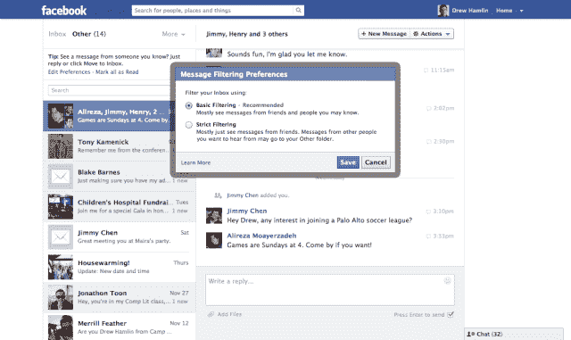
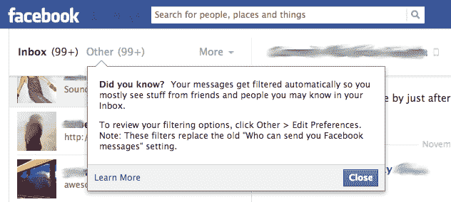

# 脸书试图让你付费以保证信息传递，改变信息隐私设置 TechCrunch

> 原文：<https://web.archive.org/web/https://techcrunch.com/2012/12/20/facebook-tries-letting-you-pay-to-guarantee-message-delivery-changes-messaging-privacy-settings/>

有时候你需要给一个非朋友发信息，今天脸书开始测试是否可以通过让你付费来确保收件人看到这条信息来赚点小钱和减少垃圾邮件。脸书还将每个人的隐私设置改为动态过滤器，让“相关”信息通过。这些举措解决了脸书的旧设置，导致重要信息有时看不见。

此前，脸书的信息隐私设置是一成不变的。您将收件箱设置为允许来自所有人、朋友的朋友或仅朋友的邮件。任何不符合条件的发件人都将他们的邮件转储到“其他收件箱”中，这是收件箱中一个鲜为人知的子选项卡，大多数人很少检查。我有一个朋友实际上收到了来自世界另一端的一个失散多年的兄弟的脸书消息，但六个月没有看到它，因为他不是朋友的朋友。

脸书试图纠正这种情况，并通过用更灵活的过滤器取代这些硬设置，为它正在测试的新收入流腾出空间。脸书在法律上被允许对隐私设置做出这种改变，因为本月它在服务条款中加入了关于信息传递的新语言[。](https://web.archive.org/web/20221207114747/https://beta.techcrunch.com/2012/12/03/facebook-users-vote-on-vote/)

如果你被设置为接收来自朋友的朋友或所有人的消息，你现在将拥有“基本过滤”功能，这意味着你将主要在主收件箱中看到来自朋友和你可能认识的人的消息。如果你将收件箱限制为只接收朋友的邮件，你将被切换到“严格过滤”模式，这意味着你将主要看到来自朋友的邮件。

你会注意到“大部分”这个词。这让脸书可以自由地向你的主收件箱发送邮件，即使这些邮件来自你首选的发件人类别之外，如果它认为这些邮件高度相关的话。例如，如果您有严格的过滤设置，并且与三个朋友和一个非朋友在一个群组消息线程中，脸书可能会允许非朋友到达您的主收件箱，因为您很可能希望看到他们的消息。

新的过滤器有助于新版[Facebook Messenger For Android](https://web.archive.org/web/20221207114747/https://beta.techcrunch.com/2012/12/04/messenger-no-facebook-account/)的运行，它允许没有脸书账户的人注册。如果一个地址簿里有你电话号码的非脸书用户试图给你发信息，脸书可能会让他通过。

这些过滤器也为脸书的新付费信息系统铺平了道路，该系统今天开始在美国的一小部分用户中进行测试。这个想法是，通过让人们支付 1 美元或其他一些小额费用，脸书知道信息对发送者很重要。这个价格理论上也阻止了垃圾邮件，因为垃圾邮件的转换率非常低，必须付费才能发送，这使得赚钱变得非常困难。脸书还将你每周可以收到的付费短信数量限制在一条，以减少被滥用的可能性。

脸书解释说，“一些评论家和研究人员已经注意到，对发送者施加经济成本可能是阻止不想要的信息和促进相关和有用的信息传递的最有效的方法。”考虑到频率上限，以及大多数人根本不需要或不经常需要这个的事实，如果它向所有人推出，它不太可能成为脸书的主要收入来源。

那么，新的隐私设置和付费信息(如果推出的话)对用户真正意味着什么呢？上面你看到的是脸书向用户展示的信息。大多数人几乎不会注意到区别。多亏了动态过滤，你可能会看到更多重要的邮件，而这些邮件可能已经被放到了另一个收件箱里

如果您以前允许来自所有人的消息，您看到的垃圾邮件可能会少一些。额外的经济信号意味着脸书可以更严格地将邮件分类为垃圾邮件，并完全拒绝发送。

最后，如果你是一个公众人物，一个漂亮的女人，或者收到了很多不想要的信息，你现在可以更有信心使用更具防御性的隐私设置，如严格的过滤，而不用担心你会错过关于你关心的人的信息。随机的陌生人将无法通过。与此同时，你的许多朋友的朋友，在你的照片中被标记，或者脸书不知何故认为你想听到的人将能够通过过滤器。如果他们想确保你看到信息，他们可以支付费用。

一些用户肯定会对这两个变化感到恼火。大多数人不希望脸书在没有明确同意的情况下干预他们的隐私设置。其他人可能会生气，因为任何有钱的人都可以给他们发信息。

最终，这些设置实际上可能会帮助人们，但我们必须等待，看看他们的影响是什么，以及用户是否能够通过他们对脸书剥削他们的美元的恐惧来理解他们的价值。但如果我不得不评论付费信息测试的宣布，我会说脸书没有做足够清楚的工作来解释这是为了阻止垃圾邮件发送者，他们太吝啬了，以至于不愿为脸书信息付费，而他们可以免费给你发电子邮件。

*后记:*

如果脸书最终允许合法企业向短信用户付费，那将与它今天宣布的测试截然不同。不过，确实很吸引人。脸书可以提供直接发给用户的高价信息，而且基本上保证能被阅读。通过这种方式，它可以超越电子邮件营销及其低打开率。赞助信息或一些类似名称的产品可以为品牌提供一个超级优质的渠道，快速生动地接触到大量受众。当然，用户可能会讨厌这些广告，说它们污染了社交频道。但这并没有阻止脸书将应用程序和游戏提醒放入通知源，这些通知过去主要是墙贴和照片标签。