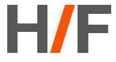

# 黑客/创始人如何从充满啤酒的酒吧聚会成长为全面启动的创业孵化器

> 原文：<https://web.archive.org/web/https://techcrunch.com/2012/12/30/how-hackersfounders-grew-from-beer-filled-bar-meetups-to-full-on-startup-incubator-tctv/>

# 黑客/创始人如何从充满啤酒的酒吧聚会成长为全面启动的创业孵化器[TCTV]

回到 2008 年，

[Jonathan Nelson](https://web.archive.org/web/20221225103135/http://www.linkedin.com/pub/jonathan-nelson/a/b24/5a7)

是一名急诊室护士，业余时间在家修补代码。作为一个不是全职工程师的人，他渴望走出家门，与其他技术人员交往。因此，他在当地一家酒吧组织了一次非正式聚会，邀请其他想进入创业世界的程序员边喝一两杯啤酒边交流故事和谈论工作。他准确地称这个组织为:黑客/创始人。

 从此颇有点变化。在过去的四年里，[黑客/创始人](https://web.archive.org/web/20221225103135/http://www.hackersandfounders.com/)已经发展成为一个全面的运动，拥有数千名成员，在他们定期的社交活动中占据了整个活动空间。尼尔森的护士生涯已经过去，他现在全职负责 H/F 的所有事情，最近在 Greylock、Andreessen Horowitz、Floodgate、Mohr Davidow、Kapor Capital、Felicis Ventures、O'Reilly Alpha Tech Ventures、CMEA、WinFunding 和 SV Angel 等投资者的支持下，H/F 推出了自己的合法初创公司[孵化器项目，名为 Co-op](https://web.archive.org/web/20221225103135/http://coop.cx/) 。

六家初创公司参与了有史以来第一个合作项目，该项目被亲切地称为“意外孵化器”[——](https://web.archive.org/web/20221225103135/http://blog.zerply.com/post/6567943071/our-stepping-stone-to-sv-the-accidental-incubator)[——【泽普利】](https://web.archive.org/web/20221225103135/http://www.zerply.com/)、[维德卡斯特](https://web.archive.org/web/20221225103135/http://www.vidcaster.com/)、[脱扣](https://web.archive.org/web/20221225103135/https://www.tripping.com/)、[代码评估](https://web.archive.org/web/20221225103135/http://codeeval.com/)、[浏览](https://web.archive.org/web/20221225103135/https://browserling.com/)和[可拼接](https://web.archive.org/web/20221225103135/https://www.pieceable.com/)——其中两家已经被[收购](https://web.archive.org/web/20221225103135/https://techcrunch.com/2012/08/02/hirevue-acquires-codeeval-a-programmer-evaluation-tool-for-recruiters/)。

这是一个有趣的事件转变，所以很高兴尼尔森最近来到 TechCrunch 电视台，给我们讲述完整的故事。观看上面嵌入的视频，了解 H/F 如何从只有几个人在酒吧的日子里发展起来，为什么他认为硅谷可以使用另一个孵化器，为什么 H/F 的合作社在其投资公司中持有 2%的股份(大多数其他孵化器项目持有 6%至 10%)，以及他认为这一运动可以从这里开始。