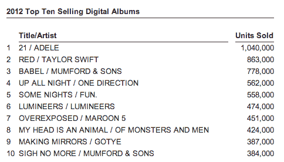
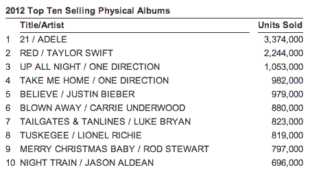

# 也许下载我:尼尔森| TechCrunch 称，受 2012 年 13 亿张数字唱片销量的推动，美国音乐市场增长了 3.1%

> 原文：<https://web.archive.org/web/https://techcrunch.com/2013/01/04/download-me-maybe-u-s-music-market-up-by-3-1-fuelled-by-1-3b-digital-track-sales/>

今天有消息称 [Spotify 停止了音乐下载服务](https://web.archive.org/web/20230326021647/https://techcrunch.com/2013/01/04/down-and-out-spotify-stops-its-music-download-service-in-europe-but-how-many-were-using-it-anyway/),转而推出更多流媒体服务——这引发了一些关于下载与流媒体音乐相比表现如何的问题。但是不管你怎么说，根据尼尔森的[新研究，数字音乐和数字音乐供应商现在主导着音乐行业。](https://web.archive.org/web/20230326021647/http://www.businesswire.com/news/home/20130104005149/en/Nielsen-Company-Billboard%E2%80%99s-2012-Music-Industry-Report)

在由尼尔森音乐扫描(Nielsen SoundScan)和尼尔森 BDS 编制的分析师集团年度音乐产业报告中，它发现数字音乐现在占美国所有音乐销售的 55.9%——包括完整专辑和等同于音轨的专辑。

这也是数字音乐商店的专辑销量首次超过实体店。iTunes、亚马逊、eMusic 和其他公司合计占所有专辑销售额的 37%。尼尔森指出，像沃尔玛和塔吉特(以及实体相册)这样的“大众商家”在过去五年里一直在这一领域处于领先地位；今年他们的份额只有 29%。

与 2011 年相比，2011 年美国专辑和曲目的总销售额下降了 1.8%，尼尔森没有提供总收入的实际货币数据，但包括单曲在内的音乐总销售额增长了 3.1%。数字音乐仍然是这一趋势的驱动力:数字专辑销量增长了 14%，数字音乐增长了 5%，相比之下，CD 销量下降了 13%。

然而，实体唱片仍然是占主导地位的专辑形式——这意味着许多数字销售是在歌曲领域，而不是专辑领域。更具体地说，数字专辑销量为 1.177 亿张，数字专辑销量为 13.4 亿张。

也是在这一年，单个数字曲目的下载量超过了 600 万次。有两首歌获得了这一荣誉:戈蒂的《某个我曾经认识的人》有 680 万次下载，卡莉·瑞·吉普森的《给我打电话吧》有 650 万次下载。Fun 的《我们年轻》以 590 万的下载量接近 600 万。

“2012 年音乐总购买量超过 16.5 亿部，比 2011 年创下的历史新高增长了 3.1%，这是由数字音乐销售推动的，数字音乐销售将继续成为市场中的一个关键增长因素，”尼尔森 SVP 客户开发部的大卫·巴库拉写道。

但是，虽然数字正在推动整个音乐行业，但我们还没有看到在使用数字渠道进行音乐消费的人口统计方面的平等。

例如，看看实体专辑和数字专辑的排行榜，阿黛尔的《21》和泰勒·斯威夫特的《红顶》分别位居第一和第二。但是再往下，你可以看到更多的倾向于主流艺术家的身体，而不是数字。Mumford and Sons 和 Gotye 在物理方面没有进入前 10 名，Bieber 在数字方面也没有出现。此外，排名前十的书籍在纸质版上比数字版要高得多。

这种情况正在慢慢开始改变。虽然“另类”仍然是数字领域最受欢迎的类别，但尼尔森指出，目前增长最快的是乡村音乐，增幅为 38%，而整体平均增幅为 14%。

在个人音乐领域，舞蹈和电子音乐的销售额增长了 36%，位居榜首。

[scribd id = 118975417 key = key-jmk 7 w3g 4d 0 uqpyclbpl mode = scroll]