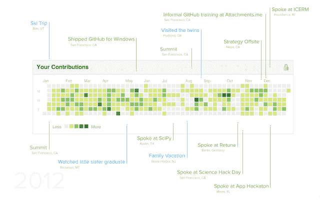

# GitHub 引入了 Contributions，这是一种在个人资料页面显示开发者正在做什么的新方式

> 原文：<https://web.archive.org/web/https://techcrunch.com/2013/01/07/github-introduces-contributions-a-new-way-to-display-on-profile-pages-what-developers-are-doing/>

# GitHub 引入了 Contributions，这是一种在个人资料页面上显示开发者正在做什么的新方式

[GitHub](https://web.archive.org/web/20230315174003/http://github.com/) 继续通过[贡献](https://web.archive.org/web/20230315174003/https://github.com/blog/1360-introducing-contributions)建立其独特的社交网络，这是个人资料页面的一个新内容，显示开发人员创建的项目和他们所做的贡献，以及显示他们所有更新的日历。

这又是 GitHub 提供基于开发者工作的社会图表的方式。开发人员可以展示他们构建的最流行的存储库。就像社交图一样，拥有最多启动和观察者的存储库位于列表的顶端。

开发人员对存储库的贡献也会被跟踪。贡献的例子包括项目的默认分支或者 GitHub-page 分支，打开一个问题，或者提出一个 pull 请求。GitHub 博客指出，这一新功能使得查看来自同一组织的同事在做什么变得更加容易。开发人员与所显示的概要文件共有的任何存储库都会显示在列表中。

新的“捐款日历”显示了过去一年的捐款频率。很像一个社交网络，个人可以添加毕业日期、生日或其他里程碑。GitHub 还引入了一个活动视图来查看某人在 GitHub 上做了什么。它给出了建议的拉请求、未解决的问题和提交的视图。

所有这些都表明了开发人员协作方式的深刻变化。这并不是孤立的事情，人们在孤岛中工作，进行更新，打包成一个大规模的软件更新。相反，这是一个迭代的过程。信誉属于做出贡献的人。现在在 GitHub 上，所有人都可以看到这些贡献。