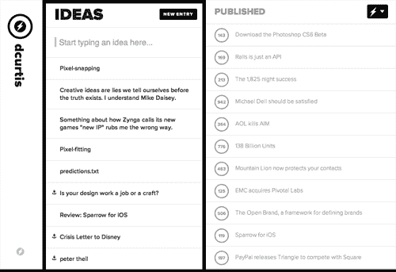

# 有了 Svbtle 的资金支持，Dustin Curtis 希望在长篇在线内容 TechCrunch 上建立业务

> 原文：<https://web.archive.org/web/https://techcrunch.com/2013/01/08/with-funding-for-svbtle-dustin-curtis-wants-to-build-a-business-in-long-form-online-content/>

达斯汀·柯蒂斯(Dustin Curtis)是一名开发人员、设计师和博客作者，他完成了创建博客平台的罕见壮举。它名为 [Svbtle](https://web.archive.org/web/20221206220126/https://svbtle.com/) ，于 2012 年初推出，作为一种[应用所需的](https://web.archive.org/web/20221206220126/https://svbtle.com/apply)Tumblr——一些科技思想领袖使用统一的极简主义主题发布长文。Curtis [今天宣布](https://web.archive.org/web/20221206220126/http://blog.svbtle.com/svbtle-funding)它已经发展到 200 多名作家，并筹集了未披露金额的资金，来自包括 SV Angel、CrunchFund 和 Betaworks 在内的早期投资者，似乎是第二轮融资。它之前也从包括 Y Combinator 在内的天使投资人那里筹集了资金，柯蒂斯是 Y Combinator 的校友。

如果不算 WordPress.com、Myspace 甚至 Twitter，Svbtle 与 [LiveJournal](https://web.archive.org/web/20221206220126/http://www.livejournal.com/) 、 [Pownce](https://web.archive.org/web/20221206220126/http://www.pownce.com/) 、 [Vox](https://web.archive.org/web/20221206220126/https://beta.techcrunch.com/2010/09/03/six-apart-and-vox%E2%80%94how-promise-gets-squandered/) 、 [Posterous](https://web.archive.org/web/20221206220126/https://beta.techcrunch.com/2012/03/12/posterous-finds-a-home-in-the-arms-of-twitter/) 有什么不同？与多年来试图将内容管理系统和社交网络功能结合起来的许多其他网站不同，Svbtle 正试图为专业级作家提供服务。正如我在三月份报道的那样，它希望找到高质量的业务，而不是通过围绕无限混合质量的内容(脸书模式)销售广告来赚钱。

CMS 不会妨碍你，所以你可以专注于你的文字。有一个写下故事想法的面板和一个简单的文本编辑器，让你轻松预览和切换到发布。每个作者都有一个独特的标志(柯蒂斯的是闪电，MG 的是柠檬)，Svbtle 主题也有一个喜欢机制——将光标放在每篇文章右边的“Kudos”圆圈上，你会给作者一分。在这一点上，它没有做更多，但也许有一天他会用它做一个排行榜。

此外，还为所有人提供免费的文字编辑和事实核查服务。虽然该网站的总浏览量达到了数百万次，但柯蒂斯认为，真正的创新将是将高质量的内容货币化。“我只是还不知道它是什么，”他在下面的采访中解释道。

  

柯蒂斯以独立博主的身份发表了精湛的表演，从而创办了这个网站。在他之前的创业失败后，他开始就主要的技术话题撰写尖锐的文章，以及富有哲理的产品评论。他的个人品牌——完美主义、极简主义、智力优势——帮助宣传了 Svbtle，并吸引了通常会出现在 Tumblr、WordPress 或其他网络上的首席设计师、开发人员、投资者和博客作者。除了 [MG](https://web.archive.org/web/20221206220126/http://massivegreatness.com/) ，还有[流行电子邮件客户端 Sparrow 的多姆·勒卡](https://web.archive.org/web/20221206220126/http://domleca.com/)，数字音乐执行官[伊森·卡普兰](https://web.archive.org/web/20221206220126/http://ethankaplan.com/)，以及[Stripe 的亚历克斯·麦克考](https://web.archive.org/web/20221206220126/http://blog.alexmaccaw.com/)等等。

凭借迄今为止的增长和资金，Svbtle 是一个有力的竞争者(与 [Medium](https://web.archive.org/web/20221206220126/https://medium.com/about/9e53ca408c48) 和 Instapaper 的 [The Magazine](https://web.archive.org/web/20221206220126/https://itunes.apple.com/us/app/magazine-for-geeks-like-us./id557744510?mt=8) 一起)在努力将优秀作品货币化。

**TechCrunch:你们分享了这笔钱吗？**

达斯汀·柯蒂斯:我不想透露确切的数字；其实我真的一点都不想谈经费。我只是想让大家知道，这家公司实际上是一家企业，它已经得到了投资者的认可，而且做得很好。这个数目不是微不足道的。

你想要这些钱做什么？

DC:三个原因:第一，雇佣能够构建基础设施和开发新阅读体验的开发者；第二，开发工具帮助作者写出好东西(这包括文字编辑和其他昂贵的服务)；第三，为实验提供缓冲。最后一点很重要，因为我认为我们正处于互联网上观点内容的质量和传递的转折点。虽然有很多网站提供原始新闻和头条，比如 TechCrunch，但没有多少新媒体公司围绕这些信息开展工作。像《纽约客》、《经济学人》、甚至《纽约时报》这样的杂志在很长一段时间里都以印刷形式发布高质量的长篇观点内容，但是它们向网络的转变却不太成功。Svbtle 在这方面会做很多实验。这笔钱为这项实验提供了缓冲。

**TC:商业模式是什么？**

DC:将内容，尤其是书面内容货币化是极其困难的。我认为 Svbtle 最大的创新会在这方面，但我还不知道是什么。