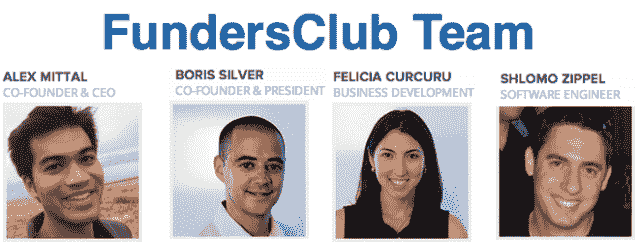

# 为了证明众筹的价值，Soldsie 筹集了 42.5 万美元，并通过 funders club TechCrunch 雇佣了 72 名投资者中的一名

> 原文：<https://web.archive.org/web/https://techcrunch.com/2013/01/09/value-add-of-crowdfunding-fundersclub-soldsie/>

在线风险投资公司 [FundersClub](https://web.archive.org/web/20221226072235/http://fundersclub.com/) 是股权众筹的先驱，今天展示了引入几十个投资者而不是几个投资者的价值。电子商务初创公司 [Soldsie](https://web.archive.org/web/20221226072235/https://www.soldsie.com/) 刚刚通过 FundersClub 从 72 名投资者那里筹集了 42.5 万美元，并最终雇佣了一名投资者。新任首席科学家[云-方娟](https://web.archive.org/web/20221226072235/http://www.linkedin.com/pub/yun-fang-juan/2/4ab/a6a)，脸书 ads 团队的创始工程师，感谢 FundersClub 发现了 Soldsie。

放宽股权众筹限制的《就业法案》尚未最终敲定，但已经有足够多的内容使 FundersClub 合法化。Y Combinator 毕业生在 7 月份推出了来挑选有前途的创业公司，并帮助他们通过其在线平台从人群中筹集风险资本。合格投资者(年收入 20 万美元或净资产超过 100 万美元的人)可以在 FundersClub 上浏览初创公司，研究他们的业务，然后投资低至 1000 美元，以换取初创公司的股权。所有的法律文书工作和资金转移都在网上进行。

[FundersClub 成为风险投资基础设施核心的机会](https://web.archive.org/web/20221226072235/https://techcrunch.com/2012/08/20/ipo-vc-angel-fundersclub/)帮助它[筹集了 YC 校友历史上最大的一轮种子资金——600 万美元](https://web.archive.org/web/20221226072235/https://techcrunch.com/2012/10/19/fundersclub-seed-round)来自 First Round Capital、Felicis Ventures、Chris Dixon 和 Aaron Levie 等知名公司。FundersClub 的目标是提供最具潜力的初创企业，这与投资者是一致的，因为只有当公司成功时，双方才能获得回报。

#### 为什么基金俱乐部事实上是合法的

请耐心听我说一会儿，因为这有点厚，但这对理解众筹真的很重要。

SEC 无疑一直在关注 FundersClub，因为它上个月完成了对初创公司 Virool 的首轮融资。如果反对的话，FundersClub 现在可能已经被起诉了。我提出了 FundersClub 是否作为未注册的经纪交易商非法经营的问题，但在与它的法律团队交谈后，我确信它是清白的。

FundersClub 不是作为一个经纪交易商来处理来自投资者的资金，而是作为一个风险投资顾问。这要归功于 2012 年 3 月通过的《就业法案》。

在 SEC 完成规则制定阶段之前,《快速启动我们的创业法案》的部分内容不会生效。其中包括第 3 条，允许未经认证的投资者投入资金，以及第 2 条第 201 A 款，允许一般招揽——初创公司公开宣传他们正在筹集资金的能力。然而,《就业法案》第 2 篇第 201 C 条在通过后立即生效，为经纪人-交易商规则创造了一个例外，并允许 FundersClub 正在做的事情。

#### 拥挤的帽子表的价值

创业公司通常选择从风投或天使那里拿钱，原因有两个。要么他们获得了很高的估值，而不必为了钱放弃太多的股权，要么投资者可以提供一些超出他们现金的额外价值。这包括战略建议、业务发展或资金联系、协助招聘或获得未来的额外资金。顶级风投和天使是最能帮上忙的。

那么，为什么要接受众筹呢？因为引入一小群投资者可以为初创公司提供布道者、测试者，以及接触他们希望结识的庞大人脉网络的机会。一个很好的例子: [Soldsie，一家让人们通过脸书评论卷轴购物的电子商务初创公司](https://web.archive.org/web/20221226072235/https://www.soldsie.com/)，刚刚通过 FundersClub 完成了 42.5 万美元的种子融资，并在这个过程中聘请了一名世界级的工程师。

Soldsie 的联合创始人 Arrel Gray 告诉我,“我们知道我们将进行一轮融资，但我们有点害怕。我们希望专注于产品，而不是浪费时间。”Soldsie 没有在山谷中四处游荡，而是会见了 FundersClub，他们挖掘了他们的数据，对他们进行了采访，并在 FundersClub 网站上为他们创建了一个执行摘要式的个人资料。Gray 说“他们做的每件事都比我们做得好。这就像有一个婚礼策划人，而不是试图经营自己的婚礼。”

Soldsie 最终接受了 72 名投资者，他们通过 FundersClub 平均每人出资 2500 美元，组成了 42.5 万美元的种子轮。格雷说，FundersClub 让 Soldsie“接触到了我们不会遇到的投资者，包括来自脸书、Pinterest 和 Yammer 的知名人士。他们了解我们的空间，真诚地为我们增值。”例如，他们吸引了谷歌和脸书的核心移动产品经理乔纳森·马图斯(Jonathan Matus)和 Yammer 的杰森·库尔森(Jason Culbertson)作为投资者，以及来自谷歌、高盛、罗技、三星、VMWare、Twilio 和 Canonical 的人。

Soldsie 的另一位投资者想在她给他们汇钱之前见见这个团队。那是[云-方娟](https://web.archive.org/web/20221226072235/http://www.linkedin.com/pub/yun-fang-juan/2/4ab/a6a)，脸书广告公司及其关系亲密度建模团队的早期工程师，当时在可汗学院工作。她通过 SecondMarket 做了一些投资后，通过脸书的一位同事偶然发现了 FundersClub，然后发现了 Soldsie。Juan 告诉我“他们遇到了技术挑战，我觉得我可以帮助他们。”因此，除了投资，她还全职担任 Soldsie 的首席科学家，使团队成员达到 5 人。

Soldsie 的首席执行官兼联合创始人克里斯·贝内特(Chris Bennett)表示，他们的众筹招聘已经解决了一些问题，“Yun-Fang 已经进来，做了许多我们自己无法完成的艰难的技术后端工程工作。

[成立于 2012 年 5 月，500 家初创公司 Soldsie](https://web.archive.org/web/20221226072235/https://techcrunch.com/2012/09/20/a-new-take-on-f-commerce-soldsie-lets-retailers-sell-through-facebook-comments/) 让电子商务公司分享到脸书的购买链接。一旦在 Soldsie 注册，买家所要做的就是在帖子上发表评论，他们就会收到一个购买链接的电子邮件。这是一种促进移动电子商务的聪明方式，让人们在手机上发现产品，并在稍后收到完成交易的提醒。Bennett 告诉我 Soldsie 想成为“社交商务的易贝”

随着第六只基金的关闭，FundersClub 现在已经向六家初创公司转移了超过 175 万美元。它的下一场战斗将是试图阻止 AngelList 和 SecondMarket 之间的股权众筹竞争，根据 T2 证券交易委员会的文件，这两家公司已经为两家初创公司筹集了 331，000 美元。

如果 FundersClub 能够让更广泛的人轻松投资最热门的初创公司，并通过证明人群的价值来吸引这些公司，它可能会成为众筹领域的一个知名品牌。如果《就业法案》的其余部分最终敲定，非授权投资者可以向创业公司敞开钱包，这可能会使其成为私营公司的一种 E *交易。