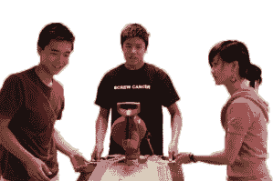
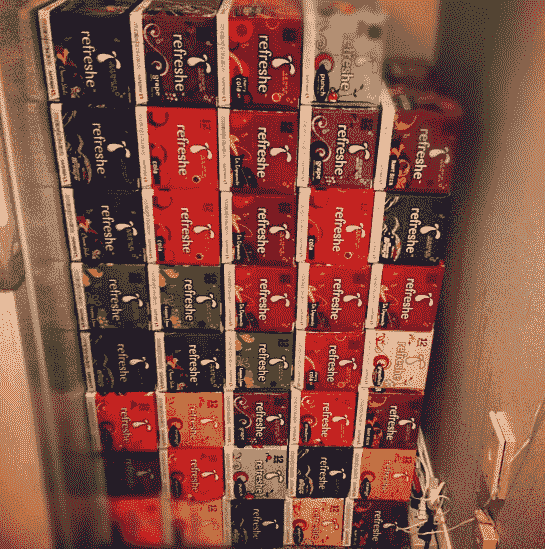
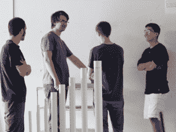

# 每周好消息:今天的问题将由明天的头脑解决

> 原文：<https://web.archive.org/web/https://techcrunch.com/2013/01/18/the-weekly-good-the-problems-of-today-will-be-solved-by-the-minds-of-tomorrow/>

**【注:这是每周一期的系列。如果你的公司正在做一些令人惊讶的事情来帮助慈善事业或在你的社区做一些好事，[请联系](https://web.archive.org/web/20230315095318/mailto:drew@beta.techcrunch.com)。]**

如果你正在寻找一个伟大的故事来结束你的一周，这里有一个。下面是一份简明扼要、易于理解的使命陈述:

**studentrand 鼓励学生在业余时间从事科技项目。**

对于真正热爱技术和与他人一起开发东西的年轻人来说，这里有他们的一席之地。就在几年前，你可能不会这么说。如今，西雅图一家名为[studentrand](https://web.archive.org/web/20230315095318/http://studentrnd.org/)的公司推出了一个项目，为高中生提供一个发挥创造力的地方，让他们和其他有同样想法的人一起发挥创造力。这就像太空营，但无论如何也不是一次性的事情。

当你为年轻人营造一个创新的环境时，你就为每个人的未来创造了真正令人惊叹的东西。当我们被困在通过 Twitter 和脸书的社交网络世界时，那些将在未来十年在世界上留下印记的开发人员正在思考更大、更深入的问题，这些问题影响着我们所有人。

某个现在 15 岁的人最终可能会在交通运输领域创造下一个巨大的进步，治愈一种严重的疾病，或者只是以一种新的方式给人们带来微笑。这是一件伟大的事情，StudentRND 正在帮助它实现。

我与 StudentRND 的首席执行官兼创始人 [Edward Jiang](https://web.archive.org/web/20230315095318/http://twitter.com/EdwardStarcraft) 讨论了 StudentRND 的使命以及他们的下一步计划。

———

**TechCrunch:你为什么创办 StudentRND？**

姜:我相信学生们有着惊人的潜力。然而，没有多少人意识到他们能做出惊人的事情。

一些高中生开始在业余时间摆弄技术——学习如何编码，摆弄电子产品，但从来没有做过任何实质性的事情，因为他们从来没有真正抽出时间去做。明天总会有一个家庭作业要交，下周还有一个测试来分散他们做自己想做的事情的注意力。

还有人想学习如何用技术做事情，却连从哪里开始都不知道。他们的朋友、老师或父母都没有接触过技术，所以他们认为这是某种不易掌握的火箭科学。

我相信学习技术的最好方法是用技术做事。当我在高中时，我学到了很多技术，因为我开始建立一个 flash 游戏网站，这样我和我的朋友们就可以在计算机实验室玩游戏。朋友们要求网站提供越来越多的功能，我出去学习如何做。随着时间的推移，我变得非常擅长用技术解决问题！

后来在我的高中生涯中，我停止了网站工作，开始参加科技竞赛。我喜欢竞赛周围的社区，但不喜欢大多数竞赛鼓励学生为他们的简历获奖，而不是做一些有意义的事情。所以——就在我即将毕业的时候，我招募了我的几个朋友，让他们在我家呆上一整个夏天，专注于构建很酷的技术项目，而不是去找工作！这就是学生天地的开始。

现在，studentrd 在西雅图有一个非常酷的生态系统，由 studentrd 实验室(以前称为 studentrd 孵化器)和 [CodeDay](https://web.archive.org/web/20230315095318/http://codeday.org/) 组成。

**TC:从组团开始，有哪些是你最喜欢的瞬间？**

姜:我们有太多有趣的故事要讲了！然而，这里有一些:

 最激动人心的事:在脸书的一次比赛中，我们从 Chase Community Giving 筹集到了最初的 25，000 美元种子资金。就在我们 2009 年获得 501(c)(3)非营利组织身份后，大通在脸书举办了一场比赛，要求人们为他们最喜欢的小型本地(年收入低于 100 万美元)非营利组织投票(前 200 名将获得 25000 美元)！2009 年，许多较小的非营利组织要么不太擅长社交媒体，不知道，要么选择不参与竞争。我们最终从朋友那里获得了大约 3000 张选票，赢得了蔡斯的资助！

最自豪的: [Tapin.tv](https://web.archive.org/web/20230315095318/http://tapin.tv/) (泰勒的公司)其实第一次见面是在 StudentRND。更多信息请点击此处:

最酷:伊萨夸高中学生马歇尔·孟(Marshall Meng)制作了一个等离子扬声器，这是一个类似泰瑟枪的设备，用电来播放音乐。他们把它放在 Kickstarter 上，筹集了 18，500 美元——超过他们最初目标的 9 倍！

大多数咖啡因:在几个代码日，这一组学生会来参加活动，并有一个喝苏打水的比赛。他们每个人都会在 24 小时内喝掉 20 多杯苏打水！在一次活动中，我正在制作杯面作为宵夜，并意识到一盒杯面的碳水化合物比一罐苏打水还少！我告诉了小组成员，他们立刻停止了喝这么多苏打水

最含咖啡因的 2:清除一整个西夫韦的苏打水:

最愚蠢的:学生世界里有一群高中生——我们经常闲逛！在这一次活动之后，我们得到了一些多余的泡沫塑料，所以 Vu 做了一个最不可思议的纸飞机:

**TC:学校可以做些什么来促进技术创新，尤其是在高中？**

**江:**  经课程？对于对技术感兴趣的学生来说，已经有了科技磁铁学校。他们只是不关注硅谷理想的开发者/企业家。这很好，因为教育不一定是关于一周的味道。围绕国家标准化考试、大学申请程序和要求等有许多限制，这使得你几乎不可能有一个本质上不同的课程。

Via 文化？这可能有点难。最近，去磁铁学校上学似乎是由父母决定的(尤其是那些希望自己的孩子进入好的公立学校的竞争激烈的父母)。不过，你可以在学校里拥有专注于技术/创业的亚文化。我认为拥有一种平衡的文化，接触比特定人群更多的人是一件好事。科技创业界有很多傲慢。(软件正在吞噬世界等。是的，软件正在吞噬世界，但还不是一切！)

不过，我想改变他的这些东西—

*像对待成年人一样尊重学生。
*每个学校的计算机科学课程。
*每季度的课时更少，但更深入(在我的高中我们每天有 7 节课)！让表现更好的学生做更多的事情，而不是通过繁忙的工作来拖他们的后腿！(相关:http://www . Forbes . com/sites/ryanmac/2012/09/24/the-risky-smart-have-be-the-risky-rich-examining-techs-rich-on-the-Forbes-400/)

在很大程度上，经营一所高中是非常困难的。我不羡慕管理员。StudentRND 的策略是获得一群热情、积极的学生，并从那里传播社区——激励和激励越来越多的学生。学校必须应付每一个学生，不管他们有多慢/多快。

给我们讲讲组织者和赞助商，他们最感兴趣的是什么？

**姜:**许多组织者和赞助商告诉我，学生天地是他们年轻时就希望拥有的东西——与我上面概述的一些问题直接相关——他们参与进来是因为他们想为其他人提供这个机会。

**TC:项目中的孩子们告诉你他们从中得到了什么？**

**江:**几件事:

*他们可以做一些在常规暑期实习或在自己家里做不到的事情。他们玩得很开心！真的。他们正在做他们觉得有意义的事情。他们交了很多新朋友，喜欢这个充满激情的社区！
*他们学习

下一步是什么？

 **姜:**我们目前正在全国范围内推广我们的 CodeDay 活动——以类似于 Startup Weekend 和 TEDx 的方式——全国各地的志愿者按照我们的模式组织 CodeDay 活动。

我们还计划在接下来的三年里，每年夏天参加 StudentRND 实验室的学生人数翻一番——去年夏天是 30 人，今年夏天我们计划有 60 人。在 3 年内，我们将通过 StudentRND 实验室接受比华盛顿大学(西雅图)计算机科学系更多的充满激情、积极向上的学生(他们每年毕业 160 人)。随着我们在西雅图地区的产能开始达到极限，我们将开始考虑在全国其他城市扩建学生研发实验室。

在我们这样做的时候，我们正在发展关系并资助合作伙伴关系来实现这一目标。

TC:我们能帮上什么忙？

**江:**两种方式:

1.帮我们组织一次[代码日](https://web.archive.org/web/20230315095318/http://codeday.org/)！我们正在美国不同的学校寻找充满激情、积极向上的学生，帮助我们在他们的城市组织 CodeDay。如果你或你认识的学生感兴趣，请告诉我们！

2.[捐！](https://web.archive.org/web/20230315095318/http://studentrnd.org/donate/)无论是 25 美元/月，还是更大的捐赠(请随时联系我们)，或者让您的公司/基金会参与进来，我们都需要财政支持来资助我们的发展！

———

当你年轻的时候，你会参加这样的聚会和团体吗？你可以通过传播关于 StudentRND 及其 CodeDay 计划的好消息来帮助改变现状。你甚至可以启动自己的项目，或者帮助你所在地区已经发生的事情。技术是一个全球性的东西，所有年龄和技能的人都可以使用它。

很棒，是吧？

**如果你错过了我们之前的每周好片，看看这里的、[这里的](https://web.archive.org/web/20230315095318/https://techcrunch.com/2012/11/30/the-weekly-good-gurbaksh-chahal-beproud-org-and-putting-an-end-to-hate/)、[这里的](https://web.archive.org/web/20230315095318/https://techcrunch.com/2012/12/07/the-weekly-good-maya-baratz-and-hunter-walk-team-up-for-the-startup-chef-cookbook/)、[这里的](https://web.archive.org/web/20230315095318/https://techcrunch.com/2012/12/14/the-weekly-good-twitter-gives-back-with-tweet4good-heres-the-behind-the-scenes-look/)、[这里的](https://web.archive.org/web/20230315095318/https://techcrunch.com/2012/12/21/the-weekly-good-googles-director-of-giving-discusses-global-concerns-and-action/)、[这里的](https://web.archive.org/web/20230315095318/https://techcrunch.com/2012/12/28/the-weekly-good-donorschoose-and-big-hairy-audacious-goals-to-help-teachers/)和[这里的](https://web.archive.org/web/20230315095318/https://techcrunch.com/2013/01/04/the-weekly-good-a-star-is-reborn-the-lester-chambers-story/)。**