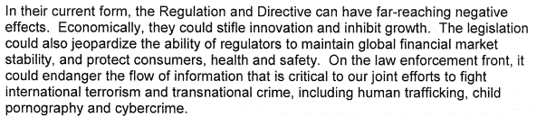

# 美国政府仍依赖欧洲淡化数据保护改革提案 TechCrunch

> 原文：<https://web.archive.org/web/https://techcrunch.com/2013/01/18/us-government-still-leaning-on-europe-to-dilute-data-protection-reform-proposals/>

美国政府正在继续游说布鲁塞尔淡化改革隐私立法的计划。欧盟的行政和立法机构正在改革该地区的数据保护规则——这是一场早就应该进行的争论，因为当前的立法可以追溯到 1995 年，当时脸书甚至不是 11 岁的马克·扎克伯格眼中的一缕阳光。

欧洲委员会去年 1 月提出了新的规则，阐述了其通过建立一个单一的国家数据保护机构来协调欧盟成员国的数据保护规则的意图，并给予公民更多的数据控制权，包括授予人们要求删除公司和组织持有的数据的权利(所谓的“被遗忘的权利”)，以及将他们的数据转移到另一个服务的权利。数据持有者还必须通知服务用户严重的数据泄露——“如果可行，在 24 小时内”。其他提议包括要求公司设立一名数据保护官员来监督合规情况。

新规则将适用于任何处理欧盟公民数据的公司和组织——即使它们完全位于欧盟以外。为了执行新规定，欧盟委员会提议加强独立的国家数据保护机构，包括赋予它们对公司处以最高 100 万€(127 万美元)或最高占其全球年营业额 2%的罚款的权力。

这些提议现在已经进入了欧洲议会委员会的辩论阶段，委员会报告员上周已经完成了[的报告草案。在所有 27 个欧盟成员国之间达成一致，使新的立法得以通过之前，还有一段路要走——所以游说者还有时间继续抗争。](https://web.archive.org/web/20221210063431/https://beta.techcrunch.com/2013/01/08/european-parliament-draft-reports-back-ecs-data-protection-reform-reinforcing-the-right-to-be-forgotten/)

欧洲数字和公民权利协会 [EDRi](https://web.archive.org/web/20221210063431/http://www.edri.org/) 获得了一份据称是最新的美国政府游说文件(在线[此处](https://web.archive.org/web/20221210063431/http://edri.org/files/us_position_20130114.pdf))的副本——这份文件呼吁欧洲在方法上更加“灵活”，并警告说改革有扼杀创新和增长的风险，并危及打击犯罪和恐怖主义所需的信息自由流动。

该文件警告说:

报告还敦促对提案进行“修订，以确保安全和商业不会受到不利影响”。

文件中阐述的论点的主旨是，美国不想受制于欧洲在隐私方面的政策决定，而是支持各自隐私框架的“互操作性”。还有一个潜在的威胁是，如果改革本身不改革，美国和欧洲之间的贸易和商业可能会受到影响。

“我们各自隐私制度的互操作性对于维持我们非凡的经济关系、促进贸易和防止非关税壁垒，以及释放我们经济创新和增长的全部潜力至关重要，”该文件称。“我们敦促欧盟更多地关注为隐私提供有意义的保护的结果，而不是关注形式主义的要求。”

这份长达 5 页的文件接着讨论了拟议中的欧盟立法的具体部分——认为在涉及互联网的情况下，通过“基于自愿共识的多利益攸关方进程”制定的标准是监管的更好替代方案，因为它们更“灵活”，更“适应快速变化的技术环境”。它还认为，用户对使用个人数据的同意“不一定总是明确、肯定的同意”，向用户提供的基于同意的选项的范围应该与“组织收集、使用或披露的个人数据的规模、范围和敏感性”相关联。

关于“被遗忘权”和“抹除权”，美国警告欧盟做出修改，以“避免妨碍创新、竞争和参与全球经济的能力”。“例如，我们建议欧盟重新考虑在同意被撤回后，对他人的出版物规定数据控制义务的可行性，”报告指出，并继续表达了对当前提案下言论自由权可能受到损害的担忧。

该文件还认为，拟议的 24 小时数据泄露通知法对于组织来说并不是一个足够长的时间来遵守，而且还可能导致过多的通知，导致消费者忽略它们或对错误信息采取不必要的行动。

文件的很大一部分都在关注这些提议对全球数据传输和信息自由流动的影响——美国游说者显然认为，欧盟的提议可能会对监管机构、执法当局和民事案件的诉讼当事人产生“灾难性的影响”。

假设这份文件是真实的，它表明美国政府正继续游说布鲁塞尔淡化其提议。

去年 10 月，TechWeekEurope 报道称，美国商会正代表美国商界游说欧洲政界人士修改拟议中的新规则。美国商会全球监管合作高级经理亚当·施洛瑟告诉该杂志，自 3 月以来，该组织一直在进行游说。

“一些最大的担忧是为不同的商业模式提供灵活性，允许遵守欧盟和第三国的现有法律义务(如反欺诈)，并实际上创建一个跨成员国可预测和一致的'一站式商店'，”施洛瑟在 10 月份告诉 TechWeekEurope。他将进展描述为“渐进的”，并补充道:商界将需要持续不断的努力，以开发一种务实的方法，考虑最终监管如何在现实世界中发挥作用。"

在撰写本报告时，美国商会尚未回复更新其对欧盟隐私改革当前立场的请求。**更新:**美国商会全球监管合作中心副总裁 Sean Heather 就商会的立场发表了以下声明:

> “美国商会坚定地致力于保护消费者数据，但希望确保法规考虑到云计算等信息技术的动态性质，并认识到许多行业必须移动数据才能移动商业。我们将继续就监管机构和立法者如何制定数据保护法规提供意见，这些法规将考虑到现实世界对行业和经济的影响。我们的参与经常是应欧盟及其一些成员国官员的要求，出于他们对美国和欧盟之间现有的管理这些政策问题的安排的考虑。”

脸书也一直在游说欧洲进行改革——在布鲁塞尔有自己的(较小的)游说团队——称这些提议的某些方面，如被遗忘的权利是不合理和不现实的。但不仅仅是大型科技公司表示反对。竞争技术协会(Association for Competitive Technology)是一个国际非营利协会/倡导组织，旨在帮助初创型中小企业，如移动软件开发商。该协会也一直在游说欧盟改革的一些方面，认为这些改革将对该地区的初创企业产生负面影响。

ACT 的欧盟发言人格雷格·波拉德(Greg Polad)对 TechCrunch 表示:“欧盟委员会将初创企业视为不与大型企业沟通的生命形式。”。

ACT 的一个特别争议点是，欧洲议会草案委员会报告中对提案的最新修正案取消了中小企业雇用数据保护官的事先豁免，代之以处理少于 500 个数据点/主题的公司的豁免，Polad 称这一限制“小得可笑”。

由于拟议的立法，中小企业可能面临的另一个管理和成本负担是要求企业在处理某些类型的数据时先发制人地进行隐私影响评估 Polad 认为这种前期成本可能会阻碍初创公司在欧洲建立业务。

“如果你对初创公司说，在开始运营之前，你需要考虑 X、Y 和 Z 成本，那么你就没有帮助他们进入市场，而且你肯定没有帮助他们创新，在市场上尝试和试验，”他认为。