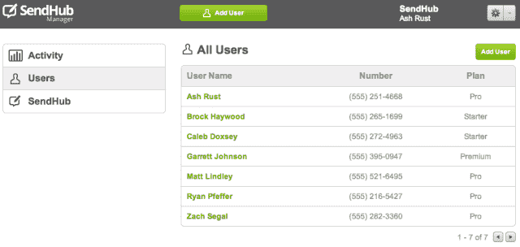
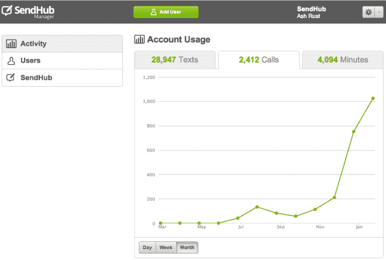

# 随着 SendHub Manager 的首次亮相，Google Voice 替代 SendHub 现在为企业提供了一种更简单的方式来提供数百条电话线路 TechCrunch

> 原文：<https://web.archive.org/web/https://techcrunch.com/2013/01/22/with-debut-of-sendhub-manger-google-voice-alternative-sendhub-now-offers-businesses-an-easier-way-to-provision-hundreds-of-phone-lines/>

Y Combinator 支持的面向个人、企业和其他组织的呼叫和消息解决方案 SendHub 今天推出了一款新产品，旨在满足大型组织中员工的号码供应需求。有了 [SendHub Manager](https://web.archive.org/web/20221205080927/https://www.sendhub.com/business) ，当该功能被调用时，组织将可以访问在线仪表板，在那里他们可以快速地为他们的员工创建、移动或删除电话线路。SendHub 联合创始人加勒特·约翰逊解释说，“这本质上就像手机上的谷歌应用程序。”

这家公司最初只提供信息服务，[在去年夏天扩展到支持语音电话和语音邮件。在这一点上，它成为了谷歌语音等产品的有力竞争对手，因为你现在可以获得自己的 SendHub 电话号码，然后使用自己的手机拨打或接听电话和短信。在 iPhone 上，SendHub 为此提供了一个本地应用程序，Android 版本正在开发中。](https://web.archive.org/web/20221205080927/https://beta.techcrunch.com/2012/06/28/sendhub-expands-beyond-messaging-now-rivals-google-voices-with-support-for-calls-voicemail/)

随着 SendHub Manager 的首次亮相，重点不再是最终用户，而是企业或其他组织将这些电话号码分配给员工。该系统基本上只包含一个在线仪表板(也可以在手机上访问)，设计得足够简单，it 部门不必参与其中——办公室管理员可以处理电话号码的添加、移动和删除。

SendHub 表示，新 SendHub 管理器的数百名早期测试者之一是 iPhone 维修初创公司 [iCracked](https://web.archive.org/web/20221205080927/http://www.icracked.com/) ，该公司使用该平台为其技术人员分配了 300 多条线路。“当他们得到一项新技术时，他们可以增加线路，或者当有人离开公司时，他们可以删除线路，”联合创始人 Ash Rust 解释说。“至关重要的是，他们不会丢失任何信息——他们可以从那个人那里获取号码，而不会丢失那个人的联系方式以及他们在这段时间里积累的所有客户。”联合创始人告诉我们，该系统也可以扩展到无限数量的电话线路。

对于许多企业来说，能够在不丢失数据的情况下分配和重新分配线路是一大优势，特别是在金融领域以及通信可能很敏感的其他组织中，如学校或医疗保健机构。

SendHub 能够记录电话通话、通话对象、通话时长和短信记录，几周后，它还将推出导出和存档这些数据的功能，这是用户在原生 Android 应用程序之外最常要求的功能。

仪表板不仅仅是使电话线供应更容易，它还可以帮助企业管理他们的移动电话预算。约翰逊说，企业可以将管理下的个人电话线路升级到对该用户有意义的特定计划。“这不是一刀切的方法。他说:“有些人会消耗更多的信息或语音时间，所以现在不必花很多钱为每个人购买相同的手机(和计划)，你现在可以使用他们现有的设备为他们提供适合他们的计划。”

SendHub 甚至允许企业让每个人开始使用最低的计划，然后根据需要选择让这些线路自动升级。“你永远不会为你不需要的东西买单，”Rust 补充道。(要是运营商这样工作就好了。)

在今天之前，该公司在其免费的个人计划之上提供了几个层次:每月 10 美元、25 美元、50 美元、150 美元的[高级账户](https://web.archive.org/web/20221205080927/https://www.sendhub.com/plans/)，提供更多的通话时间和短信、语音邮件转录、对群组的支持等等。与此同时，SendHub 管理器继续同样的定价方案——改为在这里注册，开始是每条线路 5 美元，然后层层加价(再次从 10 美元到 150 美元)。

该公司今天还宣布了新的增长数字，称其现在拥有超过 60，000 名用户，比 2012 年 6 月的 5，000 名和 10 月的 25，000 名有所增加。它现在每月发送超过 300 万条短信，高于 10 月份的 200 万条，迄今为止已经发送了 1300 万条短信，高于 10 月份的 500 万条。SendHub 每月也能处理超过 10 万个电话。

Rust 表示，自去年 10 月以来，该公司的收入也翻了一番，现在“已经达到五位数”他说，SendHub 今年将实现盈利，虽然它着眼于国际市场的长期发展(在加拿大的早期测试已经开始)，但它的近期重点是在美国做好事情。未来的直接重点是开发 Android 应用程序，并增加平板电脑支持。

有兴趣注册的 TechCrunch 读者可以在使用 SendHub Manager 时获得 10 美元的折扣。**在这里注册的前 100 名读者可以使用代码 TCSH10** 入门。