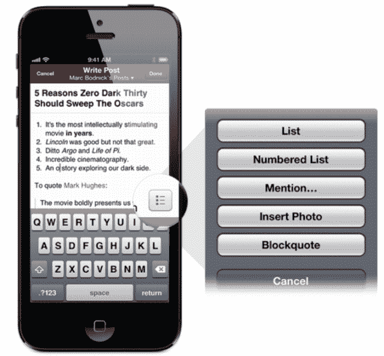

# Quora 推出带有移动文本编辑器的博客平台，为每位作者提供一个固定的受众

> 原文：<https://web.archive.org/web/https://techcrunch.com/2013/01/23/quora-launches-blogging-platform-with-mobile-text-editor-to-give-every-author-a-built-in-audience/>

互联网上充斥着专家，却没有人阅读他们的见解。建立一个追随者需要做很多工作。因此，今天 Quora 推出了一个博客平台,自动向关注相关话题的 Q & A 网站用户发布帖子。多亏了它的 upvote 系统、主页 feed 和一个[新的移动文本编辑器](https://web.archive.org/web/20230326022513/http://blog.quora.com/Introducing-the-Best-Writing-Experience-on-Mobile)，任何有精彩博客的人，甚至是第一次写博客的人，都能找到读者群。

上个月，Quora 的联合创始人 Adam D'Angelo 宣布，他的公司正计划将[扩展到问答](https://web.archive.org/web/20230326022513/http://www.quora.com/blog/Our-Mission)之外，以完成其分享和增长世界知识的使命。D'Angelo 没有说具体是怎么做的，但是提到

> “互联网应该允许任何人建立一个网页，与世界分享他们的知识。但在实践中，这太难了，耗时太长，几乎没有人去做。博客很容易开始，但除非作者很有名，否则需要数年时间来建立追随者。超过 10 亿人使用互联网，但只有极少数人贡献了他们的知识。”

这让我[预测它将推出一个博客平台](https://web.archive.org/web/20230326022513/https://techcrunch.com/2012/12/21/quora-beyond-qanda/)，为作者提供接近其高度参与的读者群的途径。这是有意义的，因为 Quora 已经获得了大量高质量的回答——本质上是孤儿博客帖子。Quora 告诉我活跃作家每月有超过 30，000 的浏览量，每年有 350，000 的浏览量。其最铁杆的贡献者每年可以获得超过 100 万的浏览量，大多数伟大的答案会像病毒一样传播开来，获得数万次阅读。将这些受众带给新手和资深博主看起来是 Quora 的自然发展。

看来我是对的。你可以通过查看我的新 Quora 博客 [TechConstine](https://web.archive.org/web/20230326022513/http://techconstine.quora.com/Quora-Launches-Blogging-Platform-With-Mobile-Text-Editor-To-Give-Every-Author-A-Built-In-Audience) 来了解 Quora 博客的内容。

从今天开始，Quora 用户可以[创建任意多的博客](https://web.archive.org/web/20230326022513/http://www.quora.com/blog/add)并在里面发帖。从网络或手机上，他们可以通过富文本编辑器和嵌入式图像来表达自己。作者可以用 Quora 的 300，000 个与其内容相关的话题来标记他们的帖子或整个博客。然后，关注他们的其他 Quora 用户，他们的博客，或者最重要的是任何被标记的主题，可能会在 Quora 主页 feed 上显示相关的博客帖子。一篇文章收到的支持票、评论和分享越多，就会有越多的人看到它。

Quora 博客也是对 [Quora 论坛](https://web.archive.org/web/20230326022513/https://techcrunch.com/2011/12/19/quora-expands-beyond-qa-launches-boards-a-way-to-personally-curate-information/)的替代，Quora 论坛让[的人发布非 Q 类内容](https://web.archive.org/web/20230326022513/http://exceptional.quora.com/)，通常被用作一个临时博客平台。目前还不清楚 Quora 博客与其旧的[帖子功能](https://web.archive.org/web/20230326022513/http://www.quora.com/Posts-on-Quora/What-are-Quora-Posts)有何关联，Brittany Darwell 指出，这种功能长期以来一直允许非 Q 类文章在 Quora 上发表。博客可能会取代它，或者作为一个更重量级的版本。

Quora 巨头马克·博德尼克认为，这家初创公司有一些锦囊妙计，可以击败拥有标准订户的传统博客。他告诉我，旧的 Quora 博客帖子获得了投票，可以突然回到 feed 中，使它们“常青并重新被发现”。这是我们的博客相对于任何其他博客或社交媒体平台的一大优势，在其他博客或社交媒体平台上，帖子写完几天后就不见了。”Quora 也确切地知道谁想读什么，因为人们关注的话题。这意味着你可以每天发布完全不同的主题，它会将它们传递给目标受众。通过这种方式，像我这样的科技作家可以发布漫画书，并让超级英雄粉丝阅读。如果我把同样的帖子分享给我关注科技的 Twitter 粉丝，他们可能会充耳不闻。

Quora 也利用今天的发布来展示它对移动的贡献。博德尼克告诉我，该网站超过 25%的流量和大部分精彩内容来自手机。然而，迄今为止，大多数移动文本编辑器只提供纯文本编辑，这使它们成为全尺寸计算机的二等发布平台。今天，Quora 首次推出了新的移动富文本编辑器，可以完全控制格式和照片，允许富有表现力的移动博客和回答。

Quora 的新博客工具将吸引两类人群。首先是那些还没有任何网络名人的人。Quora 的 Kah Keng Tay 写道，Quora 博客适合这样的人:( 1)还没有一个大的、固定的在线存在,( 2)不想做时间密集、繁重的营销博客和慢慢建立受众的工作。如果你是一名优秀的作家，但没有成千上万的 Twitter 粉丝或大量的博客读者，Quora 是一个理想的写作场所。”

另一组是那些想要额外分发的知名博主。他们不能像在其他平台上一样在 Quora 博客上展示广告，但可以帮助他们接触到一群聪明的观众。唯一的风险是，非 Q &内容稀释了 Quora 的订阅源，让普通读者失去兴趣。因为只有具有 upvotes 的智能帖子才会显示在提要中，但是我没有看到这种情况发生。吸引和留住作者将是 Quora 博客平台的真正挑战。

这一推出让 Quora 与 Obivous Corp .的新公司 Medium 竞争，后者也旨在为优秀作品提供分销服务，不管作者有多少 Twitter 粉丝。这也可能为货币化铺平道路——这是 Quora 还没有开始做的事情。既然 feed 中不仅仅只有 Q & A，Quora 可以将广告以赞助帖子的形式加入信息流。例如，特效专家关于新蝙蝠侠电影中使用的技巧的博客帖子可以由华纳兄弟赞助，以提高对这部电影的兴趣。

总的来说，Quora 博客可以重振公司。增长并不理想，联合创始人查理·契弗最近从日常运营中退出[。让普通人和大牌作家推广他们的 Quora 博客可以为 Quora 令人难以置信的知识收藏带来大量读者。](https://web.archive.org/web/20230326022513/https://techcrunch.com/2012/09/11/quora-cheever/)

*[在这里创建你自己的](https://web.archive.org/web/20230326022513/http://www.quora.com/blog/add) Quora 博客，或者访问我的博客试试看。*鼓点*它叫 [TechConstine。](https://web.archive.org/web/20230326022513/http://techconstine.quora.com/)*