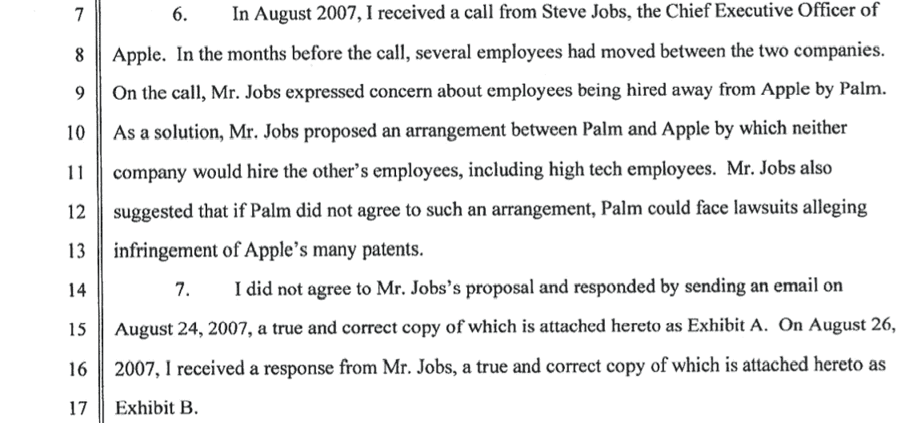
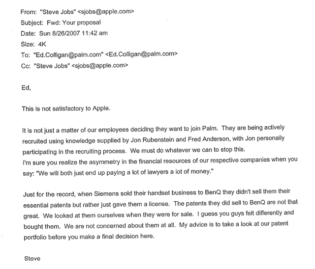

# 硅谷的“无雇佣”岁月在新的谴责文件中曝光 TechCrunch

> 原文：<https://web.archive.org/web/https://techcrunch.com/2013/01/23/the-valleys-no-hire-years-come-to-light-in-damning-new-documents/>

# 新文件披露了硅谷“不雇佣”的年代

在一份由前 Palm 负责人爱德华·克里根提交的声明中，新的证据显示了禁止雇佣协议的盛行。克里根在为自己的公司配备员工时，曾接洽苹果员工到 Palm 工作。

那些年的趋势是锁定员工，并提供不挖员工的握手协议，这种趋势一直持续到今天，只是程度稍轻一些。为什么？大概在 2007 年，苹果是创新的温床，而 Palm 也在加速发展其手机部门，以应对 Palm Pre 等机型。叛逃会极大地影响这些公司的各个部门。

克里根写道:

史蒂夫·乔布斯不希望这样，他指出，Palm 积极招聘员工，而不是允许员工自愿离职:

美国加州圣何塞地区法官 Lucy Koh 公布的其他文件曝光了 Adobe、谷歌、富士康和皮克斯的其他无雇佣协议。

这种行为导致员工无法在公司之间流动，许多这种“不雇佣”协议现在成为集体诉讼的基础，可能会使苹果和其他公司损失数百万美元。这是一个混乱的行业。

一方面，很容易理解为什么这些信会流传开来。高科技员工在全世界都很难找到，更别说在苹果了。通过同意停止挖走彼此的员工，苹果、谷歌和 Palm 可以继续致力于自己的项目，而不必担心失去关键人才。

可悲的是，当不雇佣契约实施时，损失的是员工，正如这些文件所证明的那样，一些首席执行官对待工人更像契约农奴，而不是人。

[scribd id = 121782747 key = key-vqdyb 171 q 67 NPS 8 i6 PP mode = scroll]

[通过路透社](https://web.archive.org/web/20221224201156/http://uk.reuters.com/article/2013/01/23/business-us-apple-google-lawsuit-idUKBRE90M04Y20130123)