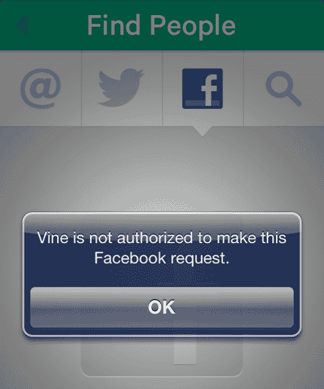

# 脸书已经不再向竞争对手提供其珍贵的社交网站——TechCrunch

> 原文：<https://web.archive.org/web/https://techcrunch.com/2013/01/24/my-precious-social-graph/150/>

在脸书的所有数据集中，社交图谱是真正独一无二的。它花了九年时间让你确认你认识谁，显然它已经厌倦了把你的朋友名单交给竞争对手。本周，它关闭了 Twitter 的新图片应用 Vine 和消息应用 Voxer 的 Find Friends，这是脸书的一个 API，可以让你在其他应用上与脸书朋友联系。但这可能会适得其反。

脸书知道你是谁，你对什么感兴趣，你去了哪里，你使用什么应用程序，等等。然而，其他公司有这些数据集的零碎信息。LinkedIn 知道你的简历，谷歌知道你的网络搜索，Twitter 知道你关注谁，苹果和亚马逊知道你的信用卡号码，你手机的操作系统制造商知道你下载了什么应用。然而，谁是你现实生活中的朋友，是脸书的领域。

在其他应用上手动重新确认你的社交图谱，往坏里说是尴尬，往好里说是烦人。想想吧。如果你的脸书账户被重置，你必须向你所有的老朋友发送好友请求，你认为会有多少人确认？即使是你最好的朋友也可能懒得加你为好友，而那些几年前你们相遇时很乐意加你为好友的人可能不会在意他们是否记得你。

脸书的社交图谱中有很多噪音。一些人盲目地接受他们收到的大多数请求，另一些人将它们发送给他们见过一次的任何人，随着时间的推移，所有的联系都变得陈旧。不过，如果你想启动一个社交应用，脸书的“寻找朋友”功能是非常有价值的。这可能是一个空提要和低保留之间的差异，也可能是一个充满活力、令人上瘾的提要，充满来自你关心的人的内容。

脸书多年来一直提供寻找朋友的服务。但那些年，它还是一个基于网络的社交网络。现在更多了，或者至少它希望如此。脸书希望主持所有你交流的方式。这使得它与苹果、谷歌和其他公司在信息领域的战争才刚刚开始。

数据可移植性在 2010 年首次成为一个大问题，当时[脸书禁止 Twitter](https://web.archive.org/web/20210903011928/https://beta.techcrunch.com/2010/06/23/facebook-blocks-twitter/) 使用其寻找朋友功能。那年晚些时候，它与谷歌就输出联系人列表的问题在[发生了口角。谷歌很生气脸书吸收了 Gmail 联系人，却没有导出好友列表。脸书最终开始提供下载你的数据，其中包括你的朋友名单，但只有纯文本格式。](https://web.archive.org/web/20210903011928/https://beta.techcrunch.com/2010/11/04/facebook-google-contacts/)

然而最近，当[切断 Instagram 对 Twitter 自己版本的“寻找朋友”的访问](https://web.archive.org/web/20210903011928/https://beta.techcrunch.com/2012/07/26/no-api-for-you-twitter-shuts-off-find-friends-feature-for-instagram/)时，Twitter 可能唤醒了这条龙这是一种可以理解的报复，因为脸书切断了它，Twitter 也想收购 Instagram。

现在脸书开始发难，引用其[平台政策](https://web.archive.org/web/20210903011928/https://developers.facebook.com/policy/)声明“竞争社交网络:(a)未经我们允许，你不得使用 Facebook 平台将用户数据输出到竞争社交网络。”

上周，它屏蔽了语音信息应用 Voxer 对社交图谱的访问。当时，脸书告诉我，这是因为 Voxer 有资格成为一个竞争信息平台，但也因为 Voxer 没有为脸书做出多少贡献。Voxer 只有一个被埋没的、基本上没有必要的“分享给脸书”选项。它收到了一封电子邮件，声明其查找朋友的权限将在 48 小时后被撤销。

然后今天脸书关闭了 Twitter 的 Vine 的 Find Friends，这是由杰夫·马丁发现的，由 T2 的 The Verge 报道。这多少有点道理。更多是因为 Twitter 是一个真正的竞争对手。它有着不错的规模和知名度，与脸书争夺同样的广告客户。Twitter 很想知道你的脸书社交图谱，这可以帮助它完善自己的版本，即“兴趣图谱”，这为其广告定位提供了动力。

这没什么意义，因为 Vine 有一个突出的“分享给脸书”选项。脸书只追求那些没什么回报的应用程序，这是怎么回事？显然，这一提议被否决了，因为 Twitter 是一个更合理的威胁。以至于脸书采取的政策是“我们保留对你的应用采取行动的权利，甚至在这 48 小时期限结束之前。”它不希望 Twitter 获得任何社交图谱数据。

这些政策的实施可能会在脸书周围形成一条护城河。它为竞争公司的参与、保留和发展制造了障碍。这将迫使社交应用依赖于其他数据集，比如你手机上的联系人，他们可能没有完整的社交图谱，尽管很可能包括你最亲密的朋友，他们的号码是你的。

不过，这种优势可能不值得。强制执行意味着脸书不是一个“开放平台”如果公司担心 Find Friends 或其他脸书数据访问可能会在毫无察觉的情况下被剥夺，这可能会对脸书平台的开发产生寒蝉效应。如果脸书数据可能消失，没有人愿意开发一个依赖它的应用。

今天早上，脸书加强了对社交网络数据输出的禁令，重申了这种担忧。俄罗斯搜索引擎 [Yandex 的新社交搜索](https://web.archive.org/web/20210903011928/https://beta.techcrunch.com/2013/01/24/yandex-launches-social-search-app-wonder-as-a-u-s-experiment-gets-legal-advice-on-why-it-shouldnt-bother-facebook/)移动应用 Wonder [在发布仅三小时后就被屏蔽了所有 API 调用](https://web.archive.org/web/20210903011928/https://beta.techcrunch.com/2013/01/24/facebook-blocks-yandex-wonder/)。这就浪费了大量的编程和产品工作。

脸书在玩火。它可以利用政策执行来烹饪竞争对手，并展示其在社交网络上的主导地位。但如果这种强制措施吓跑了开发者，他们的应用程序可能会提供可以显示在新闻提要广告旁边的内容，并通过管道进入图形搜索，脸书可能会严重受损。

*【图片来源:[新闻网](https://web.archive.org/web/20210903011928/http://www.newscom.com/)* 

—

关于这个话题的更多信息，请阅读:

[脸书澄清禁止使用其数据复制其功能或不共享的应用](https://web.archive.org/web/20210903011928/https://beta.techcrunch.com/2013/01/25/facebook-bans-replicating-its-functionality/)

[脸书克隆藤还要多久？不，脸书应该发明藤蔓](https://web.archive.org/web/20210903011928/https://beta.techcrunch.com/2013/01/25/facebook-needs-its-crystal-ball-back/)