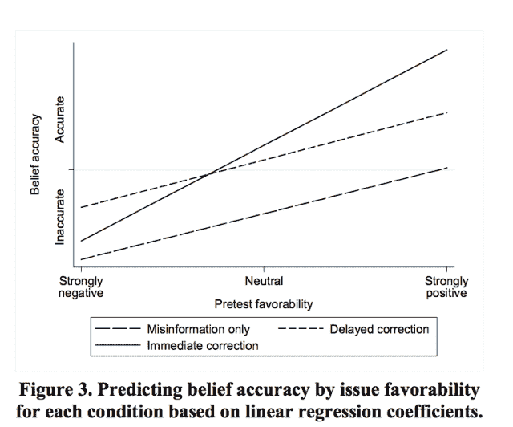
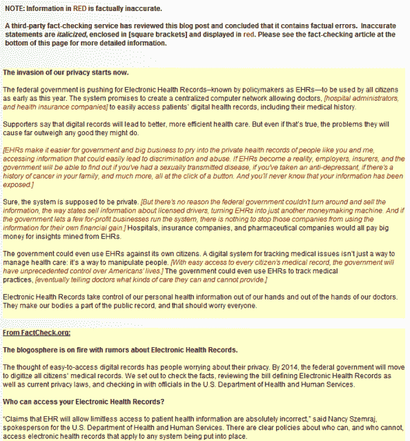

# 研究发现，即使在即时在线更正之后，我们仍然相信谎言

> 原文：<https://web.archive.org/web/https://techcrunch.com/2013/01/24/study-finds-that-we-still-believe-untruths-even-after-instant-online-corrections/>

# 研究发现，即使在即时在线纠正之后，我们仍然相信谎言

如果你想知道为什么出生论者、内幕交易者和其他阴谋论者不会简单地从表面上接受真相，OSU 的两位研究人员发现我们倾向于忽视——并拒绝——对数据的即时修正。

由 R·凯利·加勒特和布莱恩·威克斯进行的这项研究检验了当新闻报道中的虚假信息被立即纠正后会发生什么。虽然一些程序声称可以自动调出虚假信息，但这种系统让用户“更抗拒真实信息”没错:我们读的真理越多，我们就越倾向于相信谎言。

加勒特说:“人类不是你可以向其中倾倒准确信息的容器。”“纠正误解确实是一项说服任务。你必须让人们相信，尽管有不同的说法，但有一种说法显然更准确。”

科学家们给了参与者三页电子健康记录(EHRs)信息中的一页，这对一些人来说是一个潜在的分裂话题。其中一页显示了虚假信息，“不准确的陈述用斜体表示，用括号括起来，用红色显示，详细的更正出现在页面底部。”其他人阅读一篇有错误的文章，给他们一个三分钟的任务，然后给他们看改正的内容。最后，其他人得到了含有完整虚假信息的页面。

后来，研究人员问“几个群体(包括医院管理者、政府官员和其他人)访问电子健康记录的难易程度如何。”那些支持 EHRs 的人往往在测试中获得更高的分数，而那些反对 EHRs 的人的回答就好像他们根本没有被纠正过一样。简而言之，这些修正对他们的观点和后来信息的准确性没有影响。

举个例子，如果你是奥巴马总统(或者任何一个人物)的支持者，对不准确信息的更正会改变你对该信息的回忆。如果你反对他，纠正也没用。底线呢？

提供事实信息是促进学习的必要条件，但不是充分条件，尤其是围绕有争议的问题和有争议的事实。正如这项研究所强调的，个人受到各种偏见的影响，这些偏见可能导致他们拒绝仔细记录的证据，而从源头上纠正错误信息实际上可以扩大这些偏见的影响。我们的目标不是阻止这一领域未来的工作，而是建议设计者可以用来帮助克服这些偏见的各种纠正-呈现策略。

加勒特说:“我们预计，像纠纷查找器这样的系统不会改变大约六分之一的美国人的信仰，尽管有详尽的新闻报道和事实核查，他们仍然质疑奥巴马总统是否出生在美国。”

[图片:[吉格拉](https://web.archive.org/web/20221207171250/http://www.shutterstock.com/gallery-596866p1.html) / [快门架](https://web.archive.org/web/20221207171250/http://www.shutterstock.com/)