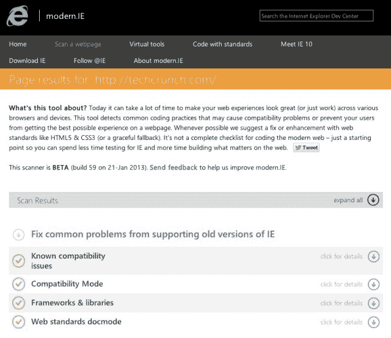

# 微软推出 Modern。IE 帮助开发者测试他们的网络应用程序的传统和现代版本 IE TechCrunch

> 原文：<https://web.archive.org/web/https://techcrunch.com/2013/01/31/microsoft-launches-modern-ie-to-help-developers-test-their-web-apps-for-legacy-and-modern-versions-of-ie/>

# 微软推出 Modern。IE 来帮助开发者测试他们的网络应用程序的旧版本和现代版本

尽管微软自己更愿意改变这个版本，但许多用户仍然依赖旧版本的 ie 浏览器。例如，对于开发者来说，这意味着花费数小时测试他们的网络应用程序，以确保它们能在 IE8 和 IE7 上运行。微软一直在努力使 IE9 和 IE10 兼容 HTML5 和 CSS3 等标准，它充分意识到了这个问题，并于今天推出了 [modern。IE](https://web.archive.org/web/20221209082949/http://modern.ie/) “让开发者更容易确保他们的网站在 Internet Explorer 和其他现代浏览器上都能很好地工作。”

微软推出 Modern。IE 来帮助开发者测试他们的网络应用程序的旧版本和现代版本

正如微软互联网浏览器总经理瑞安·加文昨天告诉我的，现代。IE 由许多免费工具和资源组成，包括一个扫描仪，它可以检查可能使网站与 IE 的现代和传统版本不兼容的常见问题。Gavin 指出，扫描仪会检查给定的页面，找出与开发人员使用的库和框架的常见兼容性问题。然后，它推荐修复方法，并为开发人员提供关于哪个版本的给定框架(如 jQuery)提供最佳兼容性的信息。

【YouTube http://www.youtube.com/watch?v=MH_Dao4FEfQ？feature = player _ detail page & w = 640 & h = 360]

微软发现，这是一个令人惊讶的大问题。目前，流量和访问量排名前 5000 位的网站中，超过 40%使用了过时的框架或库，这可能会导致与最新版本的 IE 和其他现代浏览器的兼容性问题。微软还发现，这些 5000 强网站中有 20%目前使用特定于供应商的前缀(-moz，-ms，-webkit 等)。)这可能会导致兼容性问题。这些网站中的大多数也使用浏览器检测，并经常提供与 IE9 和 10 不兼容的网站，因为他们没有意识到这些新版本的 IE 不再是传统的浏览器。

除了扫描仪之外，微软还将在检测到无法通过扫描仪公开披露的特定网站问题时，直接与开发者合作。

该网站还提供了由 jQuery Foundation 总裁 Dave Methvin 和微软技术传播者 [Rey Bango](https://web.archive.org/web/20221209082949/https://twitter.com/reybango) 撰写的一套 20 条最佳实践技巧，微软已经[与 Browserstack](https://web.archive.org/web/20221209082949/http://www.browserstack.com/) 合作，为所有开发者提供明年三个月的免费服务，让他们可以很容易地看到他们的网站在各种浏览器和操作系统中的样子。开发人员可以使用他们的脸书证书来注册这项服务。Browserstack 还提供了 [Chrome](https://web.archive.org/web/20221209082949/https://chrome.google.com/webstore/detail/test-ie/eldlkpeoddgbmpjlnpfblfpgodnojfjl) 和 [Firefox](https://web.archive.org/web/20221209082949/https://addons.mozilla.org/en-US/firefox/addon/test-ie/) 插件，只需点击一下就可以快速测试一个站点，还提供了一组 Mac、Windows 和 Linux 的虚拟机映像，可以运行 Windows 和 IE 的底层版本进行本地测试。值得注意的是，Browserstack 对任何开发人员来说都是一个有用的工具，开发人员可以使用它来测试任何操作系统上的几乎任何浏览器。

正如 Gavin 告诉我的，这里的想法是让开发人员更容易测试他们的站点，并确保它们与传统浏览器兼容。他承认，互联网浏览器的遗留版本——即 IE9 之前发布的所有版本——让网络开发人员日子不好过。现代。加文在今天的一篇博客文章中写道，IE“只是我们持续承诺的另一部分，帮助开发人员花更少的时间测试，花更多的时间构建令人惊叹的网站。”

