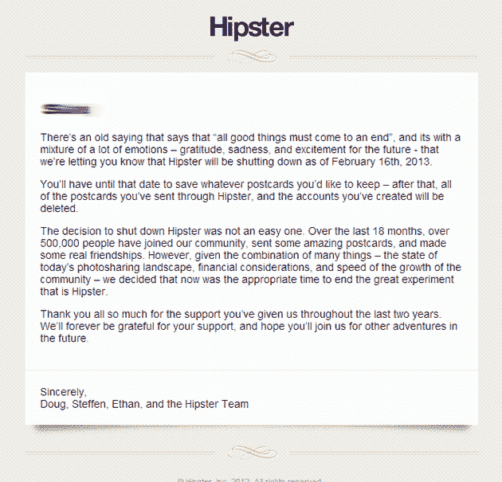

# 美国在线的更多变化:图片分享应用 Hipster.com 将于 2 月 16 日关闭 TechCrunch

> 原文：<https://web.archive.org/web/https://techcrunch.com/2013/02/05/more-change-at-aol-photosharing-app-hipster-com-is-shutting-down-february-16/>

今天 AOL 正在发生另一个变化:AOL 在 2012 年 3 月收购的超本地图片共享应用程序 Hipster.com 将于 2 月 16 日关闭。注册用户将收到电子邮件(下面嵌入了一份由读者发给我们的副本)，告知他们需要在该日期之前保存任何明信片——时髦人士对张贴图像的术语——否则他们将被删除，以及所有其他用户数据。网站本身还没有发布任何通知，尽管它的 [Twitter feed](https://web.archive.org/web/20221206102146/https://twitter.com/Hipster/status/298935019760676865) 也证实了这一消息。

**更新**:我们现在也从 AOL 得到确认，它正在“淘汰”Hipster，但一些员工将继续在 AOL 的其他项目中工作。一位发言人说:“虽然 Hipster 应用程序并不是 AOL 战略路线图的核心，但我们将继续与 Hipster 的关键人才合作，以支持 AOL 的其他产品。”

根据这封邮件——它根本没有提到 AOL——关闭是由于多种原因——“照片共享景观”的状态(意思是:Instagram 等网站的统治地位),财务考虑和网站的增长是三位创始人道格·勒德洛(Doug Ludlow)、斯蒂芬·霍夫曼(Steffen Hoffman)和伊桑·察霍(Ethan Czahor)在信中提到的原因。“关闭 Hipster 的决定并不容易，”他们指出。

他们指出，自 2011 年推出以来，该网站已经吸引了约 50 万用户。当 AOL 去年买下这个网站时，报道的价格在 7 位数以下。

抛开来自大型图片分享网站的一些更大的竞争问题不谈，AOL 也发生了一些变化。

首先，Hipster 在 AOL 的团队 AOL Mobile 实际上已经关闭，几个关键人物离开了公司，其他人被重新部署到不同的个人运营部门，如网站(如 AOL 拥有的 TechCrunch)。

前首席执行官道格·勒德洛在 2012 年 3 月收购时表示:“索尔、大卫和他的团队在帕洛阿尔托的 AOL 移动团队创造的文化非常令人惊叹——这是一群我们迫不及待要开始开发酷东西的人。”。“我们也很高兴 Hipster 不仅将作为一个产品保持开放，而且我们现在可以更快地改进/构建它。”显然，随着 AOL Mobile 的退出，Hipster 的处境更加岌岌可危。(勒德洛现在是美国在线风险投资公司的创新合伙人，还创办了儿童书籍的 T2 小书友会)

另一个变化是，本周 AOL 在发布季度收益之前，正在削减开支，提高效率，并可能在其他领域加倍努力。今天又有消息称，个人资料网站 About.me 在美国在线旗下运营两年后，[被分拆为一家独立的公司](https://web.archive.org/web/20221206102146/https://beta.techcrunch.com/2013/02/05/tony-conrads-about-me-spins-back-out-from-aol-after-raising-5-7m-capital-led-by-true-ventures/)。当天早些时候，AOL 还将 Advertising.com 更名为 AOL Networks，有报道称，AOL 正在与 Gdgt 进行谈判，Gdgt 是一家科技网站，由 AOL 旗下 Engadget 的联合创始人和前主编共同创建。

