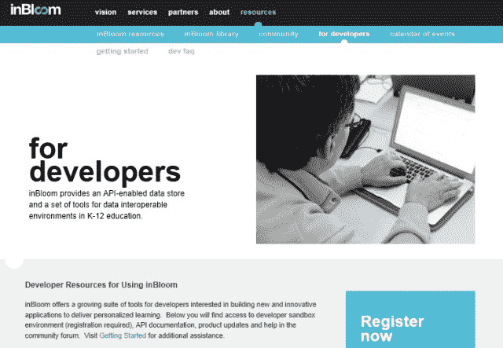

# 凭借来自盖茨基金会和其他机构的 1 亿美元，inBloom 希望通过释放其数据 TechCrunch 来改变教育

> 原文：<https://web.archive.org/web/http://techcrunch.com/2013/02/05/with-100m-from-the-gates-foundation-others-inbloom-wants-to-transform-education-by-unleashing-its-data/>

2012 年，围绕教育技术的讨论达到了新的高度，随着新的一年的到来，围绕技术对高等教育和 K-12 教育的潜在变革性影响的宣传仍在继续。这方面的例子很多，但最近最突出的例子应该是世界上最大的大学系统即将推出的试点项目，该项目将试图为加州州立大学系统带来负担得起的、较低级别的补救性(由 Udacity 提供支持)在线课程。

最近，我们看到从风险资本家和企业家到州政府和联邦政府，对教育技术的兴趣越来越大。该国一些最具影响力的商界和政界人士也开始参与讨论。上周，杰布·布什——前总统乔治·w·布什的弟弟，前佛罗里达州州长——[为美国有线电视新闻网撰写了一篇专栏文章，其中他讨论了数字教育](https://web.archive.org/web/20221124021516/http://schoolsofthought.blogs.cnn.com/2013/01/31/jeb-bush-students-should-have-the-choice-of-digital-schools/)的重要性——特别是它通过“无处不在的工具”团结学生群体的能力……以及“通过打开学生的眼睛，让他们了解更多样化、定制化的学习技术，最大限度地发挥学生的成功潜力”。"

此外，[在他给比尔和梅林达·盖茨基金会支持者的年度信](https://web.archive.org/web/20221124021516/http://annualletter.gatesfoundation.org/#nav=intro)和上周[的后续采访](https://web.archive.org/web/20221124021516/http://www.theatlantic.com/business/archive/2013/01/can-big-data-save-american-schools-bill-gates-is-betting-on-yes/272719/)中，比尔·盖茨讨论了给予学校更好的方法来收集、收集和分析数据的重要性，以及大数据在“拯救”美国陷入困境的公立学校系统中可以产生的巨大影响

考虑到教育方面的公共支出一直徘徊在该国国内生产总值的 6%左右，换句话说，考虑到每年在教育上花费数十亿美元的事实，学习成绩(成绩和毕业率等)的下降。)至少可以说是令人失望的。因此，对学生、企业和经济来说，问题的规模和机会都显而易见。

也就是说:当新闻集团在 2010 年末以 3.6 亿美元收购教育科技初创公司 Wireless Generation 时，[鲁珀特·默多克(Rupert Murdoch)谈到科技改变学习的潜力时说](https://web.archive.org/web/20221124021516/http://www.newscorp.com/news/news_464.html):“就 K-12 教育而言，我们看到仅在美国就有 5000 亿美元的行业，它急切地等待着扩大伟大教学范围的重大突破来改变它。”

我为什么要告诉你这些？除了对数字工具、大数据和个性化在学习(和教育)转型中的重要性的共同表达，以及它们潜在代表的机会和影响的大小，他们还有其他共同点。比尔·盖茨、新闻集团的无线一代和许多其他人都在某种程度上为一个名为[共享学习协作](https://web.archive.org/web/20221124021516/https://www.edsurge.com/shared-learning-collaborative#/default) (SLC)的项目的发展做出了贡献。

出于以上详述的原因，他们正在大规模介入。事实上，盖茨基金会和卡耐基公司(仅举两个例子)已经为 SLC 提供了 1 亿美元的资金支持。这对任何教育公司来说都是一笔巨大的投资，更不用说对一家非营利的教育科技初创公司了(尤其是考虑到投资是以赠款的形式，而不是风险资本)。

那么，为什么有兴趣呢？用 SLC 自己的话来说，它是一个由州、地区、非营利组织、基金会和公司组成的联盟，共同拥有“通过个性化学习提高学生成绩”的愿景虽然该组织于 2011 年首次出现，但它对其计划的细节保持沉默——除了它开始建立一套“共享技术服务”的事实，该服务旨在使州和地区能够“连接学生数据和教学材料”，并为“教育工作者、家长和学生”更有效地整合它们

毫无疑问，这是一个光荣而重要的使命，但直到现在，在没有任何组织实际计划如何实现其雄心勃勃的目标的情况下，盖茨和卡内基的巨大承诺很难得到证明。

然而，今天，我们终于得以一瞥共享学习协作的未来——以及它改变教育的潜力。今天上午，SLC 正式更名，更名为一家名为 [inBloom](https://web.archive.org/web/20221124021516/https://www.inbloom.org/) 的新非营利初创公司，该公司在过去 12 个月里一直在悄悄地建设和发展。简而言之，这个新的非营利组织旨在通过为企业家、学校和学区提供更好、更简单的方式来理解和利用大数据，从而帮助改革教育。

当然，在盖茨基金会、州立学校首席官员委员会以及州和联邦机构的支持下，人们很容易担心政治和金融利益会对 inBloom 的发展方向产生巨大(适得其反)的影响。然而，inBloom 首席执行官伊旺·施特莱肯伯格向我们保证，该公司从一开始就被设计为一个非营利组织，以阻止特殊利益，从而创造一个与数据、平台和用户无关的工具——一个可以帮助教育工作者、学校和企业家释放长期以来被困在专有数据孤岛和无数软件平台中的教育数据背后的价值的工具。

他说，这种碎片化和缺乏可移植性使得数据无法交流，剥夺了它的大部分效用，实际上是它的价值。因此，他认为，没有一家公司、机构或国家计划——无论规模有多大——能够创建底层的、不可知的数据资源，允许各种类型的应用程序、软件、工具和平台相互通信，并使其数据更具可操作性。但是，有了来自支持者的 1 亿美元，几十家公司、机构和地区的支持，非营利组织和开源技术的支持，有理由相信 inBloom 可能会在其他人失败的地方取得成功。

最近，在与一位朋友讨论教育技术的现状时，我们都同意，这个领域在过去的一年里充满了活动，结果就是炒作。然而，在与投资者的交谈中，我发现，尽管许多人因为教育的重要性、规模以及技术对相关行业的潜在变革而希望投资教育，但许多人仍在犹豫。虽然早期阶段的风险资本已经自由流入教育科技企业，但许多后期阶段的投资者还没有看到足以保证大笔投资的投资回报率。仍然有太多未经证实的概念(和未煮熟的商业模式)，太多的功能-伪装成公司。

无论哪种方式，从长远来看，实验无疑都是有价值的，但我们希望 2013 年将是我们的注意力、投资和焦点超越新奇、炒作和功能，转向真正有效的核心的一年。

InBloom 才刚刚起步，但前景和潜力肯定是有的。学区竞相改编材料和评估，以适应共同的核心国家标准，出版商正在努力跟上内容的数字化和新的学术要求。与此同时，教师和学校正在被数据淹没，新的创业公司在每个转折点都推出工具、软件和应用程序，同时仍在与陈旧的基础设施和多种格式的数据搏斗——实际上，只是一个破碎的系统。

LearnSprout 和 Clever 于 2012 年成立，旨在帮助开发一套标准化的 API，允许开发人员解锁学生信息系统(包含学校大部分重要学生数据的数据仓库)，并创建可以与这些数据交互的应用程序，并利用这些数据来创建真正有所作为的工具。InBloom 希望更进一步，创建一个标准化的开源数据架构，不仅仅限于学生信息系统，还包括学习管理系统和应用程序，即学校和学区存储关键学习数据的任何门户。

这家新的非营利组织希望简化数据集成和内容搜索，通过将学习应用程序连接到以各种格式和位置存在的系统和信息来丰富学习应用程序，同时帮助降低学校的成本。这位首席执行官表示，他希望 inBloom 能够全面了解每个学生的历史，他们的进步，并帮助初创公司，开发商，公司和学校创建工具，让他们更好地了解学生如何提高他们的学习成果，并个性化他们的学习路径。

该公司还希望帮助教育工作者从多个提供商那里找到符合标准的教学资源，将它们与学生的个人需求相匹配。“我们希望为学校和教育工作者创造更多的选择，”Streichenberger 说，但不是以压倒性或使他们的生活更加混乱的方式。“但在某种程度上，允许创业公司和公司创建不同版本的学习分析，例如，教师可以选择最符合他们需求的版本。”

反过来，首席执行官希望这将为所有船只提供一个上升的潮流，通过允许他们在同一教育领域工作，同时在该领域进行专业化，提升货币化潜力，即公司赚钱的能力。无论是学习管理系统的工具，还是特定州、地区或学校系统的评估应用程序——基于它显示的数据，inBloom 允许他们访问——公司都可以为特定需求创建特定工具。

“InBloom 让我们能够从十几个不同的系统中编译和访问评估数据，”马萨诸塞州埃弗雷特的助理督学汤姆·斯特拉说。“这些信息与符合学生个人需求的相关内容相结合，有助于最大限度地利用教师的时间和学生的学习潜力，让他们专注于课堂教学。”

这意味着 inBloom 的框架可以让技术提供商和初创公司开发和部署他们的应用程序和产品，而不必花时间建立与每个州和地区的数据源的定制连接。自然，这有可能解决开发者、教师、学校和创业公司在为学校构建技术时面临的许多成本和痛点。这是巨大的。

今天，21 家教育科技公司已经宣布计划开发将与 inBloom 的开放 API 一起工作的应用程序，包括 Agilix、BloomBoard、CaseNex、Clever、Compass Learning、ConnectEDU、CPSI、Ellevation Education、eScholar、Global Scholar、GoalBook、Gooru、KickBoard、Learning.com、LearnSprout、LoudCloud、PBS、Promethean、Scholastic、Schoology 和 Wireless Generation。

除此之外，九个州(代表超过 1100 万名学生)目前正在参与其服务的开发和试点，包括科罗拉多州、特拉华州、乔治亚州、伊利诺伊州、肯塔基州、路易斯安那州、马萨诸塞州、纽约州和北卡罗来纳州。其中五个州已经选择了部分地区进行试点测试。

inBloom 首席执行官还特意表示，尽管该公司是开源的，并专注于内部通信、数据可移植性和可扩展性，但仍将数据隐私作为“首要任务”，该平台符合《家庭教育权利和隐私法》(FERPA)，他说。对于感兴趣的开发者来说，该公司计划在今年夏天的某个时候发布 inBloom 背后的代码，并将在 3 月份的 SXSW 上演示该平台。

这只是对 inBloom 新平台的一个总体介绍，我们希望在未来几周内有更详细的细分，敬请关注。现在，[在这里](https://web.archive.org/web/20221124021516/https://www.inbloom.org/)可以找到更多关于家庭的信息。