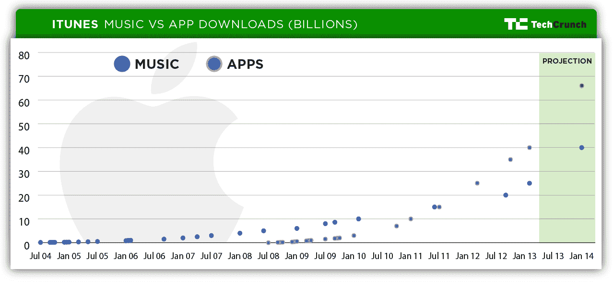

# 绘制 iTunes Store 销售 250 亿首歌曲、下载 400 亿个应用程序的路径图

> 原文：<https://web.archive.org/web/https://techcrunch.com/2013/02/06/charting-the-itunes-stores-path-to-25-billion-songs-sold-40-billion-apps-downloaded-and-beyond/>

# 绘制 iTunes Store 销售 250 亿首歌曲、下载 400 亿个应用程序的路径图

苹果公司今天宣布了 iTunes 数字音乐商店的新销售里程碑，售出了 250 亿首歌曲。这个消息是在本月早些时候宣布的，该应用商店自成立以来已经有超过 400 亿次的应用下载。对于 iTunes 音乐商店来说，这张新唱片刚刚迎来 10 周年纪念日，但对于 App Store 来说，增长更快，更大的数量是在大约四年半的时间里积累的。

每当跨越 iTunes store 下载或销售的关键里程碑时，苹果都会向公众发布数据，这一点相当一致，除了通过像这样的独立公告之外，苹果经常在 WWDC 这样的开发者活动、发布新产品的新闻发布会或季度财报电话会议上公布数据。因此，我们创建了一个图表来跟踪两家商店的进度。

【T2

此处使用的所有数字均来自苹果公司在上述事件类型或文件类型中做出的官方声明。除了历史数据，我们还根据过去的数据和通过分析这些数据得出的增长率，对明年进行了粗略的预测。两个商店在最近的年度数据之间显示了相似的年增长率，但 App Store 目前更大的下载量表明，如果情况大致保持不变，明年的总下载量将达到更高的水平。也就是说，随着 Android 的普及和流媒体音乐服务继续其扩张战略以及与 OEM 制造商的合作关系，这可能是两个数字市场的动荡时期。

其他一些有趣的花絮来说明这些数字:苹果 iTunes 的增长意味着如果你平均一下全球人口下载的歌曲数量，结果是每人 3.57 首，250 亿首歌曲也意味着在 iTunes 商店存在的 9 年 9 个月零 9 天里每天平均下载 7，002，585 首歌曲。

苹果 iTunes 音乐商店的歌曲购买量从今天到上一次报告数字增长了 25%，上一次是在 9 月的一次新闻发布会上宣布超过 200 亿美元。这大约是 65%的年增长率，超过了自 2010 年以来衡量进展的三年平均年增长率 50%左右，可能表明商店实际上看到了增长率的增加，但也有可能这两个日期之间的假期对增长率在这个特定时刻的表现产生了巨大的影响。