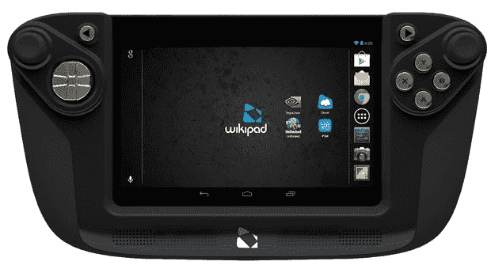

# Wikipad 通过一款 7 英寸、售价 249 美元的游戏平板电脑让梦想成真 TechCrunch

> 原文：<https://web.archive.org/web/https://techcrunch.com/2013/02/07/wikipad-keeps-the-dream-alive-with-a-7-inch-249-gaming-tablet/>

# Wikipad 用一款 7 英寸、售价 249 美元的游戏平板电脑让这个梦想成真

Wikipad 还活着！几经推迟后，该公司准备将其游戏装置推向市场。最终的模型与概念不同，但它更便携，更便宜，也更光滑。我想要它。

维基百科的信息还是一样的。控制环绕在 7 英寸屏幕上，Wikipad 试图成为 Android 的游戏男孩——它看起来更像世嘉游戏设备。该公司尚未宣布确切的发货日期，但[将在今年春天](https://web.archive.org/web/20221007005922/http://www.engadget.com/2013/02/07/7-inch-wikipad/)到来。

最初的 Wikipad 使用了 10.1 英寸、1280 x 800 的屏幕和 Tegra 3 芯片。这要花 500 美元，很可能会失败。很难。

[正如 Engadget 解释的](https://web.archive.org/web/20221007005922/http://www.engadget.com/2013/02/07/wikipad-redesign/)，该公司推迟了 10.1 英寸型号的改进，但随着发布日期的临近，屏幕制造商对 Wikipad 的面板打了折扣。因此，Wikipad 朝着制造一个更小的模型前进，这显然已经在路线图上了。

7 英寸的 Wikipad 仍然采用 1280 x 800 的屏幕，只是采用了 7 英寸的形式。游戏控件仍然放在平板电脑上，平板电脑仍然使用 Tegra 3 芯片。现在售价 249 美元，这款平板电脑实际上有机会进入市场。Wikipad 有机会成为 PS Vita 应该成为的样子。

便携式游戏世界缺少一款像 249 美元的 Wikipad 这样的设备:一款严肃但仍然负担得起的游戏平台，可以进行多任务处理。索尼错过了 PS Vita 的一个大好机会。索尼最新便携式电脑的硬件棒极了。它是一个计算的发电站，但用户体验和对物理介质的依赖扼杀了它成为游戏机以外的东西的能力。售价 249 美元的 PS Vita 应该能够轻松浏览网页，并支持丰富的应用生态系统，即使它是有限的。

安卓游戏可能是下一个大事件。随着 OUYA、Game Stick 和 Wikipad 等专用游戏设备的出现，几乎在一夜之间，将会突然出现一大批渴望新游戏的设备。

该公司的销售总裁表示，10 英寸的 Wattpad 仍将上市。在 2013 年圣诞节前寻找它，并期待 Tegra 4 电源。

