# 网飞的《纸牌屋》是互联网电视资助的原创节目，但不要自欺欺人，它没有广告(剧透警告)

> 原文：<https://web.archive.org/web/https://techcrunch.com/2013/02/11/netflixs-house-of-cards-is-internet-tv-funded-original-programming-but-dont-kid-yourself-its-ad-free-spoiler-alert/>

当网飞在 2011 年竞标并赢得《纸牌屋》的版权时——在该剧开拍前就买下了它，并承诺播出整整两季——《T2》成为头条新闻。这是有充分理由的:在大卫·芬奇和凯文·史派西的参与下，投资如此高知名度的原创节目让网飞扮演了一个通常由 HBO 扮演的角色。

关于 HoC 的价格标签为[1 亿+](https://web.archive.org/web/20221206163837/http://www.deadline.com/2011/03/netflix-to-enter-original-programming-with-mega-deal-for-david-fincher-kevin-spacey-drama-series-house-of-cards/) 的谣言四处流传。一位 AllThingsD 消息人士建议每集至少 300 万美元——总成本至少 7800 万美元。网飞还没有公开证实这部剧的花费，尽管一位“熟悉网飞计划”的 WSJ 消息人士称成本可能远低于 1 亿美元。

无论最终的数字是多少，网飞已经铺开了一条红地毯，大肆宣扬该节目对互联网电视的意义。“我们相信 2 月 1 日(《广告狂人》第一季在网飞播出的日期)将是互联网电视发展的一个决定性时刻，”它在上个月的一次财报电话会议上宣称。“对于观众来说，网络电视是一种更好的体验，因为它提供了自由和灵活性，而且在网飞，没有商业广告，”它补充说。

当然，宣传互联网电视是网飞的工作，因为这是它的业务。但是，除了能够按照自己的节奏观看新节目，不受线性多周剧集发布时间表的束缚，HoC 真的如此具有革命性吗？

看完整个节目后，我被一件事所震惊:HoC 充满了商业内容——远远超过我在任何最近或不太最近的电视节目中看到的内容。对于网飞来说，声称互联网电视缺乏商业广告，当涉及到原创节目的这一特定部分时，充其量是不诚实的。

产品不仅仅是偶然出现在电影背景中的*,它们是围绕动作的固定框架，也是导演镜头的偏转焦点。更糟糕的是:有时，品牌利益明显劫持了部分情节、角色弧线、脚本——这些作品。*

苹果产品主导了展会，但它不是唯一的品牌，黑莓、佳能、戴尔和索尼也获得了一部分播放时间(这只是我立即注意到的品牌)。这些产品的外观有些转瞬即逝。很多都不是。

在各种情况下，这部剧都充满了商业内容，以至于把这种情况描述为“植入式广告”是不准确的。更像是产品合拍。这确实非常有趣。这表明，互联网电视资助的原创节目，至少在如此大的规模上，可能并不那么具有革命性。无论如何，不是在没有商业广告的情况下。

网飞没有时代华纳旗下 HBO 的资源。在上个月的[2012 年第四季度收益](https://web.archive.org/web/20221206163837/https://beta.techcrunch.com/2013/01/23/netflix-beats-the-street-reports-fourth-quarter-revenues-of-945-and-2-million-new-subscribers/)中，网飞报告该季度收入为 9.45 亿美元，而时代华纳第四季度仅网络业务收入就为 37 亿美元。为这种水准的原创节目提供资金对网飞来说是一个新领域，也是一个 T4 不得不奋力开拓的新领域。“我们的目标是比 HBO 成为我们更快地成为 HBO，”本月早些时候，网飞首席内容官 Ted Sarandos 对 GQ 说。

正如 AllThingsD 的 Peter Kafka 在网飞谈判《纸牌屋》版权时指出的那样，该公司有能力制作这部剧，但它不能制作“太多”这样的剧。“除非(首席执行官里德·黑斯廷斯)想出了一个办法，与合作伙伴一起削减一些成本，或者创造某种生产奇迹。”

嗯，削减这些成本的一个方法可能是削减更多的植入式广告交易。这实际上意味着与品牌合作，给他们提供广告风格的产品展示机会，这些机会涉及主要人物，并被偷偷带入剧情，作为嵌入的、隐藏的商业广告。

当我问及 HoC 的植入式广告时，网飞拒绝置评。它也不会讨论它在制作这部电视剧中的参与程度。展览大门上方的名字是独立工作室制作公司 [MRC](https://web.archive.org/web/20221206163837/http://www.mrcstudios.com/) 和导演大卫·芬奇。但是没有隐藏所有品牌的主角。或者是网飞在该剧开拍前就买下了它——这给了它参与制作的机会。(有一项引人入胜的研究正在等待进行，它详细描述了当各种品牌出现在屏幕上时，仅苹果标志在广告中出现的时间，或者解构了场景构成和相机角度。)

随着互联网电视和 DVR 让更多的观众删掉商业广告，它们也很可能将更多的商业内容带入观众无法避免的画面。《彭博商业周刊》去年的一篇关于好莱坞对苹果产品的喜爱的报道引用了尼尔森的研究，该研究显示苹果的植入式广告近年来有所增加。根据尼尔森的数据，2011 年，Cupertino 的产品在电视上被讨论或展示了 891 次，比 2009 年的 613 次有所上升。光是特设委员会就一定会在 2013 年大幅提高这一数字。

苹果已经表示[它不会为植入广告支付](https://web.archive.org/web/20221206163837/http://www.washingtonpost.com/wp-dyn/content/article/2006/04/14/AR2006041401670.html)。相反，它显然是免费向生产商提供设备，以换取自由销售——换句话说，是一种易货交易。不管有没有钱，苹果显然非常重视植入式广告。在去年美国苹果诉三星专利大战期间，库比蒂诺的营销主管[菲尔·席勒透露](https://web.archive.org/web/20221206163837/http://www.sfgate.com/technology/article/Marketing-chief-gives-glimpse-into-Apple-3761800.php)该公司有一名员工与好莱坞密切合作，以确保其产品出现在大银幕上。(苹果没有回应我关于其植入式广告的问题。)

因此，虽然还不清楚网飞是否能从 HoC 内部的植入式广告中获得实际收入(当生产商打电话来时，苹果可能会拒绝拿出支票簿，但其他品牌可能不得不支付)，但它可以利用植入式广告来降低整体生产和营销成本。事实上，这正是网飞正在做的事情。

看起来也有一些跨业务的背后抓痒——索尼的 PS3 和 PS Vita 都在节目中出现，可以播放网飞的内容(苹果产品也可以)，所以肯定有共同的利益(“业务协同”)。但是在比传统竞争对手更大的降低成本的压力下，网飞似乎不太能阻止商业利益在它的内容上留下他们的指纹。

换句话说:现在没那么革命了。

[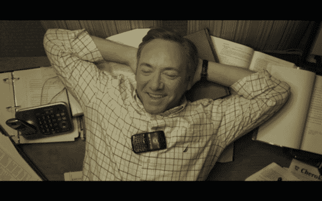](https://web.archive.org/web/20221206163837/https://beta.techcrunch.com/?attachment_id=754819)

### 近距离产品植入

对于不介意一些情节剧透的读者，我在下面详细介绍了几个嵌入《纸牌屋》的商业内容的例子(带有截屏)，以说明节目中并非所有的产品植入都是一样的。并让人们看到最糟糕的例子(参见:“丑陋的”)。

**剧透警告:如果你还没有看完全部 13 集，现在就停止阅读。你已经被警告了！**

### ~~好的~~还过得去

许多人在日常生活中使用智能手机。他们中的许多人甚至使用 iPhone，特别是在美国。所以尽管《纸牌屋》中几乎每个人都使用 iPhone 有点令人毛骨悚然——有些角色甚至有他的黑色和白色的 iPhone——这也是可以忍受的。

[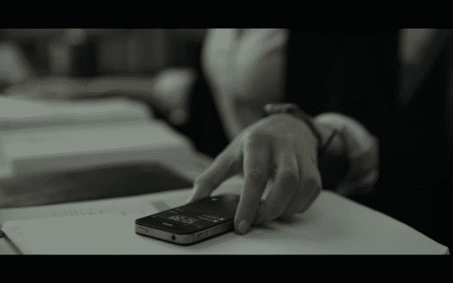](https://web.archive.org/web/20221206163837/https://beta.techcrunch.com/?attachment_id=754817)

[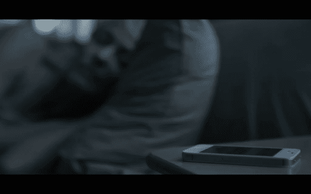](https://web.archive.org/web/20221206163837/https://beta.techcrunch.com/?attachment_id=754830)

至少这场秀包括了一个替代品:黑莓手机，它通常被政治家们用作工作电话。到目前为止，还算公平。也就是说，我找不到一部正在使用的安卓手机。因此，这绝对是对智能手机市场的扭曲看法。

有趣的是，在第一集的一个关键场景中出现了一部看起来很普通的手机(见下图)——还有图形覆盖来描绘来回的短信(后面几集默认为 iOS 文本屏幕)——但也许这些场景是在植入式广告交易敲定之前拍摄的。

### [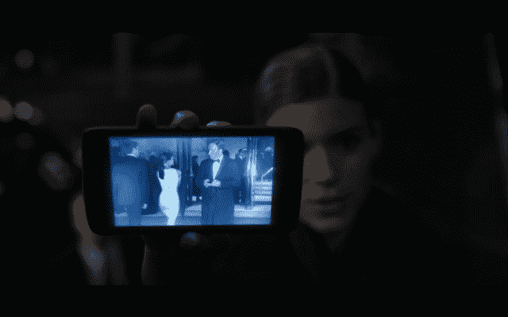](https://web.archive.org/web/20221206163837/https://beta.techcrunch.com/?attachment_id=755058)

### 坏事

如前所述，苹果产品是展会上最具主导地位的品牌，代表了所有的 iDevices 从 iPhones，到 iPads，到 iMacs，到 Macbooks，甚至是苹果独特的白色耳塞。在其他地方，戴尔偷偷带进了几台个人电脑，索尼进入了游戏领域，但这部剧感觉就像是在 1 Infinite Loop 的外景地制作的。累积的影响破坏了节目的气氛，给人一种苹果生活方式广告的感觉，并在内容和观众之间建立了一个可信度壁垒。

[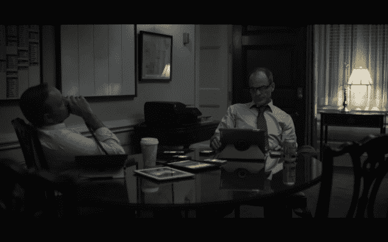](https://web.archive.org/web/20221206163837/https://beta.techcrunch.com/?attachment_id=754815)

除了超现实的品牌同质性，在许多情况下，品牌产品并不只是偶然出现。通常，编剧们似乎已经想尽办法来创造出现/引用的机会——无论是使用品牌产品代替普通产品，还是为节目编写脚本，以故意吸引更多对产品及其功能的关注。

例如，角色们用他们的 iphone 作为手电筒，不止一次地提到某某人不需要叫醒电话，因为他们的手机是他们闹钟的两倍。在另一个场景中，一个角色试图通过在 iPad 上观看视频来学习折纸。

[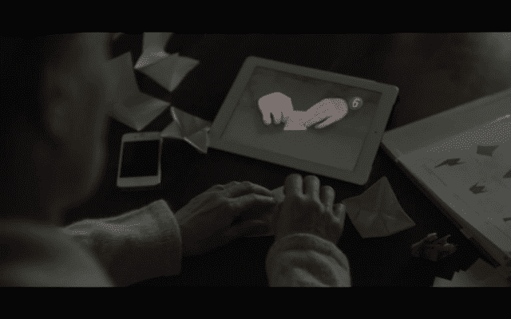](https://web.archive.org/web/20221206163837/https://beta.techcrunch.com/?attachment_id=754816)

在另一个特别裸露的产品广告中，一个角色来到另一个人的公寓，指着桌子上的一个设备，评论道:“那是 PS Vita 吗？”然后他问里面有什么游戏(“所有的，”另一个角色说)，然后继续谈论他如何已经拥有一台 PS3，并以“我必须为我的车买一台[PS Vita]”结束这一序列。从而结束嵌入的 PS Vita ad。

[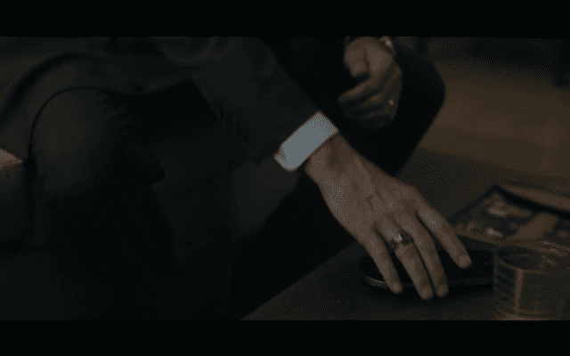](https://web.archive.org/web/20221206163837/https://beta.techcrunch.com/?attachment_id=754655)

当然，人们使用小工具，但是人们做很多事情。《纸牌屋》没有花任何时间展示人物剪脚趾甲，但它确实花了很多时间在电子乐上——场景构图、相机角度/移动都是特意选择的，以框住和展示品牌商品。

[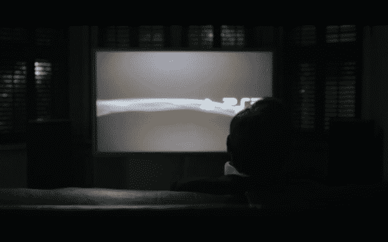](https://web.archive.org/web/20221206163837/https://beta.techcrunch.com/?attachment_id=754821)

整个情节点也往往取决于技术——在某种程度上，这让你怀疑部分情节是由游戏中品牌的商业利益所决定的。有时，剧情中的科技元素与讨论中的人物相符；其他时候他们肯定不会。一名中年国会议员不止一次地用他的 PS3 抨击一些坏人。在我看来，这个例子似乎有点道理——至少说明了他内心的攻击性。

同样，在另一个场景中，一名记者拿出她的 iPhone 在社交媒体上发布她刚刚被解雇的消息——这反过来导致她的老板被解雇(这是一个多么好的 iPhone 广告啊！).她还用她的 iPhone 为一个故事做笔记，并与潜在的消息来源互动。这些例子，虽然仍然很明显是植入式广告，但至少看起来符合她的角色——一个年轻的、对数字感兴趣的科技用户和记者。

但在另一个场景中，一位来自美国南部小镇的悲伤母亲在一次驾驶事故中失去了女儿，她用 iPhone 展示了她(现已去世)女儿的照片。在这里，iPhone 突出了一英里——也许是因为悲伤对于一个广告来说是如此奇怪的背景。

[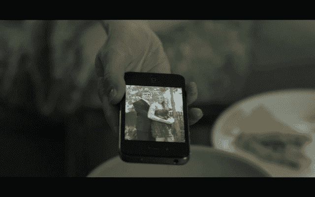](https://web.archive.org/web/20221206163837/https://beta.techcrunch.com/?attachment_id=754808)

### 丑陋的

《纸牌屋》中最没有理由的植入式广告实际上更好地被称为“角色植入”这个角色——以及他的情节主线中的一系列关键场景——完全由产品决定。当然，我无法证明这一点——网飞拒绝置评——所以我是根据我看节目的经验来推测的。但在这一点上，商业议程是如此赤裸裸，我认为只需要一双眼睛来解构推动剧本的利益。

首先，角色的职业——摄影师——完全可以被选择来展示两种主要产品(佳能制造的):一台相机和一台照片打印机。他是一名摄影师对整个情节并不特别重要——许多其他职业都会如此。但对佳能来说，他是至关重要的，因为他是他们的品牌传播者。

[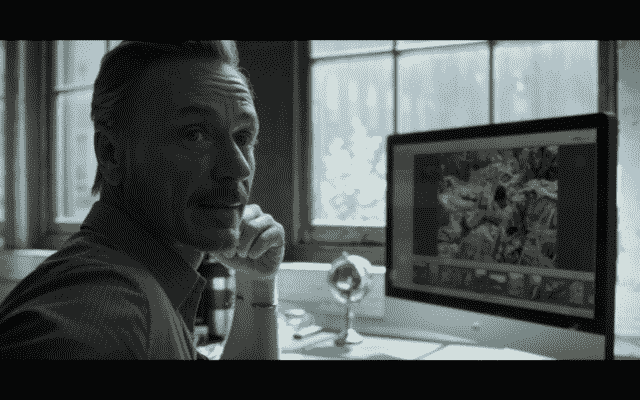](https://web.archive.org/web/20221206163837/https://beta.techcrunch.com/?attachment_id=754824)

这个角色过着广告商喜欢描绘的那种充满抱负的生活方式，拥有一个开放式的纽约阁楼公寓兼工作室，看起来像是直接从杂志上搬来的。他还是那种喜欢找乐子、自由自在的人，只要他想开派对，就能让一屋子迷人的单身朋友聚在一起。这些匿名朋友是你经常在酒类广告中看到的那种有品味的享乐主义者，他们笑着跳着舞——也就是说，从不喝醉，从不吵闹，从不说话。他们不是人物，他们是他渴望的生活方式的门面。

在这个角色的情节中，最不必要的一幕是摄影师和他的爱人之间一次明显自发的晨间散步。这个场景本身就够尴尬的了，因为不可能对一个行走的广告产生任何情感上的依恋，但更糟糕的是，他带着他巨大的 DSLR 佳能相机。

然后，这位女性恋人拿走了他的相机，放大了远处一个坐在长椅上的女人，拍出了一张非常清晰的照片，尽管他完全是个业余摄影爱好者。这一系列是未经稀释的佳能商业广告。但是还有更多。回到公寓后，两人(从佳能照片打印机上)打印出了一幅巨大的照片马赛克的最后一页，照片上是他们在公园里毫无意义地拍摄的女孩——一个与他们的生活毫无关联的女人——并把它放在地板上。看，它在说，看产品。

[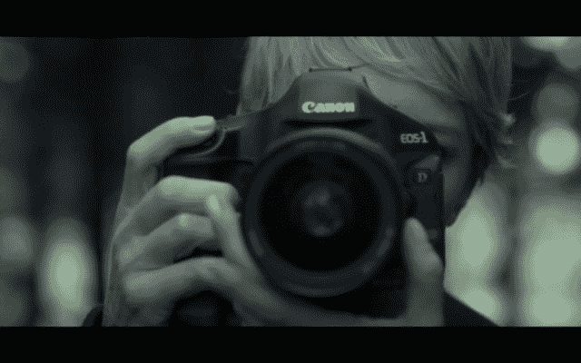](https://web.archive.org/web/20221206163837/https://beta.techcrunch.com/?attachment_id=754643)

[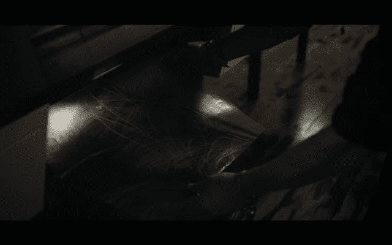](https://web.archive.org/web/20221206163837/https://beta.techcrunch.com/?attachment_id=754645)

[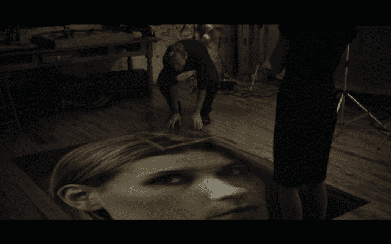](https://web.archive.org/web/20221206163837/https://beta.techcrunch.com/?attachment_id=754649)

总而言之，人们不会那样做。广告可以。这整个序列是如此赤裸裸的商业化，这是对观众智力的侮辱。由于它缺乏任何情感冲击(这些是广告，不是人物，所以我们对他们没有任何感觉)——它的叙事目的也在应该是该剧关键情节点的地方脱轨了。

我们对女性角色一无所知——她是整个情节的核心，并离开了她的丈夫和这个男人在一起——因为我们太忙于被告知佳能的相机有多棒，其照片打印机系列有多棒。

这个序列是一个商业死胡同，产品被允许与明星交换位置，节目的完整性随之下降。

对此只有一个词——而且绝对不是“革命性的”把它拿走，大卫·林奇:

[YouTube http://www.youtube.com/watch?v=F4wh_mc8hRE]