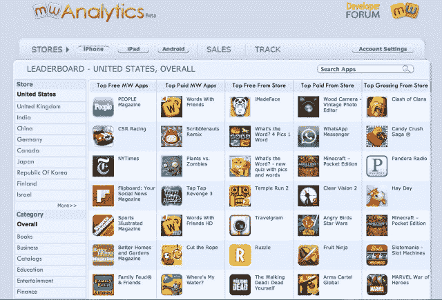

# Mobilewalla 从亚马逊早期投资者 Madrona 等人那里筹集了 400 万美元，将类似 Quantcast 的受众测量引入 Mobile TechCrunch

> 原文：<https://web.archive.org/web/https://techcrunch.com/2013/02/12/mobilewalla-raises-4-million-from-early-amazon-investor-madrona-others-to-bring-quantcast-like-audience-measurement-to-mobile/>

[Mobilewalla](https://web.archive.org/web/20221209003337/http://www.mobilewalla.com/) 、一家[应用搜索和发现网站](https://web.archive.org/web/20221209003337/http://www.mobilewalla.com/)、 [Android 应用](https://web.archive.org/web/20221209003337/https://play.google.com/store/apps/details?id=com.mobilewalla.app#?t=W251bGwsMSwxLDIxMiwiY29tLm1vYmlsZXdhbGxhLmFwcCJd)以及有点隐秘的应用开发者[分析平台](https://web.archive.org/web/20221209003337/http://analytics.mobilewalla.com/)已经在由早期亚马逊投资者[Madrona Venture Group](https://web.archive.org/web/20221209003337/http://www.crunchbase.com/financial-organization/madrona-venture-group)([Scott Jacobson](https://web.archive.org/web/20221209003337/http://www.linkedin.com/in/sxjacobson))牵头的一轮新融资中筹集了 400 万美元。同样参与的还有[印度天使网络](https://web.archive.org/web/20221209003337/http://www.indianangelnetwork.com/) (IAN)的知名人物，包括[文卡特·拉朱](https://web.archive.org/web/20221209003337/http://in.linkedin.com/in/venkatraju)、谷歌印度首席[拉詹·阿纳丹](https://web.archive.org/web/20221209003337/http://www.crunchbase.com/person/rajan-anandan)和前雅虎印度 R & D 首席执行官[沙拉德·夏尔马](https://web.archive.org/web/20221209003337/http://www.crunchbase.com/person/sharad-sharma)。新加坡[资讯通信发展局](https://web.archive.org/web/20221209003337/http://www.ida.gov.sg/)的风险投资部门是新一轮的第三个投资者。

这是该公司自 2011 年成立以来首次获得外部资金。

Mobilewalla 是应用搜索和发现行业的早期参与者，但大约一年前，该公司宣布将进军分析业务。当时，它描述的服务听起来相当普通。例如，根据 [MediaPost](https://web.archive.org/web/20221209003337/http://www.mediapost.com/publications/article/169297/mobilewalla-delivers-analytics-for-mobile-apps.html#axzz2KcdRG9PS) 上一篇关于即将推出的服务的文章，据说该服务将公开可用的排名数据与开发者的私人销售数据相结合，以及像 Twitter 和脸书这样的网站上的社交提及之类的东西。该报告称，这家初创公司已经从苹果应用商店和安卓市场(现为 Google Play)积累了约 50tb 的数据，并且每周增加约 1tb。

但正如你从这笔新资金中可以看出的那样，Mobilewalla 的产品不仅仅是另一个应用分析平台。

Mobilewalla 创始人兼首席执行官[安尼迪亚·达塔](https://web.archive.org/web/20221209003337/http://www.crunchbase.com/person/anindya-datta)解释道，该公司一直在开发新技术，将移动用户组织成不同的人口统计群体。“如果你想想尼尔森为电视做了什么，或者 comScore 为网络做了什么——他们做了观众测量，”达塔说。“我们正在努力寻找衡量手机受众的方法。”

达塔说，对于网络和电视测量，像上面提到的那些公司使用面板——用户的交叉选择，然后他们的行为被投射到更广阔的世界。但这是不可能在移动设备上复制的，因为应用程序的受欢迎程度非常不稳定。为了让你明白他的意思，一个现在很受欢迎的电视节目很可能在 90 天后仍然受欢迎，但如果你从现在开始一周内查看苹果应用商店中排名前 100 的应用，就会有 50%的流失率。

如今，大多数做移动受众测量的公司都在使用自我报告的人口统计数据。在某些情况下，他们通过脸书(通常用于应用程序登录)获取人口统计数据，这使他们能够获得性别、年龄或位置等人口统计数据。然而，Mobilewalla 正在努力建立“类似 Quantcast 的人口统计数据”也就是说，像非常具体、详细的年龄组(例如，小于 12 岁、12-18 岁、19-24 岁等。)、收入等级(低于 25K 美元、25K-35K 美元等。)，还有更多。

【Mobilewalla 如何集群应用

Mobilewalla 估计数据是它的秘密武器，所以达塔谈到了一个非常高的水平。“我们如何筛选这些应用程序是公司的核心知识产权，这很难，”他说——这来自一位拥有 20 多年行业经验的博士、前计算机科学教授。

从广义上讲，这个过程涉及机器学习和大数据。更具体地说，它需要根据用户的相似性将 Mobilewalla 迄今为止索引的近 200 万个应用聚集到非常小的桶中(例如，每个桶大约 100 个应用)。

每个桶都有一个参考应用程序，其人口统计数据是已知的。而且之所以知道，是因为 Mobilewalla 要么与参考应用的公司有关系，要么是因为应用的人口统计数据一般与其公共网站相同。例如，猫途鹰的移动应用程序用户就像猫途鹰的网络用户。分配到每个存储桶的所有应用程序都有相同类型的用户。

然后，使用 Mobilewalla 的 API，该公司的客户可以要求该服务返回具有非常窄的人口统计选择的应用程序，并立即获得结果。达塔说，一些新的实时竞价交易已经在使用 Mobilewalla。

假设 Mobilewalla 的数据准确可靠，它提供的价值主张是独一无二的，并且肯定可以获得高达 400 万美元的资金。

“移动广告仍处于起步阶段，其中一个原因是因为品牌对在移动设备上做品牌广告非常谨慎，”达塔说。“他们不确定受众接触能力是否存在，就像在网络上一样——这就是我们正在解决的问题。”

到目前为止，Mobilewalla 的分析服务一直对访问公司主页的用户隐藏，连续几个月都被列为“即将推出”。但分析服务非常活跃，自 3 月份首次亮相以来，已悄然聚集了超过 3500 家出版商。达塔无权在出版商方面透露其大客户，但在客户端，他可以告诉我们，顶级移动广告网络 [InMobi](https://web.archive.org/web/20221209003337/http://www.inmobi.com/) 是一个值得注意的客户。

这个由 13 人组成的团队以前总部设在亚特兰大，今年 3 月将迁至西雅图，首席运营官[杰伊·克拉克](www.linkedin.com/in/jaydclark)也将加入其中，克拉克曾担任过首席执行官。达塔说，他和克拉克的日常职责没有改变。

有了新的资金，该公司正计划增加工程人员，特别是在产品管理方面，并希望在未来六个月内增加到 30 名员工。它还将能够从二级商店中取出那些旧的万亿字节的数据，并将它们返回到亚马逊网络服务上的活动商店，其中 Mobilewalla 现在有大约 65 万亿字节的应用程序数据。

至于 Madrona 的参与，达塔说他们被选中是因为他们与亚马逊和微软都有联系。“他们了解(移动)生态系统，并拥有合适的人脉，”他表示。他补充说，特别是亚马逊“可能是一个很好的合作伙伴。”