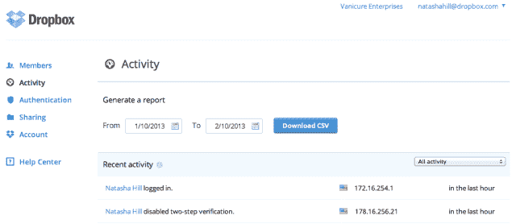
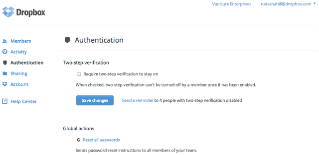

# 面向团队的全新 Dropbox 为 IT 提供了深度控制和可见性，揭示了有关公司下一章的更多信息 TechCrunch

> 原文：<https://web.archive.org/web/https://techcrunch.com/2013/02/12/new-dropbox-for-teams-gives-it-deep-control-and-visibility-reveals-more-about-companys-next-chapter/?utm_source=feedburner&utm_medium=feed&utm_campaign=Feed%3A+Techcrunch+%28TechCrunch%29>

# 面向团队的全新 Dropbox 赋予 IT 深度控制和可见性，揭示了公司的下一个篇章

[Dropbox for Teams](https://web.archive.org/web/20220930235640/https://www.dropbox.com/teams) 拥有一系列新功能，使 IT 部门能够深入了解和控制个人和团体使用该服务的方式。这些新功能表明，Dropbox 正在进入其发展的新篇章，预示着未来其业务的一个重要方面将专注于商业市场。

面向团队的 Dropbox 于 2011 年末推出。去年 8 月，该公司开始提供双因素身份认证，随后在 10 月为 IT 部门提供了更多关于谁在使用身份认证功能的可见性。通过今天提供的新功能集，Dropbox 提供了粒度，例如，让 IT 部门可以查看人们采取的行动、他们正在使用的设备、每个用户的存储使用情况、链接的设备以及个人或小组正在使用的第三方应用程序。

新的用户界面使 IT 管理员能够控制用户和组的活动、身份验证设置、共享和帐户访问。

它可以查看团队活动，如成员登录和团队邀请。新功能还提供了生成可下载报告的能力。

【T2

通过个人用户视图，IT 可以看到个人使用什么设备来访问服务。它还可以删除对单个设备的访问。

Dropbox 进一步加强了认证控制，能够要求双因素认证。它可以重置密码，并在小组周围画出一个周界，这样就不会有数据在公司之外被共享。

##### 超越魔法文件夹

Dropbox 的服务建立在“神奇文件夹”的概念上。它的下一章是关于作为后端的 Dropbox。一个新的同步 API 是这一演变的关键。新的 API 意味着，即使开发者离线并再次上线，应用程序的更新也会同步。这意味着更多的应用将会与 Dropbox 服务挂钩。结合新的 IT 控制，Dropbox 认为该公司将更深入企业。

Dropbox 将其差异化视为终端用户应用的黄金标准。它的挑战将来自下一步该服务的领域。有许多服务提供文件共享。Box、SugarSync 和 Mozy 等等。Box 现在集成了 Jive 等协作产品，VMware 的 Project Octopus 是该公司更大的 VMware Horizon suite 的一部分。

但就目前而言，Dropbox 表明，它的服务可以凭借强大的安全性和更深入的 IT 可见性和控制力在企业中立足。