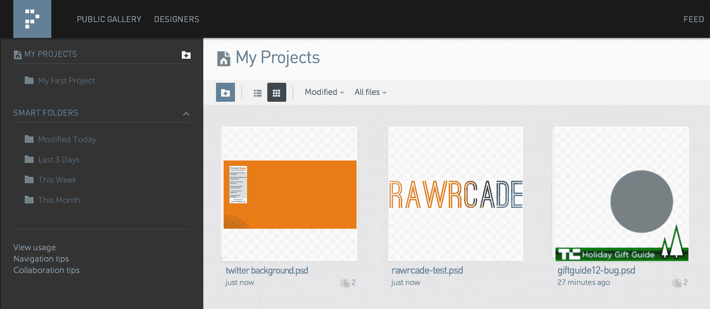

# YC 支持的 Pixelapse 为您的设计项目带来 GitHub 风格的共享和版本控制 TechCrunch

> 原文：<https://web.archive.org/web/https://techcrunch.com/2013/02/13/yc-backed-pixelapse-brings-github-style-sharing-version-control-to-your-design-projects/>

由于 GitHub 等的存在，共享和跟踪代码对于程序员来说相对简单，但开发者并不是唯一能从这类服务中受益的人。设计师们也可以用更聪明的方式来管理他们的项目，而这正是总部位于旧金山的 [Pixelapse](https://web.archive.org/web/20221208023150/https://www.pixelapse.com/) 想要填补的空白。

当联合创始人闵·罗明在谷歌担任 UX 设计实习生时，这个问题首次暴露出来——事实证明，在那里记录设计和模型的过程并不美好。

“他们真的没有一个过程来控制他们工作的版本，”联合创始人兼首席执行官 Shravan Reddy 说。“每个人都把他们的文件放在一个巨大的文件夹里。很难区分谁的资产是谁的。提供反馈是一件痛苦的事——有点乱。”雷迪在自己的工作中经历了一些类似的设计难题，不久之后，Pixelapse 在斯坦福大学和 Y Combinator 的 [StartX](https://web.archive.org/web/20221208023150/https://beta.techcrunch.com/2013/02/07/startx-class-eight/) 公司从空想变成了演示。

Reddy 说，该团队在内部将 Pixelapse 称为设计师的 GitHub，但在使用它一段时间后，很难不将 Dropbox 包括在内。

一旦安装了 Pixelapse 配套应用程序，它会创建一个 Pixelapse 文件夹，用户可以在其中保存他们正在进行的工作(如果用户已经有了一个用于这种事情的文件夹，他们可以指示应用程序来监控它)。之后，Pixelapse 安静地坐在后台，等待问题艺术家决定进入正题。每当它检测到预设文件夹中的文件发生更改时，它会将其备份到 Pixelapse 用户分配的服务器空间。

到目前为止，这一切听起来都很平凡(尽管 Reddy 指出“同步是一个巨大的问题”，但一旦这些文件被保存到 Pixelapse 服务器并被查看，真正的奇迹就会发生。从那里，用户可以登录并查看对他们存储的文件所做的所有修改的可视化时间线，并根据需要下载这些修改。简而言之，这太棒了。它让那些设计者可以即时访问他们的文件版本，而这些版本对于他们来说可能已经不存在了，但它也可以突出那些项目中的思想。

保持一个人正在进行的工作的运行记录的能力已经足够好了，但 Reddy 对 Pixelapse 的愿景不仅仅是迎合寻找跟踪项目方法的个人设计师。该团队的目标是让 Pixelapse 成为同事、设计公司和内部设计部门的必备工具，因此他们还为受邀合作者提供了对正在进行的工作发表评论以及可视化注释图像的功能。

与同事分享是一回事，但 Reddy 和团队的其他成员还希望将 Pixelapse 平台用于学习，而不仅仅是满足客户需求。为此，他们还建立了一个[公共画廊](https://web.archive.org/web/20221208023150/https://www.pixelapse.com/gallery)，鼓励人们与志同道合的设计师社区分享他们的艺术(以及导致艺术的修改)。

“当与公众分享时，这些修改显示了一件作品的成长，”雷迪说。与此同时，该团队正在为公共网站提出一系列想法，比如将现有的设计分叉出来，并将其合并到主项目中。

看起来 Pixelapse 可能一次尝试了太多事情，但早期的 traction 对其努力进行了非常积极的描述。迄今为止，已经有超过 50 万的图片修改被托管在 pix elasses 上，虽然 Reddy 没有给我一个确切的用户数量，但他确实指出，自从 pix elasses 首次推出其私人测试版以来，它的用户群已经增长到了数千人。然而，绝大多数人实际上并没有为这项服务付费。相反，他们正在用免费帐户附带的 1GB 免费空间来凑合。公平地说，Pixelapse 刚刚推出了新的分层定价计划，但现在的大问题是这些非付费用户是否会转变为真正的客户。尽管如此，Pixelapse 仍处于早期阶段，我想很多设计师会找到坚持使用这项服务的理由。