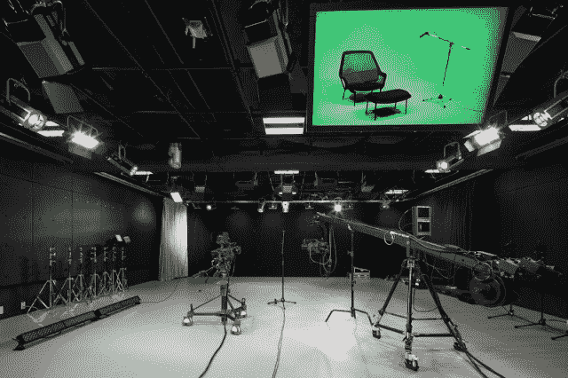

# YouTube 在东京开设制作空间，帮助创作者制作更好的视频 TechCrunch

> 原文：<https://web.archive.org/web/https://techcrunch.com/2013/02/13/youtube-creator-space-tokyo/>

在过去几年中，YouTube 一直在大幅增加向在其平台上上传视频的创意社区提供的资源。从收购 TK 的 Next New Networks 开始，该公司一直在投资为其众多创作者提供工具、设备、资金和指导，以帮助他们提高内容质量。

最近，这包括在 2012 年奥运会之前在伦敦和去年秋天在洛杉矶开设生产设施。这些空间旨在吸引欧洲和北美的创作者。现在，亚洲，特别是日本，正在拥有自己的创作者空间，在东京六本木山的生产设施启动。

像其他 YouTube 空间一样，东京的设施将开放给选择 [YouTube 合作伙伴](https://web.archive.org/web/20221007140346/http://youtube.com/partners)的人，他们将能够免费使用它来启动雄心勃勃的新项目，获得先进的设备，或者只是在与其他创作者合作的同时磨练他们的技能。

【T2

通常，创作者通过在[youtube.com/space](https://web.archive.org/web/20221007140346/http://www.youtube.com/space)申请获得空间。YouTube 将于 4 月 1 日开始接受申请，并将在春季晚些时候为那些将参与的人做出选择。

被接受的人有三个月的时间使用制作设施，包括进入摄影棚，以及使用高质量的摄像机、灯光、制作和编辑设备。这个空间有三个制作工作室、设备室、放映室和后期制作设施，包括编辑间和福利室。

除了为 YouTube 创作者上传的点播内容提供支持，该空间还将放映他们的内容，并将举办现场活动。这包括直播音乐会议和谷歌视频聊天，包括日本歌手 Juju 本周晚些时候在 2 月 15 日举办的一场音乐会。

虽然 YouTube 继续通过在洛杉矶和东京等地推出制作空间以及其他举措，为独立创作者提供指导和资金，但它并不孤单。Machinima、Maker Studios 和其他一些多渠道网络已经出现，为寻求增加受众的创作者提供营销和制作支持。