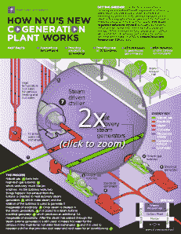
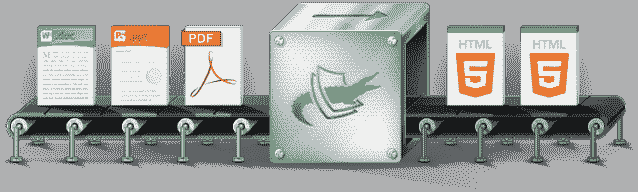

# Crocodoc 预览其改进的 HTML5 文档转换器，适用于 PDF、Word 和 PowerPoint 文件

> 原文：<https://web.archive.org/web/https://techcrunch.com/2013/02/14/crocodoc-pdf-word-and-powerpoint-documents-html5-converter/>

# Crocodoc 预览其改进的 HTML5 文档转换器，适用于 PDF、Word 和 PowerPoint 文件

[croco docc](https://web.archive.org/web/20221124021543/http://preview.crocodoc.com/)允许您上传您的 pdf、Word 和 PowerPoint 文档，并将其转换为 HTML5，以便您可以轻松地将它们嵌入到您自己的网站上。自 2010 年推出以来，该公司已转换了 6000 多万份文档，并与 Dropbox、领英、Yammer 和 SAP 等公司签约成为客户。该公司刚刚宣布推出新的 HTML5 文档转换器，其转换引擎经过改进，显示质量更好，加载速度更快，移动性能更好。

使用 HTML5 和[可伸缩矢量图形](https://web.archive.org/web/20221124021543/http://en.wikipedia.org/wiki/Scalable_Vector_Graphics) (SVG)，更新后的 Crocodoc 转换器采用了一种与服务上一次化身截然不同的方式。正如 Crocodoc 的联合创始人兼首席执行官瑞安·达米科(Ryan Damico)昨天在一封电子邮件中告诉我的那样，最后一个版本将除文本之外的所有内容都显示为一个大图像。使用 HTML 网络字体将文本覆盖在图像的顶部。现在，Crocodoc 将文档中的所有内容显示为 HTML5 和 SVG，而不是上一个版本中使用的光栅图形。这将使转换后的文档中的线条和形状更清晰，在视网膜显示器上尤其明显。

点击图片观看演示。

文档加载速度也将大大加快，因为浏览器不必加载大图像来显示。“在我们的新浏览器中，文档每页的平均下载大小与同一页的小缩略图大致相同，”达米科写道。

这也意味着移动体验现在有所改善。事实上，当我在苹果手机和 Safari 上测试新的文档查看器时，速度接近我对本地应用程序的预期。Damico 还表示，“捏来捏去地缩放、滚动和文本选择工作起来非常顺畅，感觉就像一个本地应用程序。”他还认为，与 iOS 上的内置文档查看器相比，Crocodoc 在显示复杂文档方面做得更好。

有了这个更新，开发人员也可以更好地控制文档在网站上的呈现方式。开发人员现在可以直接访问该服务生成的 HTML，并且可以根据自己的需要对其进行操作，而不仅仅是一个 iFrame。

