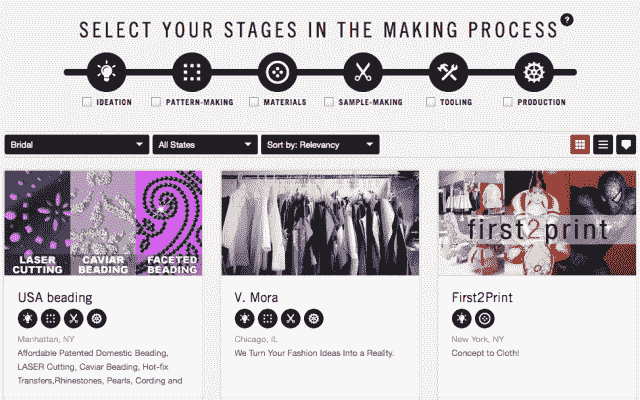

# Maker's Row 成为时装设计师和国内制造商之间的媒人 TechCrunch

> 原文：<https://web.archive.org/web/https://techcrunch.com/2013/02/20/makers-row-grows-as-a-matchmaker-between-fashion-designers-domestic-manufacturers/>

# Maker's Row 成为时装设计师和国内制造商之间的媒人

艾米丽·戈里戈斯基撰稿人

More posts by this contributor

长期以来，国际制造业的壁垒和高昂的燃料成本让小企业在海外生产痛苦不堪。现在，美国制造业的经济趋势为[制造商之路](https://web.archive.org/web/20221012211131/http://makersrow.com/)创造了一个及时的市场入口。这家初创公司是上周 [Women 2.0 Pitch 竞赛](https://web.archive.org/web/20221012211131/http://www.women2.com/pitch-sf-conference-2013-agenda/)的决赛入围者，它表示希望成为创造任何东西的首选资源。

联合创始人马修·伯内特和坦尼娅·梅嫩德斯在 11 月推出了 Maker's Row，作为一种类似于 Match.com 和 Kiva.org 的工厂和设施简介。该网站允许知名设计师和业余爱好者与制造商合作，这些制造商可以在网站上按州搜索，以创造一系列产品，从手袋到运动服。它向制造商收取订阅费。

伯内特说，通过委托在美国本土生产，品牌可以更密切地指导流程，防止订单在国外或海关的运输过程中受阻。工厂正在利用这个平台互相交流，寻找材料，这种互动甚至让联合创始人都感到惊讶。

Maker's Row 看到了一个获得中小型企业订单的好机会，这些企业是“认真制作东西的人”，迄今为止已经筹集了 7.5 万美元。它希望筹集 125 万美元来雇佣后端开发人员，并开发更多跟踪连接的工具。

伯内特说，当他还是马克·雅可布和 Izod 等品牌的手表设计师时，文化和语言障碍使他与海外制造商的合作变得复杂。伯内特说:“每次和新的制造商合作，我都觉得自己是在赌博。”。然后，他开始了自己的国产配饰系列，布鲁克林面包店。那时他遇到了梅嫩德斯，当她不在高盛从事自动化项目的时候，她开始和他一起开发这个品牌。

 梅嫩德斯试图取代传统工艺的经验，加上两人在寻找强大的生产合作伙伴时面临的困难，这两个因素结合在一起，产生了“制造商之路”的想法。Scott Weiner 作为技术负责人帮助启动了该公司，使采购变得更容易的概念使其三位联合创始人参加了[Brooklyn Beta summer incubator program](https://web.archive.org/web/20221012211131/https://brooklynbeta.org/summer-camp)来开发他们产品的第一个版本。

阿里巴巴在中国做着类似的工作，但将设计师与国内资源联系起来似乎是创客街拥有的一个空间。这家位于 DUMBO 的公司在视觉上打破了实物产品生产的各个步骤，包括构思、制模和加工。对于制造商来说，这带来了合格线索的希望(理解为:想要制造东西并实际知道自己需要什么的人)。

到目前为止，Maker's Row 的输出是多少？一款“黑客马拉松连帽衫”即将从 Subrational 服装公司推出，该公司由一对企业家朋友创办，他们正在委托旧金山的一家制造商工作(可能会推出第一款面向周末黑客观众的“修身性能”装备)。茉莉亚伦的 [VOZ 服装和配饰](https://web.archive.org/web/20221012211131/http://madebyvoz.com/mainENG.html)已经将生产从智利转移到纽约，这要感谢通过网站建立的联系。而 [Kickstarter 为黑色&牛仔布](https://web.archive.org/web/20221012211131/http://www.kickstarter.com/projects/2146408518/black-and-denim-american-made-jeans-and-apparel-fr?ref=live)发起的活动可能会帮助这家初创公司与制造商的供应商和承包商一起开始生产，他们的目标是帮助重振美国纺织制造业。

Maker's Row 将借助设计师之间的口碑推荐，希望在未来 12 个月内建立 75 万个新连接。帕森斯设计新学院最近未经请求就在推特上发布消息称，该校学生应该把他们的作品上传到网站上。此后，该公司开始与设计学校合作，这些学校的教师和学生希望将他们的概念开发成专业制作的产品。加州艺术学院视觉艺术学院和罗德岛设计学院都是它目前的合作伙伴。

伯内特说:“当我去设计学校(在普拉特学习工业设计，现在是合伙人)时，我离开了被别人雇佣，而不是自己。"我们想帮助学生提出他们自己的想法。"