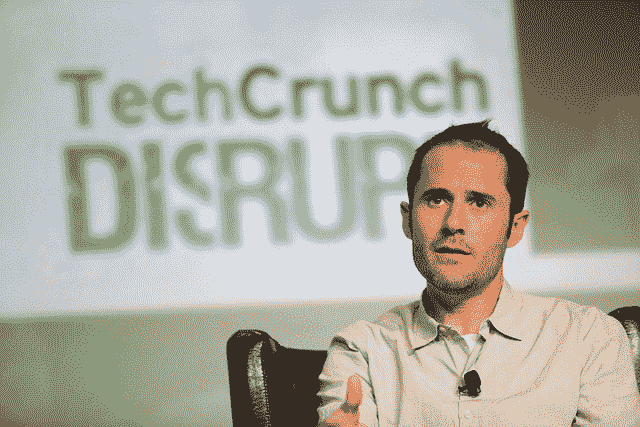

# Ev 出售创业公司的 3 个理由:优势、威胁和选择。Twitter 没有获得 TechCrunch 的资格

> 原文：<https://web.archive.org/web/https://techcrunch.com/2013/02/21/why-sell-your-startup/>

# Ev 出售创业公司的 3 个理由:优势、威胁和选择。Twitter 没有资格

你是放弃还是坚持己见？Twitter 的联合创始人 Ev Williams 说，只有当出价抓住了有利的一面，有迫在眉睫的威胁，或者你个人想卖掉你的公司时，你才应该卖掉你的公司。威廉姆斯说，“它们中的任何一个都足够了”，但是 Twitter 没有。

在 [Medium post](https://web.archive.org/web/20230130100924/https://medium.com/on-startups/6a25c0cbd358) 中，Williams 讨论了在 2008 年，一家科技巨头是如何对收购 Twitter 感兴趣的。他没有透露是谁，但大约在那个时候，[《财富》](https://web.archive.org/web/20230130100924/http://tech.fortune.cnn.com/2011/04/14/troubletwitter/)和其他人报道 Twitter 正在与微软、脸书和谷歌谈判。在给 Twitter 投资者的一封电子邮件中，威廉姆斯解释了公司应该出售的三个理由，以及 Twitter 不必出售的原因。

卖出的第一个也是最明显的原因是，如果要约的财务状况抓住了你公司潜力的有利方面。如果出价大大超过了你公司的最终价值，那就卖出。这种计算需要密切关注你的市场。这是一个宏大的、改变世界的空间吗？在这里，成功可以为你带来财富？或者这是一个离散的机会，即使你打了一个全垒打并彻底获胜，你的价值也是有限的。想想谷歌和照片分享应用。Ev 认为 Twitter 的短格式通信具有巨大的潜力，因此收购报价不够高。

第二，贵公司是否面临**迫在眉睫的威胁**？可能会让你的业务脱轨、妨碍整个空间或者给你的竞争对手一个机会的东西？那么，如果你试图自己战胜这种威胁却失败了，出卖可能会让你得到一笔可能永远也不会实现的收入。Ev 列举了 YouTube 围绕版权的法律问题和 PayPal 的欺诈问题，作为它们分别出售给谷歌和易贝以获得帮助来抵御这些风险的明智之举。在 Twitter 的案例中，威胁来自失败的鲸鱼。它一直存在可扩展性问题，导致网站崩溃，给 Twitter 带来了不可靠的名声。但是当提议通过时，Ev 认为 Twitter 已经钓到了失败的鲸鱼。

最后，如果创始人真的想卖，公司应该卖掉**。有时候，他们想转向一个新的想法，或者对当前的想法失去了热情。其他时候，创始人将收购公司视为合适的家园，可以将他们的业务带到新的高度，或者他们希望去那里工作并学习更多。Ev 很高兴成为 Twitter 的新首席执行官，并认为收购者不适合他的团队。**

看来威廉姆斯赌对了。现在，Twitter 正在向 IPO 迈进。收入预计将继续同比翻番，而且它有一个[新的广告 API](https://web.archive.org/web/20230130100924/https://techcrunch.com/2013/02/20/twitter-ads-api/) 可以促进销售。Twitter 的用户基础恶名显著增长，因为它是一个基本上未网络化的社交网络，只有 50 名员工，“用户可能不到 1000 万。”

话又说回来，Ev 已经把 Blogger 卖给了谷歌，赚到了自己的养老金。当你在银行里已经有了几百万美元时，下一个亿就没那么诱人了。