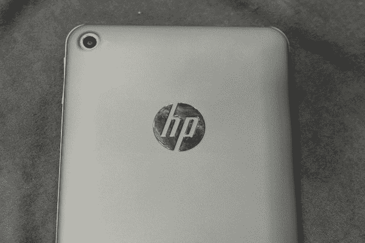

# 售价 169 美元的安卓惠普 Slate 7 只是惠普最新的米色盒子，只有平板 TechCrunch

> 原文：<https://web.archive.org/web/https://techcrunch.com/2013/02/25/the-169-android-hp-slate-7-is-just-hps-latest-beige-box-only-flat/>

惠普在平板电脑领域起步较晚，但绝对没有出局。惠普 Slate 7 售价 169 美元，稳操胜券。即使惠普的销量没有超过竞争对手，它也一定会赢。

惠普[刚刚宣布](https://web.archive.org/web/20221207224920/https://beta.techcrunch.com/2013/02/24/hps-android-powered-slate-7-tablet-is-cheap-and-it-works-but-is-that-really-enough/)Slate 7。没有什么特别的地方。它售价 169 美元，拥有双核 1.6GHz SoC，16×9 显示屏，塑料边框相当厚。简而言之，这是一款廉价的平板电脑。去掉背面的惠普标志，它只是一个随机的普通平板电脑。这很好。

在这一点上，惠普作为一个成熟和值得信赖的品牌，不需要创新；他们只需要出现。

尽管最近麻烦不断，惠普仍然是这个星球上最大的个人电脑制造商。在落后戴尔四年之后，该公司自 2006 年以来一直保持这一头衔。联想可能很快会从惠普手中夺走这一头衔，但这不会削弱惠普仍然有价值的品牌。对于大多数消费者来说，购买惠普产品是安全的，并将继续如此。

说每个人都有过惠普电脑的问题并不夸张。作为过去 15 年来销量最高的电脑制造商，它花了很长时间来打消消费者的幻想。每个人都有一个惠普恐怖故事。但尽管如此，该品牌仍比其他任何品牌销售更多的个人电脑。很多人仍在购买惠普电脑。

### 对于普通沃尔玛购物者来说，华硕是谁？

作为一个知名品牌，消费者知道他们将从惠普产品中获得什么。他们知道他们将得到广告软件，低于标准的硬件，但价格合理。他们将从华硕平板电脑中获得什么？对于普通沃尔玛购物者来说，华硕是谁？一个未知数。

我们都知道这个故事。在几年几乎没有行政领导之后，[惠普正在消费者市场苦苦挣扎。个人电脑销量下降。惠普没有移动产品。人们购买的打印机越来越少。而且，就像美国在线的拨号订阅一样，惠普很大一部分收入来自打印机墨水。](https://web.archive.org/web/20221207224920/https://beta.techcrunch.com/2013/02/21/hp-q1-2013-earnings/)

更糟糕的是，惠普的企业硬件和服务业务[也下滑了](https://web.archive.org/web/20221207224920/https://beta.techcrunch.com/2013/02/21/hp-q1-2013-earnings/)。尽管如此，尽管出现了这些下滑，惠普上个季度还是成功超出了华尔街的预期。

简而言之，惠普机器正在减速，但即使是减速的惠普也是一个强有力的竞争者。

惠普无处不在。从沃尔玛到百思买，到人类所知的每一家办公用品商店，惠普电脑无处不在。惠普成为最大的电脑制造商，不是因为他们制造了最好的电脑，而是因为物流。

得益于这个庞大的分销网络，惠普可以不费吹灰之力就在一大堆人面前拿到一台 169 美元的安卓平板。然后，一旦这款平板电脑进入市场，惠普可能会遵循其成熟的笔记本电脑战略，发布一款屏幕更好、规格更高、价格略高的升级版。这种型号，或者可能是系列型号，将提供从 Slate 7 的简单追加销售。想要更好的屏幕？多花 30 美元，也能得到更快的处理器。

惠普 Slate 7 是惠普的强项。这是惠普移动设备，而不是创造下一个大东西。

平板电脑正迅速成为一种商品，销售米色盒子是惠普最擅长的。在这一点上，经济型平板电脑就是经济型平板电脑。我们自己的 Chris Velazco 玩了几分钟惠普的模型，发现它没什么意思。是啊。这是一款 169 美元的平板电脑。不会给人留下深刻印象，但也没必要。

惠普袖手旁观，看着亚马逊和谷歌的昂贵竞争，创造了这个廉价平板电脑市场。惠普从来都不是优质产品；它知道如何销售装有赞助软件的大量钻孔机来降低成本。惠普第一次尝试消费平板电脑失败了，仅仅是因为它试图与众不同。那不是一个米色的盒子。惠普 Slate 7 应该不会失败。

