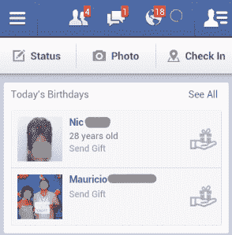
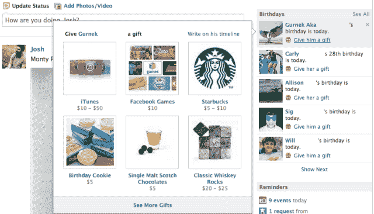

# 脸书礼品销售和收入起步缓慢 TechCrunch

> 原文：<https://web.archive.org/web/https://techcrunch.com/2013/02/28/how-many-gifts-has-facebook-sold/>

十亿美元的生意？也许不是。尽管分析师、记者和我本人都对脸书的礼品做出了很高的预测，但一份新的报告从该公司的公开声明中挑出一些内容，表明该公司在 2012 年第四季度最多售出 66.7 万件礼品，或许还会少很多。当然，现在还为时过早，但脸书可能需要一段时间才能将礼物变成游戏规则的改变者。

**更正**:本文的原始版本是基于 Aggregift 的一份不正确的第三方报告。它表明，脸书在 2012 年第四季度获得了最多 100 万美元的收入，并出售了 26.7 万份礼物，这要追溯到脸书在 2012 年第四季度通过页面推广帖子和礼物获得了 500 万美元的收入。事实上，在财报电话会议上宣布的 500 万美元来自礼品和更为新生的用户推广产品，关于这一点的销售数据较少，这妨碍了报告中显示的分析类型。脸书有机会质疑原始报告，但拒绝发表评论，尽管方法有缺陷。为了提高准确性，这篇文章经过了大量编辑。

脸书在 9 月份推出了让朋友们[互相购买现实世界礼物的功能](https://web.archive.org/web/20221005181936/https://beta.techcrunch.com/2012/09/27/facebook-gifts/)，尽管直到 12 月份才面向所有美国用户推出。这意味着它肯定没有获得整个第四季度的电子商务现金。尽管如此，现在是圣诞节，脸书在生日侧边栏和[移动提要](https://web.archive.org/web/20221005181936/https://beta.techcrunch.com/2012/10/10/facebook-mobile-birthdays/)顶部兜售礼物，外加一个购买最后一分钟节日礼物的大电话。

社交网络对礼物的表现守口如瓶，并试图平息对它的炒作。在第四季度收益电话会议上，首席执行官马克·扎克伯格说:

> “我确实想稍微降低对来自礼品或图形搜索等其他领域的收入的近期预期……支付和其他收入也包括来自游戏以外的大约 500 万美元，主要是用户推广的帖子，以及在较小程度上来自我们的新礼品产品。虽然我们仍然对脸书的长期商业潜力感到兴奋，但目前来自用户推广帖子和礼物的收入非常少，考虑到目前的运营速度，我们预计 2013 年来自这些活动的贡献将仍然非常少。”

脸书表示，2012 年第四季度，它从非游戏支付、特别是推广帖子中获得了 500 万美元的收入，“在较小程度上，来自我们的新礼品产品。”这可以被解释为礼品相当于该季度最高 250 万美元的收入。

11 月底，脸书称购买礼物的平均花费是 25 美元。虽然脸书没有披露其收入削减，但这项研究将 15%作为一个大概的数字。当你处理这些数字时，你会发现脸书最多可以卖出 667，000 份每份 25 美元的礼物。

最大的统计数据是，在第四季度，脸书的美国用户中最多只有 0.4%购买了礼物。像我现在听起来过分热情的[10 亿美元](https://web.archive.org/web/20221005181936/https://beta.techcrunch.com/2012/12/11/facebook-gift-revenue/)的年度礼物收入的估计是基于脸书平均每个用户每年销售一份礼物。脸书必须找到一种方法，让礼物变得更加主流，如果这是对其底线的实质性贡献的话。

有些令人失望的统计数据证实了马克·扎克伯格的说法，并可能进一步粉碎礼物成为社交网络有意义的赚钱工具的希望。他们还解释了为什么它一直在注入新的购买信息和折扣来吸引新的买家。

上周《脸书内幕》报道称，脸书似乎正在浏览状态更新，寻找关于新工作、怀孕和孩子出生的词汇，并鼓励作者的朋友给他们买礼物。昨天， [CNET](https://web.archive.org/web/20221005181936/http://news.cnet.com/8301-1023_3-57571713-93/facebook-already-marking-down-prices-on-gifts/) 报道称，脸书为一些用户购买价值 5 美元或以上的礼品提供高达 4 美元的折扣。与此同时，它推出了[脸书礼品卡](https://web.archive.org/web/20221005181936/https://beta.techcrunch.com/2013/01/31/facebook-unveils-the-facebook-card-a-reusable-gift-card-that-holds-multiple-balances-from-different-stores/)，这是一张可以在实体商店如橄榄园和塔吉特百货[充值的塑料卡片。](https://web.archive.org/web/20221005181936/https://beta.techcrunch.com/2013/02/24/facebook-gift-card/)

随着时间的推移，随着脸书对商业的了解越来越多，礼物可能会成为社交网络中更自然、更常用的一部分。但现在，如此努力地让人们送礼物，而不是说生日快乐或祝贺新工作，感觉有点谄媚。如果它不能在礼物上赚到数亿美元，它可能不值得把金钱放在朋友之前。