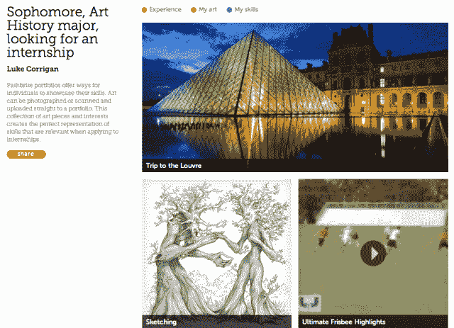

# 在与 Pearson & McGraw Hill 达成交易后，Pathbrite 追加 400 万美元，将数字投资组合扩展到校园之外 TechCrunch

> 原文：<https://web.archive.org/web/https://techcrunch.com/2013/03/04/after-deals-with-pearson-mcgraw-hill-pathbrite-adds-4m-to-take-digital-portfolios-beyond-the-campus/>

去年 6 月，在线投资组合初创公司 Pathbrite 宣布，它已经在由 Rethink Education 牵头的首轮融资中筹集了 250 万美元，同时还获得了大学和职业准备评估公司 ACT 的战略投资。

现在，这些投资者准备加倍押注这家初创公司的下一代在线投资组合管理方法，因为 [Pathbrite](https://web.archive.org/web/20221208033703/https://pathbrite.com/) 今天宣布，它已经在 A2 轮融资中筹集了 400 万美元——这是它在 6 月份完成的第二轮融资的第二部分。这一次，ACT 选择领投，并得到了 ReThink、Serious Change 的约书亚梅尔曼(Joshua Mailman)和一些天使投资人的支持。

有了新的资本，这家初创公司迄今为止已经从投资者那里筹集了总计超过 800 万美元的资金，其中包括上述投资者，以及 Ben and Jerry 的 Ben Cohen 和 Zynga 的联合创始人 Steve Schoettler。Pathbrite 计划使用其额外的资金继续其产品开发，并专注于扩大其在高等教育以及 K-12 及更大范围内的覆盖面(和客户获取策略)。

随着大学和求职者之间竞争的加剧，学生和毕业生都在寻找新的、更好的方法来脱颖而出。随着在线教育越来越受欢迎，学历证书本身(以及它们所代表的价值)正在发生变化。传统上，简历和文凭在机构和雇主中占有最大的份额，但今天，拥有文凭和 LinkedIn 档案的人不再是少数。

在竞争激烈的职场中找到工作的关键是，能够向未来的雇主展示你的独特之处，无论是你学到的技能、完成的项目，还是让你登上黑客新闻的黑客技术。但是，再一次，一张纸上的一行字或你 LinkedIn 个人资料上的一个简介似乎不再是展示你的技能和成就以及传达你的独特之处的最有效方式。

这就是为什么我们开始见证数字作品集的崛起，正如它听起来的那样，这是一个在线收集你的个人、学术和专业项目和荣誉的地方——一个展示你的写作、演示、黑客、证书、文凭以及所有这些的地方。对于工程师和开发者来说，最受欢迎的例子之一就是 [GitHub](https://web.archive.org/web/20221208033703/https://github.com/) 。在一个日益数字化的世界里，在线作品集可以提供展示你才能的最佳机会，代表着个人主页和名片的 [About.me](https://web.archive.org/web/20221208033703/https://about.me/) 品牌的演变。

Pathbrite 于去年夏天公开推出，旨在成为创建数字投资组合的首选目的地，为任何人提供使用其简单模板创建更强大的个人和专业成就在线记录的机会。从一开始，Pathbrite 就明确迎合大学和高中学生，但是，随着时间的推移，它的范围已经扩大，今天它的作品集制作工具可以被任何希望建立三维数字简历的人使用。

该平台允许用户包含来自各种媒体的内容，无论是来自 YouTube、Google Drive、LinkedIn、Khan Academy 徽章或 Coursera 证书的内容，都使他们能够快速添加和/或导入来自硬盘或网络的内容。一旦添加，用户可以包括对您的投资组合中每个特定元素的描述，等等，目标是实现一个比现有平台提供的更深入、更具描述性的数字标识。

据《T1》杂志报道，今年 1 月，Pathbrite 在其平台上增加了“教育工作者作品集”，这是一个基本上允许教师帮助他们的学生创建数字作品集(并创建作品集以组织学生工作进行复习)的工具。

这项新服务允许教师在 Pathbrite 的平台上创建一门课程，选择如何支付作品集——是让学生支付创业公司的年费，还是使用学校购买的许可证——然后输入课程信息、课程名称和主题，并邀请其他教师和学生直接加入。然后，学生可以将该文件夹存储在他们现有的作品旁边，并导入和添加内容，就像他们自己的个人文件夹一样。

据《T3》杂志报道，作为向教师推出这一新选项的一部分，Pathbrite 宣布与培生达成协议，将这家初创公司的作品集平台整合到其基于云的在线课程 LMS 中，名为 LearningStudio，[。首席执行官希瑟·希尔斯(Heather Hiles)和他的公司一直在努力确保与其他机构和教育公司的合作伙伴关系，这将使这家初创公司增加其足迹，扩大分销并创造货币化机会，例如，它与麦格劳-希尔斯坦福大学注册商 ACT 的战略合作伙伴关系。](https://web.archive.org/web/20221208033703/http://thejournal.com/articles/2013/01/15/pathbrite-offers-digital-portfolio-gets-embedded-into-pearson-lms.aspx)

目前，Pathbrite 的平台对教师和教职员工是免费的，而学生每年需要支付 10 美元。展望未来，这家初创公司希望确保学生和教师可以从任何设备和平台(移动或桌面)管理他们的作品集。虽然它已经通过云端存储和基于网络的访问在一定程度上实现了这一点，但这家初创公司将在不久的将来发布自己的原生移动应用程序，并增加到 100 所学院和大学的基础上。

更多信息，请点击这里，找到 [Pathbrite。](https://web.archive.org/web/20221208033703/https://pathbrite.com/)

