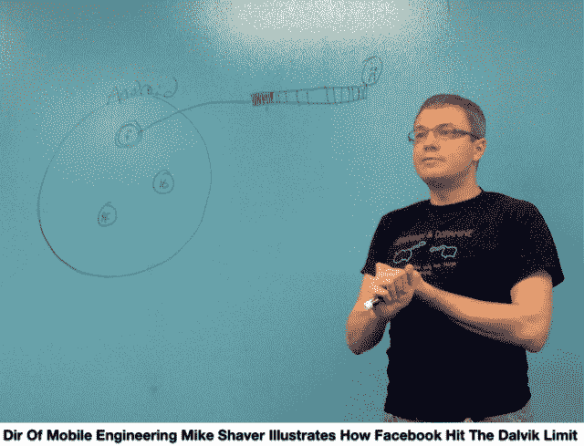

# 脸书和谷歌暂时冰释前嫌，解决姜饼科技博客 TechCrunch 的一个核心问题

> 原文：<https://web.archive.org/web/https://techcrunch.com/2013/03/04/facebook-google-dalvik/>

当脸书在 Android 的虚拟机 Dalvik 中遇到一个限制，这将停止其应用程序开发时，谷歌和脸书合作为姜饼创建了一个补丁。“我们对他们来说是一个重要的应用程序，他们对我们来说也是一个重要的平台，”脸书移动工程师总监迈克·谢弗解释道。这是脸书核心移动工程培训取得成果的又一个例子。

今天，在门洛帕克脸书总部的 Android“白板会议”上，Shaver 向一群记者讲述了 Dalvik fix，脸书与谷歌的关系，以及它如何不仅将软件工程师，而且将项目经理，设计师，甚至客户支持人员转变为移动开发者。

转折点发生在脸书聘请移动培训机构[大书呆子牧场](https://web.archive.org/web/20221206091539/http://www.bignerdranch.com/index)为员工提供 40 小时的 iOS 和 Android 开发速成课程。谢弗说“一天八小时，一周五天。如果你有客人来，他们会被打发走。扎克可以留言。这就是你要做的。人们出来时头脑有点混乱，但他们可以在那个星期一编写生产代码。”大书呆子牧场是在苹果教授 iOS 开发和在谷歌教授 Android 开发的同一支队伍。自 7 月以来，脸书已经通过该项目培训了 450 名手机工程师。

最近，在 Android 姜饼中发现了一个巨大的绊脚石，它运行在大约一半运行 Android 的手机上，这在世界上大约一半的手机上运行。Android 的虚拟机 Dalvik 实际上运行你安装的应用程序，它有 300 万个方法限制。脸书已经达到了这个极限，这意味着它不能在其原生 Android 应用程序中添加更多功能。

Shaver 列出了脸书的三个选择:停止开发其 Android 应用程序，停止为姜饼用户提供其 Android 应用程序，或者修复 Dalvik。幸运的是，“我们可以看看引擎盖下面，看看为什么我们会达到这个极限。在移动操作系统中能够做到这一点并不常见，”Shaver 说，补充了 Android 的开放性。

因此，一群脸书移动工程师花了几周时间分析这个问题，并提出了一个只有大约 6 行代码的补丁。Shaver 高兴地承认，“我们能够将补丁发送到谷歌，以获得他们的意见。他们非常有帮助。”谷歌看了这个补丁一天，然后给了脸书放行的机会。然后脸书开始测试。Shaver 表示，社交网络能够与谷歌合作，使用他们的测试实验室。

“我们从 Defcon 1 和塞壬，我们无法再为半个 Android 世界开发脸书，到人们熬夜修复它，到能够扩展平台并与谷歌合作。”如果没有这个补丁，脸书说它将不得不考虑去掉一些功能，比如从脸书给 Android 发短信的功能。今天晚些时候，脸书将发布一个工程博客帖子，详细介绍该补丁，以便其他开发人员可以使用它，避免浪费数周时间来对抗姜饼 Dalvik 限制。

白板会议总体上传达了一个想法，即在成为 iOS 第一的公司这么久之后，脸书正在认真利用 Android 的影响力来推动其连接世界的使命。虽然它的许多员工可能仍然更喜欢 iPhones，但 Android 的低成本和可用性使其成为脸书赖以增长的新兴国际市场的最爱。让开发者准备好构建 Android，以及有谷歌的支持，意味着它可以将社交融入开放操作系统的 DNA。