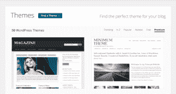

# WordPress.com 推出具有自定义域名、无限存储和支持的企业账户，每个网站每年 299 美元 TechCrunch

> 原文：<https://web.archive.org/web/https://techcrunch.com/2013/03/05/wordpress-com-launches-business-accounts-with-custom-domains-unlimited-storage-support-for-299-per-site-per-year/>

# WordPress.com 推出定制域名、无限存储和支持的商业账户，每个网站每年 299 美元

Automattic 的[WordPress.com](https://web.archive.org/web/20221206025951/http://wordpress.com/)刚刚[推出](https://web.archive.org/web/20221206025951/http://en.blog.wordpress.com/2013/03/05/introducing-wordpress-business/)WordPress.com[进行业务](https://web.archive.org/web/20221206025951/http://en.wordpress.com/business/)。商业账户，每个网站每年 299 美元，包括先进的[设计工具](https://web.archive.org/web/20221206025951/http://store.wordpress.com/premium-upgrades/custom-design/)，支持定制网络字体，50 个高级主题和无限的视频和音频存储，以及实时聊天支持。商业用户也将获得他们网站的免费域名。

这个包中的一些功能也可以在 WordPress.com 每年 99 美元的 [Pro 捆绑包](https://web.archive.org/web/20221206025951/http://store.wordpress.com/premium-upgrades/pro-bundle/)中获得，但实时支持选项、高级主题和无限存储只能通过企业帐户获得(或作为该公司价格更高的[企业](https://web.archive.org/web/20221206025951/http://en.wordpress.com/enterprise/)和 [VIP](https://web.archive.org/web/20221206025951/http://vip.wordpress.com/) 版本的一部分)。当然，这些网站也不会有广告。

 对商业客户的支持将在美国营业时间(美国东部时间)提供，在定制网站时需要更多帮助的用户将能够呼叫“幸福工程师”，他可能会在那里为他们设计一些幸福。

WordPress.com 的这项服务显然是针对中小型企业的，但公告也指出，这可能是“希望在提交之前尝试一系列优质主题的专业博客作者”或“建设其第一个网站的非营利组织”的一个选择

WordPress.com 上的高级主题每个 50 美元起，最大的[存储升级](https://web.archive.org/web/20221206025951/http://en.support.wordpress.com/space-upgrade/) (200GB)每年花费 290 美元，因此需要这些功能的企业现在最好订阅这项新服务。