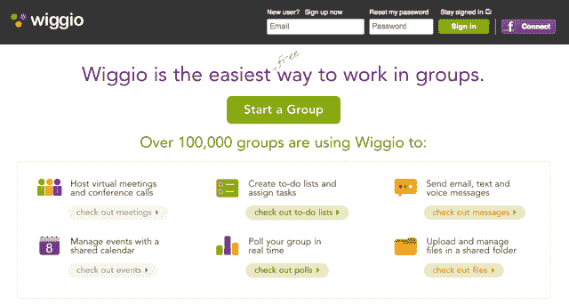
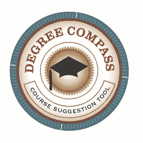
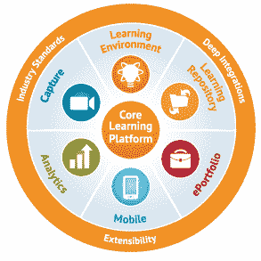

# Desire2Learn 以 8000 万美元收购了“反 Sharepoint 学生平台 Wiggio ”,这是它在两个月内的第二次收购 TechCrunch

> 原文：<https://web.archive.org/web/https://techcrunch.com/2013/03/08/flush-with-80m-desire2learn-buys-anti-sharepoint-for-students-platform-wiggio-its-2nd-acquisition-in-2-months/>

位于加拿大安大略省滑铁卢市的在线学习平台 Desire2Learn 于 2012 年 9 月在 T2 筹集了 8000 万美元，现在正逐步走向并购。今天，我们获悉并证实，该公司正在进行几个月来的第二次收购，收购学生合作平台 [Wiggio](https://web.archive.org/web/20221006170327/http://wiggio.com/) 。

这两家公司没有透露交易的财务条款，但我们知道的是，这家有十多年历史的加拿大学习公司正在寻求扩大其在美国高等教育市场的立足点。Wiggio 总部位于波士顿，波士顿是电子学习市场的一个重要枢纽，但这并不是因为它是一个大的大学城或其他什么地方。(开玩笑，[它有 35+所院校](https://web.archive.org/web/20221006170327/http://www.bostonredevelopmentauthority.org/PDF/ResearchPublications/BBNCollegesUniversities.pdf)，不止一个是 Desire2Learn 的客户。)

收购 Wiggio 意味着 Desire2Learn 不必在市场上从头开始，并允许其开设波士顿办事处。因此，所有六名 Wiggio 员工都收到了聘用通知，他们(对于那些接受的人)将留在 Beantown，帮助开设 Desire2Learn 的新办公室。

我们还听说，该公司正在加拿大边境以南扩张，因为它正着眼于最终在美国首次公开募股。

教育科技市场的退出也有另一个重要原因:许多教育科技初创公司，其中一些有很好的想法，但收入很有意义，已经获得了种子资金，但其中许多公司一直在努力筹集 A 轮和 B 轮融资——这是许多初创公司更大问题的放大。在许多情况下，投资者现在并没有兴趣在这些公司投入大笔资金，所以在大多数情况下，对他们来说最好(或者唯一)的选择就是被收购。

关于 Desire2Learn 是否会将 Wiggio 的技术集成到其平台中并开始向学校提供该技术，尚未做出最终决定。对于那些不熟悉的人来说，正如 Sarah 去年 4 月写的那样，Wiggio 开始建立“反 SharePoint”，为学校提供与教育机构相关的团体的社交和合作网络，这些团体可以是数学俱乐部、运动队和女生联谊会。

【T2

换句话说，Wiggio 旨在为学校提供与 Box、Yammer、WebEx 和 Basecamp 等服务向企业提供的工具相同的易用协作工具——例如，通过网络会议举行虚拟会议、共享日历和文件、创建文档和学习计划，或者就今晚的家庭作业与同学聊天和视频信息。

虽然整合 Wiggio 的计划仍悬而未决，但 Desire2Learn 市场开发副总裁 Jeff McDowell 告诉我们，在可预见的未来，Wiggio 的平台将继续作为独立服务运营，这意味着 Wiggio 的 110 万用户和 10 万个协作组不会被迫在下周开始寻找新家。没有即将关闭。

Wiggio 已经从新大西洋风险投资公司、Bob Doyle 和天使投资公司筹集了 255 万美元。它由 Dana Lampert 在 2008 年创立，当时他刚从康奈尔大学毕业，受到了他在华尔街实习时接触到的所有企业协作工具的影响。兰伯特目前是首席执行官。

### 度数罗盘

wig gio 交易是 Desire2Learn 几个月来的第二次收购，紧随其后的是 1 月下旬的[收购 Degree Compass](https://web.archive.org/web/20221006170327/http://gigaom.com/2013/01/24/exclusive-desire2learn-buys-bill-gates-backed-virtual-guidance-counselor-degree-compass/)。在盖茨基金会的支持下，Degree Compass 提供了一个预测分析工具，就像网飞的电影推荐引擎一样，可以帮助学生找到符合他们兴趣、技能和年级水平的班级、课程和科目，并帮助他们向学位迈进。

该服务还允许学校通过其成绩预测系统更好地了解学生在特定科目上的表现，该系统在几所试点学校的早期测试中，已经能够根据学生之前的表现预测学生是否能通过课程，准确率为 90%。不仅如此，它还能区分一个学生是否会得到 A、B、C、D 或 F，准确率高达 92%。

麦克道尔告诉我们，Desire2Learn 将在下个月与 Degree Compass 一起上市，其版本与收购的版本非常接近。

因此，尽管 Degree Compass 解决了 Desire2Learn 及其机构客户的即时市场需求，并正在立即实施，但鉴于该公司目前的服务，Wiggio 的技术并没有那么高的需求，这使得其长期未来更加不确定。

然而，很明显，自从 9 月份从 [New Enterprise Associates](https://web.archive.org/web/20221006170327/http://www.crunchbase.com/financial-organization/new-enterprise-associates) 和 [Omers Ventures](https://web.archive.org/web/20221006170327/http://www.crunchbase.com/financial-organization/omers-ventures) 获得 8000 万美元融资以来，Desire2Learn 一直在寻求成为 EdTech 的收购者，它聘请了麦克道尔，他曾在滑铁卢居民黑莓公司帮助领导平台营销和业务发展，这是另一个证明。

 这一轮 8000 万美元的融资是加拿大科技公司迄今为止最大的一笔融资(也是 NEA 有史以来最大的融资之一)，旨在帮助 Desire2Learn 投资于客户服务和云基础设施、平台开发和全球增长，即收购。自 1999 年推出以来，Desire2Learn 已经发展成为一个学习管理系统(LMS ),与像 [Blackboard](https://web.archive.org/web/20221006170327/http://www.blackboard.com/) 和 [Moodle](https://web.archive.org/web/20221006170327/http://www.moodle.com/) 这样的巨头竞争。

事实上，该公司在生命的前三年左右深陷与 Blackboard 的专利相关诉讼。当时，Blackboard 在与竞争对手打交道时，使用诉讼手段并不陌生。尽管战斗持续了数年，Desire2Learn 还是获得了足够的资金和蒸汽开始建设。如今，Desire2Learn 在高等教育、K-12、医疗保健和企业部门拥有 700 多名客户和 800 多万名学习者。

它在全球拥有 600 多名员工，并希望在今年年底扩大到 750 名(看起来部分是无组织的)。虽然该公司不披露财务信息，但我们一直听说，它与客户的机构合同正在转化成数百万美元的收入——这在 EdTech 是相对罕见的事情。