# 谷歌街景内幕:从拉里·佩奇的车到大峡谷深处

> 原文：<https://web.archive.org/web/https://techcrunch.com/2013/03/08/inside-google-street-view-from-larry-pages-car-to-the-depths-of-the-grand-canyon/?guccounter=1&guce_referrer=aHR0cHM6Ly9sZW5zLmdvb2dsZS5jb20v&guce_referrer_sig=AQAAAD_Tg5phPXq5fHum8cHYfhUK_DASjU-3obTZ2eYXxU44OcgckrnkyzlPhLW0Wzhpug5CzwL3lBHijlPkugxYZZmTR5X1ParGwKfAkeHG43c37CQHeJXx2gFrqzjKhYLCgc6Cx4Dbp6ptXmKq_vSrOIGRC4J0tkHR60tVJ-fsQpPx>

*" [心灵运输](https://web.archive.org/web/20230129103930/http://en.wikipedia.org/wiki/Teleportation)是将物质从一个点转移到另一个点，而无需穿越它们之间的物理空间，类似于概念 apport，这是一个更早的用于唯心论上下文中的词。"*

对许多人来说，不用“亲身”旅行就能自由地在世界各地旅行的概念是他们的梦想。能够探索数千英里之外的物理空间，而不必应对旅行的艰苦，这似乎是科幻小说中的事情。有了街景，谷歌让我们尽可能地接近了心灵运输——当然，没有实际的物质转移。

该项目始于斯坦福大学的研究，然后跳上了谷歌联合创始人兼首席执行官拉里·佩奇的汽车。抓拍地球上每一个角落和缝隙的照片，以便人们可以在自己家里或移动设备上舒适地环游世界，这是谷歌对周围世界和技术发展的方法的标志。

我花了一天时间与街景团队的创始成员一起了解它是如何从一个人心目中的噱头变成一个我们不假思索就使用的实用工具，在某些情况下，我们不想离开它生活。

街景技术最初是绑在佩奇车上的一个摄像头，现在已经被应用到货车、轿车、三脚架、[背包](https://web.archive.org/web/20230129103930/https://techcrunch.com/2013/01/31/googles-plans-for-trekker-come-to-fruition-with-9500-grand-canyon-panoramas-added-to-google-maps/)、自行车甚至雪地摩托上。自 2007 年 5 月 25 日推出以来，它已经成为谷歌所有愿景中我们如何看待世界的眼睛。虽然这款产品饱受争议，但谷歌已经稳步前进。

### 在你真正到达之前去某个地方

### 那是一辆看起来像科学怪人的汽车。

在我与谷歌地图的工程总监 Luc Vincent 和工程经理 Daniel Filip 交谈之前，我对整个谷歌地图产品的历史做了相当多的研究。我所不知道的是街景的概念实际上是“天上掉馅饼”,一旦技术变得如此普遍，这是一个很容易产生的误解。

文森特告诉了我一些关于街景的第一个概念，它是基于由马克·莱沃伊领导的斯坦福大学的一些实验在谷歌孵化的。Levoy 和他的一个学生想出了一种拍摄视频并将其粘贴到一张图片中的方法，谷歌决定投资一点钱进行更多的实验，看看是否可以拍摄旧金山的每条街道。通过一帧一帧地解析这个视频，它可以制作一个真正“长”的图像，或者一整条街的正面。当然，它被扭曲了，但这是谷歌需要证明其街景理论的基石。

在这些长长的、摇摆不定的、非常早期的街道照片上，文森特说，“我们对此很感兴趣。”很中肯，那就是街景诞生的时刻。

测试结束后，拉里·佩奇将一台相机绑在他的车上，在整个旧金山进行拍摄。这些图像，以及一些非常基本的街道数据，将被拼凑成一些不太有用的东西，但更“有趣”，正如文森特所说。

从佩奇的车里，由一些随机的谷歌人组成的非常早期的街景团队利用他们 20%的时间，将一些相机扔进一辆装有 GPS 和一些激光器的货车。激光是为了获取数据，这样团队就可以知道摄像机和建筑物外墙之间的距离。正是这种空间识别帮助谷歌将所有图像拼接在一起，并赋予其 3D 感。相机拍了很多照片，这些设备连接到货车后部的一组计算机上，然后这个非常独特的数据集，也就是街景街景，就积累起来了。但正如文森特所说，这并不美好:

> 这是一辆看起来像弗兰肯斯坦的车，但它让我们在海湾地区捕获了足够的数据。我们有一辆从保安队借来的货车。它会进入城市，做一些驾驶，事情会停止工作，电脑给我们错误。

[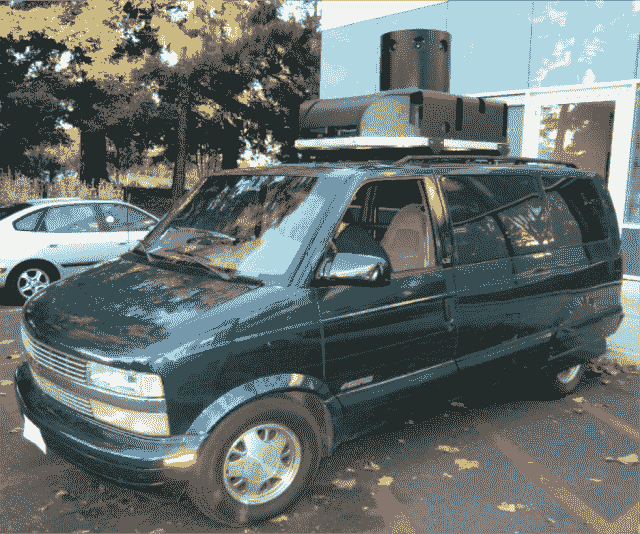](https://web.archive.org/web/20230129103930/https://techcrunch.com/wp-content/uploads/2013/03/street-view-van.png)

[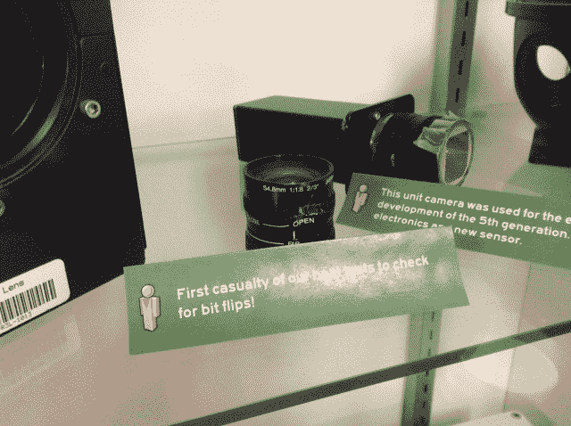](https://web.archive.org/web/20230129103930/https://techcrunch.com/wp-content/uploads/2013/03/img_0308.jpg)

### 获得认同

### 要做到全面，成本必须很高。

用 20%的时间在谷歌做一个项目只是战斗的一部分。让其他人加入你的团队并获得批准是一个完全独立的障碍。文森特告诉我，一旦他们收集了所有这些数据，人们就开始将它们拼凑在一起，演示就有了意义。

2005 年第三季度，Vincent 和他的团队在 Google 做了一个技术演讲，这个演讲每周五举行，并且能够让超过 20%的人加入团队，包括一个关键的工程副总裁。2005 年 10 月，街景获得批准并获准扩建。没有回头路了。世界将由一群想入非非的思想家一个像素一个像素地绘制出来，他们试图计算出他们可以在一辆汽车上安装多少设备而不会每五英里发生故障。虽然街景在这一点上仍然在雷达下，文森特可以开始雇用人-菲利普是第一个。事实上，这两个公司今天仍在开发这个产品，这证明了它已经走了多远，还有多少工作要做。

2006 年初，有七名谷歌员工全职开发街景，目标是让它成为“真正的产品”。文森特在转场时说:

> 那时候有几件事是我们真正感兴趣的。透视全景很酷，但很难制作。我们只有一个 UI/UX 的家伙来弄清楚如何将其集成到地图中，但没有令人信服的方式来展示它，因为我们开始时没有“谷歌地图”。

 是的，你今天在谷歌地图产品中看到的所有基础设施当时甚至还不存在，所以谷歌的街景团队甚至已经通过了谷歌目前的计划和轨迹。文森特分享道:

> 我们所做的是建立一个新的平台。我们想制造一些可靠的、可扩展的东西，并把它放在汽车里。一些高速相机拍照，所以我们有 8 个单反相机在一个玫瑰配置来拍摄车辆周围的图像。我们当时的想法是“要做到全面，成本必须很高。”

[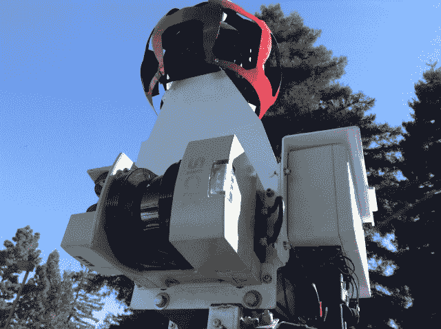](https://web.archive.org/web/20230129103930/https://techcrunch.com/wp-content/uploads/2013/03/cameracar.jpg)

这种“玫瑰花形设计”最初由五个镜头和一个被称为 L2 的主鱼眼组成，现已成为每辆街景车的核心。一旦这种摄影和信息收集的方法确定下来，谷歌知道这将会奏效。

### 数据

### 收集尽可能多的数据，搞清楚。

谷歌街景，以及谷歌所做的一切，都是关于它收集的数据。从很多方面来说，谷歌极度痴迷于收集所有类型的数据。这种方法激怒了那些觉得自己的隐私被侵犯的人，但该公司采取的方法是“尽可能多地收集，以后弄清楚，以帮助人们的方式展示。”采取这种方法，然后冲洗并重复。

街景收集了相当多的数据。文森特的团队必须想出一种方法来扩大这些原始货车的规模，以尽可能多地抓住它，这样他们就不必多次驾驶相同的路线。该团队将激光投射到货车上——每侧四个——以获得距离信息、更多 GPS、收集的风速以及两者之间的一切。他说方法很简单:“收集尽可能多的数据，然后把它弄清楚。”

然而，这在旧金山以外的地方会怎样呢？现在有来自全世界 47 个国家 3000 多个城市的街景数据，所以在这个项目问世之前还有很多工作要做。

文森特说:

> 我们的车后面有四五台机器，但是总有东西坏了。我们制作了三四个这样的相机，主要在加州拍摄照片。汽车总是出故障，所以我们无法扩大规模。

[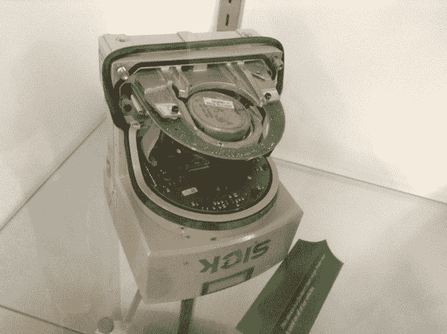](https://web.archive.org/web/20230129103930/https://techcrunch.com/wp-content/uploads/2013/03/img_0311.jpg)

在行驶了 500 万英里后，现在故障已经很少了。

### 理解数据

所有这一切听起来都很棒——仅通过在城市中行驶来收集数据和照片——但要让它真正有用，该团队必须想出一种方法来可视化它，并从用户体验的角度对它进行调整。1 和 0 让超级数学极客感到高兴，但我们的父母不可能理解其中的任何一点。为了充分体验谷歌地图和街景，设计必须近乎完美，就好像你第一次踏入一个外国城市，头还在旋转。

为了做到这一点，街景团队为自己建立了一个内部工具，以搅动所有的地理信息:他们在上面拍了一层又一层的照片，使用了从建筑物和地标反射回来的激光拍摄的所有空间细节，然后确定它是否实际可用。经过大量的工作，它最终变成了:

[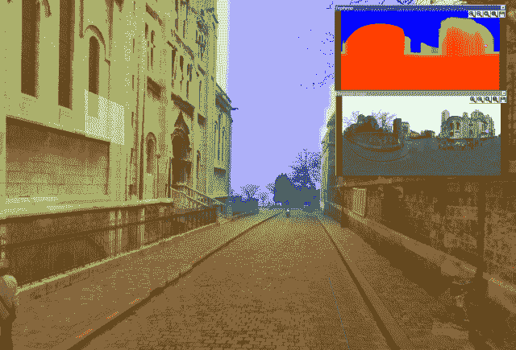](https://web.archive.org/web/20230129103930/https://techcrunch.com/wp-content/uploads/2013/03/cb-view-depth-map.png)

这些数据是由司机收集的，他们会把硬盘装满，然后运回谷歌。在五个磁盘完全写满之前，驱动程序不会发送它们。磁盘将被运送到数据中心，上传信息，然后一切都将被输入其核心数据库，并经过一些处理步骤。

其中一个处理步骤是模糊人脸和车牌。这些似乎是显而易见的隐私问题，在这个产品存在之前没有人想到过，所以谷歌必须发明技术来系统地做到这一点。此外，你今天在街景上看到的每个完成的镜头和角度都有 15 张图像，谷歌的软件将所有这些图像混合在一起，调整阳光、阴影、色差和亮度的曝光。这就是制作“完美”全景图像的过程。

与此同时，谷歌正在从街道标志等物体中检测和提取信息，以反馈到主要的谷歌地图产品中。那是相当大的负担。

[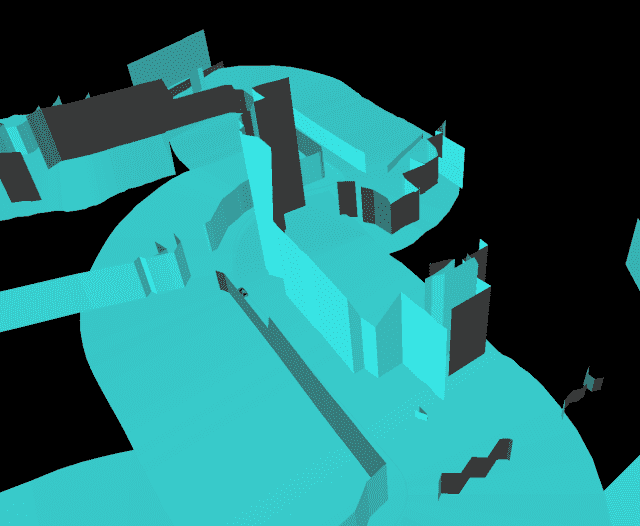](https://web.archive.org/web/20230129103930/https://techcrunch.com/wp-content/uploads/2013/03/cb-view-3d-facade-generation-geometry.png)

由于车辆顶部的每个摄像头都会拍摄照片，位置信息可以与它相关联，同时还有来自图层的空间信息，因此街景团队可以将所有必要的角度缝合在一起，以创建这一美丽的全景图像。

[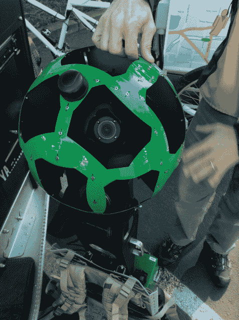](https://web.archive.org/web/20230129103930/https://techcrunch.com/wp-content/uploads/2013/03/img_0275.jpg)

从正面、侧面、背面拍摄的照片，以及最终从鱼眼俯视建筑物的照片，将会变成我们今天所欣赏的 3D 视图:

[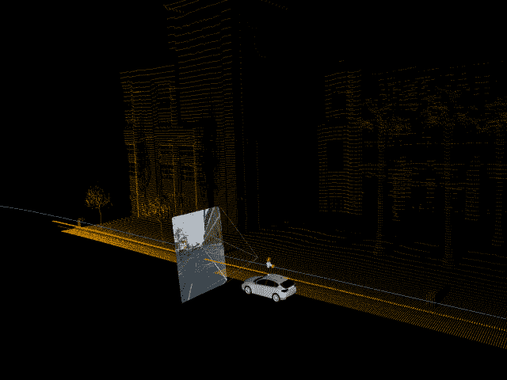](https://web.archive.org/web/20230129103930/https://techcrunch.com/wp-content/uploads/2013/03/cb-view-unstitched-image2.png)

我了解到的一件很酷的事情是，由于车辆前方和后方的摄像头被部分遮挡，谷歌发明了一种技术，通过从其他角度拍摄来平滑这些图像，这就是为什么 3D 图像看起来好像拍照车辆从未存在过:

[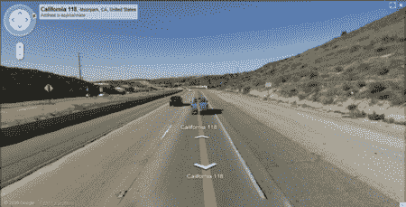](https://web.archive.org/web/20230129103930/https://techcrunch.com/wp-content/uploads/2013/03/streetview_after.png)

### 今天的发布会和街景

### 我们看到车流如织。

谷歌街景于 2007 年正式推出，仅适用于旧金山、纽约、拉斯维加斯、迈阿密和丹佛。当时的摄像头是 500 万像素，勉强达到我们今天手机的水平。现在是 7500 万像素；试着用你的大脑来思考这个问题。

这是一个立竿见影的成功，尽管街景团队和谷歌不知道它会受到多大的欢迎。当然，谷歌已经准备好通过提供这些图片来烧毁一些机器，文森特回忆起那天的感觉:

> 我们看到流量突破了上限，达到了我们能提供的最高水平，但我们很快就达到了极限。在谷歌的好处是你可以观察流量和兴趣。发布会显示了人们的兴趣，一堆网站开始出现，一些网站显示了我们捕捉到的有趣图像。

这些有趣的，有时令人不安的图片已经引起了轩然大波，谷歌[不得不在某些情况下为自己辩护](https://web.archive.org/web/20230129103930/https://techcrunch.com/2013/01/16/google-not-involved-in-donkeys-murder-says-company-and-no-its-not-april-fools-this-happened/)。

最初的货车是不可扩展的，所以安装这项技术，现在由带有相同 8 个镜头和一个鱼眼的“瓢虫”相机组成，必须被安装到可以在世界各地行驶的汽车上。你可能已经看过一部了。

[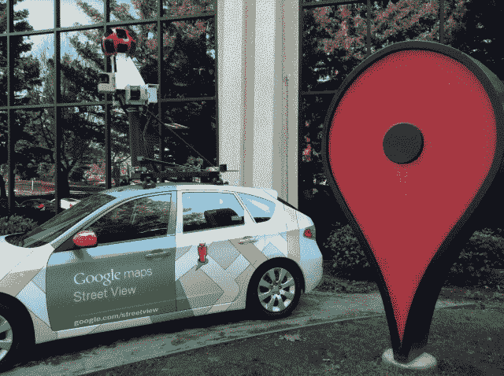](https://web.archive.org/web/20230129103930/https://techcrunch.com/wp-content/uploads/2013/03/img_0313.jpg)

“这花了一些时间，”文森特谈到街景时说，因为它所有的装置都经历了多次迭代，导致谷歌最终建立自己的相机和定制钻机。一旦核心技术得到巩固，街景就会在其他国家的小城市和城镇中被要求，因此该团队缩小了钻机的规模，以适应自行车等其他车辆。街景三轮车可以在小巷里进出，绕过大型地标建筑，沿着不足以容纳汽车或货车的街道行驶。

[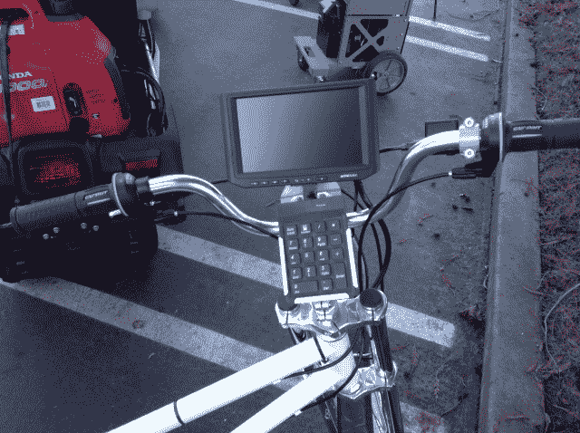](https://web.archive.org/web/20230129103930/https://techcrunch.com/wp-content/uploads/2013/03/img_0239.jpg)

[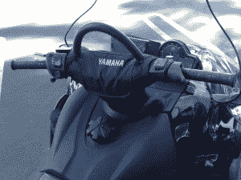](https://web.archive.org/web/20230129103930/https://techcrunch.com/wp-content/uploads/2013/03/img_0250.jpg) 然后，团队中的一名成员决定在 2010 年温哥华奥运会期间在山上做街景处理。为什么不呢，对吗？街景技术随后被改造成由雪地机动车驾驶。对于摄像机来说，外面太冷了，所以文森特说工程师不得不脱下他的夹克来保暖。随着收集的数据越来越多，网上展示的图像越来越多，想法越来越快。

### 我们想把人们联系起来。

为什么你会停止使用外部图像？为什么不在室内拍摄全景图像，尤其是在著名的博物馆？街景手推车就这样诞生了。在室内街景上，文森特说:

> 我们做了一台新的迷你电脑，把所有的东西都缩小了，然后把它放在一辆手推车上，放在大的室内空间里。三脚架太费时间了。挑战在于室内没有 GPS，所以我们研究了复杂的算法，在没有 GPS 的情况下，用激光和位置数据提取手推车的位置。这辆手推车现在已经帮助了 50 个博物馆。

你开始明白了。如果它不存在，那也不会阻止有远见的谷歌人。一旦某样东西有了一点点效果，而且对消费者来说看起来很酷很有用，那么资金和资源就会被分配，东西就会通过任何必要的手段被快速制造出来。

[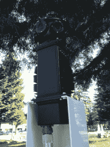](https://web.archive.org/web/20230129103930/https://techcrunch.com/wp-content/uploads/2013/03/trolly.jpg) 当前的街景相机目前由 15 个相机组成(不再需要鱼眼)，因为文森特觉得街景没有得到足够的*照片。谷歌继续挑战质量和准确性的极限，这也是为什么[苹果在推出自己的地图产品](https://web.archive.org/web/20230129103930/https://techcrunch.com/2012/09/28/well-played-on-maps-apple-your-move-google/)时如此艰难的原因之一。你看，谷歌从 2005 年就开始做这些事情了。不仅如此，自 2007 年以来，它一直在大规模地这样做。所有这些经验教训，所有这些数据和所有这些工时意味着谷歌不仅有一个良好的开端，而且还有一个长期的前进优势。基本上，能抓就抓。*

 *在街景摄制组的一天结束时，我问文森特为什么要开始这一切。他面无表情、严肃而又充满同情地回答道:“我们想把人们联系起来。”

### 让复杂的事情变得普通

[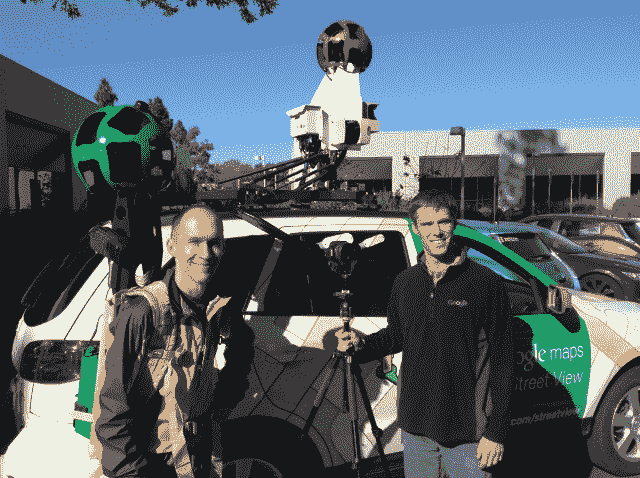](https://web.archive.org/web/20230129103930/https://techcrunch.com/wp-content/uploads/2013/03/img_0297.jpg)

是的，谷歌的很多技术在我们的台式机和手机的后台运行，我们任何人都不知道它是如何工作的。这就是神奇之处。你不会真的想知道香肠是怎么做出来的；你只是想知道它的味道真的很好。当某样东西味道好的时候，你会回来吃更多，甚至告诉你的朋友。文森特喜欢谷歌产品被视为理所当然，因为这让他们能够更快地创新。

街景未来可以完成的事情有很多。通过它的 Trekker 背包，树木繁茂的地区可以被绘制出来[以帮助工作人员寻找失踪的人](https://web.archive.org/web/20230129103930/http://thenextweb.com/google/2012/06/06/googles-street-view-trekker-could-help-find-people-who-have-gone-missing/)，也可以让你[发现大峡谷](https://web.archive.org/web/20230129103930/https://techcrunch.com/2012/10/24/google-takes-its-backpack-sized-trekker-street-view-cameras-to-the-grand-canyon/)而不必真正登上飞机或公共汽车。

[https://web.archive.org/web/20230129103930if_/https://www.youtube.com/embed/9ae5MzPKAQ4?feature=oembed](https://web.archive.org/web/20230129103930if_/https://www.youtube.com/embed/9ae5MzPKAQ4?feature=oembed)

视频

[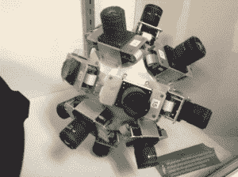](https://web.archive.org/web/20230129103930/https://techcrunch.com/wp-content/uploads/2013/03/img_0307.jpg) 尽管早期的街景并不好看，无论是拼凑起来的设备，还是贴出的满是艺术品的图片，人们都得到了这个概念，接受了这个概念，并要求更多。只要谷歌继续努力收集尽可能多的数据，并想出以后如何显示这些数据，我们就会不断地被介绍给更多的产品。

虽然你可能还不能进行身体上的瞬间移动，但你的思想可以随意游走，让世界感觉更小。它以一种其他技术无法实现的方式将我们与人联系起来。

街景历史作品中最棒的部分是这些方法都是开源的，就好像在说“来找我们吧。”你能赶上谷歌吗？说到地图，你最好有一个相当复杂和快速的交通工具，因为它们几乎无处不在；只需寻找标志性的相机。

此外，当你用智能手机搜索一个感兴趣的区域时，要记住快速显示平滑图像的所有内容。谁知道呢，也许有一天你能参与这个项目。有了谷歌眼镜，你*可能*能够拍摄你周围的世界，并将它们包含在街景图像中。

听起来很疯狂，不是吗？就像把数码相机绑在创始人的车上一样疯狂。

**[我和街景团队](https://web.archive.org/web/20230129103930/https://plus.google.com/photos/+DrewOlanoff/albums/5853447460583284209)在一起时的照片。***