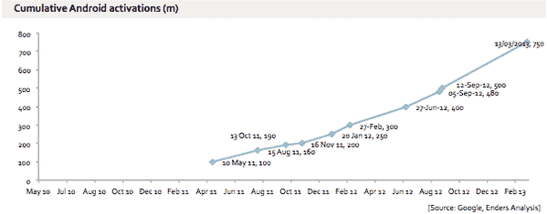

# 拉里·佩奇说现在已经有 7.5 亿安卓激活

> 原文：<https://web.archive.org/web/https://techcrunch.com/2013/03/13/larry-page-says-there-have-now-been-750m-android-activations/>

# 拉里·佩奇说现在已经有 7 . 5 亿安卓激活

在拉里·佩奇不久前关于安迪·鲁宾辞去 Android 主管一职，由桑德尔·皮帅接任的笔记中，他还提供了 Android 设备激活的最新情况:现在有 7.5 亿个 Android 设备，来自 60 个硬件制造商的智能手机和平板电脑。这是对 2012 年 9 月[报道的 5 亿数字的更新。](https://web.archive.org/web/20221209014037/http://ben-evans.com/benedictevans/2013/3/2/android-activations)

来自 Page 的注释:

> 快进到今天。创新的步伐从未如此之快，Android 是世界上使用最多的移动操作系统:我们有超过 60 家制造商的全球合作伙伴关系；全球已激活超过 7.5 亿台设备；Google Play 上已经下载了 250 亿个应用程序。对于十年的工作来说，这是相当惊人的进步。

本尼迪克特·埃文斯为我们展示了 Android 是如何发展的。

根据分析师的许多估计，谷歌的 Android 是目前世界上最大的智能手机平台。例如，来自 Gartner 的最新数据显示，就最近售出的设备而言，它占据了 70%的市场份额。然而，激活是一个稍微模糊的统计，因为，正如埃文斯指出的，它们不包括，例如，在可能使用谷歌服务的国家销售的 Android 设备，如中国。而且他们没有计算设备的第二拥有者，而在发展中国家，你有时可能会遇到这种情况。

Evans [说](https://web.archive.org/web/20221209014037/https://twitter.com/BenedictEvans/status/311888221413982208)7.5 亿 Android 激活意味着活跃基数约为 6.75 亿。“当然还有中国。”作为比较，iOS 大约为 4 亿。

分析师 Horace Dediu 根据今天 7.5 亿的数字和历史增长，[预测](https://web.archive.org/web/20221209014037/https://twitter.com/asymco/status/311897125229309952)到 2013 年 8 月中旬，Android 的激活量将达到 10 亿。

[上周](https://web.archive.org/web/20221209014037/https://beta.techcrunch.com/2013/03/06/google-play-offers-over-5m-ebooks-and-more-than-18m-songs-one-year-after-its-rebranding/)，谷歌提供了电子书和音乐在该平台上进展的最新情况:Google Play 上现在有超过 500 万本电子书和 1800 万首歌曲，一年前它更名为 Android Market。