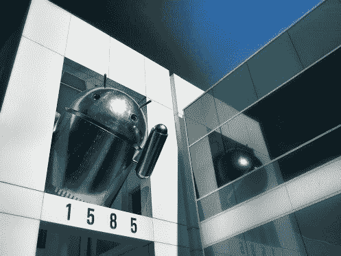

# 桑德尔·皮帅接替安迪·鲁宾担任谷歌 Android 主管，标志着 Android、Chrome 和应用程序的统一

> 原文：<https://web.archive.org/web/https://techcrunch.com/2013/03/13/sundar-pichai-takes-over-for-andy-rubin-as-head-of-android-at-google/>

# 桑德尔·皮帅接替安迪·鲁宾成为谷歌安卓主管，标志着安卓、Chrome 和应用的统一

谷歌刚刚在首席执行官拉里·佩奇撰写的官方博客中宣布，安迪·鲁宾将在公司担任新职务，桑德尔·皮帅将领导安卓部门。皮查伊除了现有的负责 Chrome 和应用的工作之外，还将负责领导 Android，这表明他将统一所有这些平台。

佩奇在博客中表示，鲁宾“已经决定”转向其他项目(仍在公司内部)。关于鲁宾的新重点可能是什么，没有额外的细节，但佩奇呼吁“更多的月球照片”，所以他有可能进入一个更具实验性的角色。

至于皮查伊，他在 Chrome 副总裁的职位上增加了新的职责，这是一个有趣的举动，因为最近的发展使 Chrome 和 Chrome OS 更接近谷歌的移动平台。例如，Chromium 开发者版本的变化导致了 Chrome 的稳定版本，包括建议 [Google Now 将进入桌面](https://web.archive.org/web/20230320181513/https://techcrunch.com/2013/03/12/google-now-coming-to-the-desktop-per-chromium-builds-for-windows-and-chrome-os/ "Google Now Coming To The Desktop, Per Chromium Builds For Windows And Chrome OS")。

佩奇在描述皮查伊将如何有利于安卓时，并非没有陈词滥调:他写道，随着公司“努力推动生态系统向前发展”，新的安卓首席执行官将“加倍关注安卓”。Google Now 甚至在公告的最后一段专门提到了 Android 和移动应用，还强调了 Nexus 计划和 Google 的 OEM 合作伙伴。

有很多关于 Chrome OS 和 Android 的潜在合并或联姻对谷歌来说可能有意义的讨论，一名谷歌员工[最近取笑了下面这张在谷歌园区拍摄的图片](https://web.archive.org/web/20230320181513/http://www.zdnet.com/are-android-apps-for-chromebooks-on-the-way-7000010626/)。显然，你不能从一个铬合金机器人雕像中推断出任何东西，但像这样一个高调的角色变化给现有的猜测增加了实际的重要分量。

