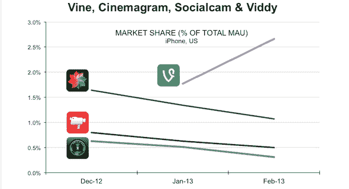

# 早期 Vine 应用见证了视频应用在 iOS 上的崛起，而 Cinemagram、Viddy、Socialcam 都在衰落 TechCrunch

> 原文：<https://web.archive.org/web/https://techcrunch.com/2013/03/14/early-vine-use-sees-video-app-rising-on-ios-while-cinemagram-viddy-socialcam-all-decline/>

称之为一种时尚，称之为推特效应，或者称之为当第一个行动者付钱给*而不是*时的另一个例子，但看起来两个月后，推特的简短视频分享应用 [Vine](https://web.archive.org/web/20230130100805/https://vine.co/) 正在吸引用户，就像他们正在过时一样。

根据跟踪美国 iOS 设备应用使用情况的 Onavo Insights 的数据，自 1 月份上线以来，Vine 的月活跃用户数在上个月增长了 50%，截至 2 月底，美国所有 iOS 设备中有 2.66%使用了 Vine。

看起来 Vine 的涨潮并没有提升所有的船。iOS 上的其他三个视频分享应用程序——Cinemagram、SocialCam 和 Viddy——同时下降，自 12 月以来，它们的月活跃用户普遍下降。2 月份，Cinemagram 的美国设备使用率为 1.07%，SocialCam 为 0.50%，Viddy 为 0.31%。

这些数字与另一家分析公司 RJ 度量公司的数据有一定的可比性，该公司衡量了 Vine 与 Viddy 和 Socialcam 在 Twitter 上的使用情况。它发现，在第一个月，Vine 有 2.8%的 Twitter 高活跃用户使用，Viddy 有 0.5%，Socialcam 有 0.2%。

它也遵循早期建立的[模式](https://web.archive.org/web/20230130100805/https://techcrunch.com/2013/01/31/one-week-in-vine-could-be-twice-as-big-as-socialcam/)。

虽然 Onavo 没有这三款应用在最初几个月的使用情况的对比统计数据(当时它没有跟踪这一数据)，但它指出，事实上 Vine 现在比过去六个月中的任何一款都要大。Viddy 和 [SocialCam](https://web.archive.org/web/20230130100805/http://insights.onavo.com/apps/ios/photo-video/3f26e5dabf01025d1/socialcam-video-camera) 都在普遍下滑，而 [Cinemagram](https://web.archive.org/web/20230130100805/http://insights.onavo.com/apps/ios/photo-video/a38b0df285dd93d99/cinemagram) 在去年秋季出现了不错的增长，只是在 12 月份也开始下滑。

在另一个社交网络推出基于图片的应用程序的背景下，Vine 的崛起很有趣。脸书首次推出的 Poke 是一款短暂的图片通讯应用，被视为脸书的 Snapchat，它在刚推出时获得了大量关注，但当它吸引活跃用户时，这种关注似乎很快消失了。随着对 Poke 的兴趣逐渐消退，Snapchat 继续增长。如今，Snapchat 的市场份额为 12%，脸书的 Poke 市场份额为 0.25%。

这里一个可能的信息是，如果你正在进入一个尚未被任何一家公司拥有的市场，你可能会有更好的成功机会，无论你是否是在一个广受欢迎的社交媒体平台的支持下推出的。Vine 进入了一个只有 1.3%的 iPhone 用户使用其最接近的竞争对手的领域，并且正在下滑。相比之下，当 Poke 决定戳穿 Snapchat 时，只有 10%的人在使用它，而且还在上升。根据 RJMetrics 的数据，总的来说，移动视频仍然是一个非常开放的空间，只有大约 4%的 Twitter 高活跃用户使用视频应用。

很明显，当 Twitter 推出照片过滤器时，它选择在 Twitter 本身而不是作为一个单独的服务来做。Onavo 告诉我，在竞争格局中，美国有 32.3%的 iPhone 用户每月使用 Instagram。

接下来，看看这将如何利用报道的 Twitter 音乐应用的发布和使用，将是一件有趣的事情。Onavo 说，美国 iOS 上使用最多的音乐应用是 Pandora，每月有 31.8%的美国用户访问它，Spotify 为 7.14%。