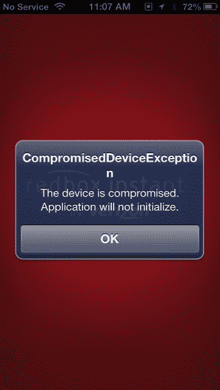

# 网飞的竞争对手本周推出的 Redbox Instant 不能在越狱的 iOS 设备上运行

> 原文：<https://web.archive.org/web/https://techcrunch.com/2013/03/15/redbox-instant-the-netflix-competitor-launched-this-week-wont-run-on-jailbroken-ios-devices/>

本周[向公众推出的视频流媒体服务](https://web.archive.org/web/20221210031452/http://www.techmeme.com/130314/p49#a130314p49)red box Instant，不能在你越狱的 iOS 设备上运行。相反，在启动移动应用程序时，越狱设备的用户会收到一条错误消息，通知他们“设备受到威胁”然后应用程序无法加载。

对于这种情况，似乎还没有任何解决办法，所以如果你是刚刚越狱了你的 iPhone 或 iPad 的数百万人中的一员，那么 Redbox 的流媒体服务将是你的禁区。

 作为背景，威瑞森和 Redbox [今年 7 月宣布了他们针对网飞竞争对手的](https://web.archive.org/web/20221210031452/https://beta.techcrunch.com/2012/07/24/redbox-and-verizon-announce-their-netflix-competitor-but-leave-out-details-about-pricing-content/)计划，该计划于 12 月进入 beta 测试[，应用程序同时适用于 Android 和 iOS。截至本周公开亮相时，该服务为用户提供了约 4600 个流媒体标题，以及从 Redbox kiosk 位置以每月 8 美元的价格租赁四张 DVD。每月 6 美元，用户只需支付流媒体费用，不能选择在自助服务亭租借光盘。每月 9 美元，顾客可以选择蓝光光盘。](https://web.archive.org/web/20221210031452/https://beta.techcrunch.com/2012/12/19/redbox-instant-by-verizon-launches-into-beta-as-app-goes-live-in-google-play/)

此外，由于工作室合作伙伴的限制，并非所有 Redbox Instant 的内容都可以用于即时流媒体。对于这些(大部分是新发行的)电影，客户可以选择付费租赁或购买电影，起价为 99 美分，以后还会更高。

这项服务最基本的计划比竞争对手网飞每月低 2 美元，但内容选择在这个时候没有可比性。它目前有来自 Epix(维亚康姆和狮门影业)、米高梅和其他公司的电影。不过，4600 本书远远少于网飞报道的 60000 本。公平地说，因为网飞把一部电视剧的每一集都算作一个标题，这个数字有点夸张。[截至今年 1 月](https://web.archive.org/web/20221210031452/https://beta.techcrunch.com/2013/01/18/netflix-u-k-has-far-more-tv-shows-series-than-lovefilm-instant-but-amazons-on-demand-service-has-twice-as-many-films/)，网飞(美国)实际上有大约 14，000 个可流式播放的标题，其中 9，000 多个是电影。

在最初的测试版发布时，以及年初 [TechCrunch 对 Redbox Instant](https://web.archive.org/web/20221210031452/https://beta.techcrunch.com/2013/01/06/hands-on-redbox-instant-by-verizon/) 的实际评估时，更新的 iOS 设备尚未越狱。但是在二月份，一群自称为[的 iOS 黑客发布了“Evasi0n”越狱](https://web.archive.org/web/20221210031452/https://twitter.com/evad3rs)，它可以在大多数 iOS 6.0+设备上运行，最重要的是，包括从未有过可用越狱的 iPhone 5。

那次越狱现已成为有史以来最受欢迎的一次，截至 2 月，已有近 700 万台设备遭到黑客攻击。不幸的是，这些用户将无法运行 Redbox Instant。尽管我们应该注意到网飞的流媒体应用程序*可以在越狱设备上运行。*

这并不是第一次有公司因为 DRM 问题而限制提供受保护内容的应用程序在移动设备上运行。当网飞第一次把它的服务带到 Android 时，事实上，它只支持特定的 Android 型号。在正式支持新设备之前，该公司需要仔细测试和保护每个设备，这不仅是因为一般的错误测试，还因为它必须小心 DRM。当然，在 Android 上，用户很快[找到了问题的](https://web.archive.org/web/20221210031452/http://lifehacker.com/5804109/install-netflix-on-your-unsupported-android-device-no-rooting-required) [变通办法](https://web.archive.org/web/20221210031452/https://beta.techcrunch.com/2011/05/13/how-to-install-netflix-on-most-android-devices/)。然而，在 iOS 上，要让 Redbox 即时工作，就要靠越狱开发者社区的成员了。

坦率地说，与网飞不同，对服务的需求可能不值得这样的努力。