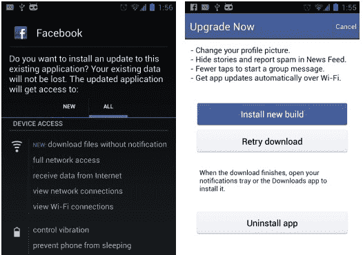

# 脸书成立早期用户俱乐部，重燃移动实验热潮 TechCrunch

> 原文：<https://web.archive.org/web/https://techcrunch.com/2013/03/17/its-alive-mwa-ha-ha-ha/>

抛弃 HTML5 让脸书失去了在用户子集上修补和悄悄尝试设计或功能变化的灵活性。但是现在它可以再次实验。周四，脸书推出了一个测试版俱乐部，为一些安卓用户提供早期使用新功能的机会。由于静默下载的软件更新，脸书可以实地测试其移动体验的演变，因此它不会对数亿人造成影响。

在黑客马拉松、锁定和持续的代码推送之间，实验是脸书产品开发的核心。它设计了系统[看门人](https://web.archive.org/web/20221124021513/https://beta.techcrunch.com/2011/05/30/facebook-source-code/)，这样它就可以在极小部分用户基础上同时测试大量不同版本的脸书。新功能通常在偏远地区进行测试，如新西兰的农村，或者在特定的人口统计数据中进行测试，如没有朋友的人，以在不引起公众注意的情况下获得反馈。

如果最初的测试进展顺利，脸书会将变更推给 1%的用户，并监控 bug、定性反馈和使用波动。当一个更新被证明是稳定和受欢迎的，它会被推广到 10%的用户，最终是 100%的用户。这让它在网络上服务的瘴气智能进化。

### 用实验换取速度

在手机上不是这样。通常对于原生应用，更新会以手动从应用商店或 Google Play 下载软件的形式一次发送给所有用户。这意味着每个人都可以同时获得新功能，如果不改变每个人的体验，就很难衡量影响。

脸书通过在其 iOS 和 Android 应用中包装从其网站上下载的 HTML5 来解决这一问题。HTML5 虽然灵活，但速度不够快，无法满足脸书数亿移动应用用户的需求。转换到本地基础设施使其应用程序的速度翻倍。

当更快的 iOS 应用程序推出时，脸书的 iOS 移动产品经理 Mick Johnson [告诉我](https://web.archive.org/web/20221124021513/https://beta.techcrunch.com/2012/08/23/facebook-for-ios-faster/)“我们故意做出权衡以达到规模。我们使用 HTML5 进行测试和尝试。”在脸书工程[的博客文章](https://web.archive.org/web/20221124021513/https://www.facebook.com/notes/facebook-engineering/under-the-hood-rebuilding-facebook-for-ios/10151036091753920)中，Jonathan Dann 写道“我们选择使用 HTML5 是因为……它允许我们通过发布和测试新功能来快速迭代体验，而不必发布我们应用的新版本。”

马克·扎克伯格最近在 TechCrunch Disrupt 的舞台上宣布，在移动网络标准准备就绪之前过度依赖它是脸书最大的错误之一。然而，对 HTML5 的回溯剥夺了脸书的一些实验能力。脸书弥补的一个方法是[通过其独立应用](https://web.archive.org/web/20221124021513/https://beta.techcrunch.com/2012/11/09/standalone-guinea-pigs/)进行测试。相比其主要应用程序，脸书在早期用户中更受欢迎，它在信使和相机应用程序中尝试了音频消息和批量照片上传等功能。那些受欢迎的产品逐渐成为其旗舰移动产品的特色。

### (对某些人来说)打碎东西

现在，由于静默更新，它可以干预其最受欢迎的应用程序 Android 版脸书，该应用程序在 12 月底拥有 1.92 亿月用户。根据 Liliputing 的首次报道，周四，它促使一些用户下载 Android 版本 141046 的[脸书，并选择提前获得测试版功能。此更新仅适用于一些在 Android 上启用了从 Google Play 之外安装应用程序的用户。那些有义务的人从那时起通过 Wi-Fi 默默下载测试版更新。不过，Beta 测试人员必须手动确认更新的安装。如果脸书认为所有用户都会从测试版中受益，它会向所有人推送一个标准的 Play 更新。](https://web.archive.org/web/20221124021513/http://liliputing.com/2013/03/facebook-pushes-android-update-to-enable-silent-updates-bypassing-the-play-store.html)

这一切都有点像黑莓的测试区。静默下载更新是 Android 对开发者限制较少的生态系统的好处之一。脸书可能会在 iOS 上做类似的事情，但这需要一个像 [TestFlight](https://web.archive.org/web/20221124021513/http://www.crunchbase.com/company/testflight) 这样笨拙的系统，用户必须手动拖入更新。这篇文章并不是说脸书已经停止了手机实验。它开始每两到四周更新一次应用程序。它只是不能悄悄地这样做。

对于一些铁杆 Facebookers 用户来说，新的 beta 俱乐部可能是一个令人兴奋的机会。毕竟，在我们生活的世界里，拥有最新的应用程序或技术可以让你看起来很酷，就像过去了解地下乐队一样。

我经常看到有人问他们如何成为脸书的试验品。该公司过去只提供了有限的自愿测试机会。它[要求其](https://web.archive.org/web/20221124021513/https://beta.techcrunch.com/2010/05/31/facebook-questions-facebook/)[自废问题](https://web.archive.org/web/20221124021513/https://beta.techcrunch.com/2012/10/19/facebook-questions-shut-down/)产品的测试对象给它一个良好的开端，并且[以前](https://web.archive.org/web/20221124021513/http://www.wikihow.com/Become-a-Facebook-Beta-Tester)接受申请成为 beta 测试者，尽管现在不再接受。现在有了一条清晰的路线，成为你所在街区第一个拥有下一代脸书功能的人:买一个安卓系统，支持侧装应用程序更新。

脸书正努力将自己重新定义为一家移动公司。然而，它仍然首先推动网络的重大变化，包括最近推出的[图形搜索](https://web.archive.org/web/20221124021513/https://beta.techcrunch.com/2013/01/15/facebook-announces-its-third-pillar-graph-search/)和[重新设计的新闻提要](https://web.archive.org/web/20221124021513/https://beta.techcrunch.com/2013/03/07/facebook-launches-multiple-topic-based-feeds-bigger-images-and-a-consistent-design-across-devices/)，这两个都还没有在 iOS 或 Android 上出现。为了避免被真正以移动为先的灵活创业公司颠覆，脸书需要继续积极迭代其应用程序。幸运的是，现在它找到了一种新的方式来点燃本生灯，在小屏幕上烹饪我们的未来。

*【图片来源:[轮毂](https://web.archive.org/web/20221124021513/http://www.hubspot.com/)*