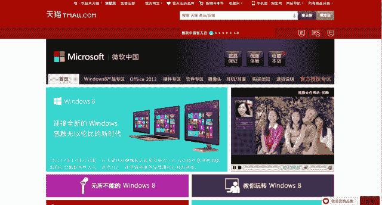

# 微软在天猫——中国的亚马逊——TechCrunch 上开设在线旗舰店

> 原文：<https://web.archive.org/web/https://techcrunch.com/2013/03/18/microsoft-opens-online-flagship-store-on-tmall-the-amazon-of-china/>

# 微软在“中国的亚马逊”天猫上开设在线旗舰店

微软今天在 Tmall.com 推出了其在中国的旗舰在线商店，此举可能有助于提高其硬件在中国的市场份额，包括平板电脑和智能手机。

由阿里巴巴集团运营的 Tmall.com 是中国最大的消费者电子商务平台，拥有超过 5 万个商家。根据市场研究公司 Euromonitor 的调查，[天猫将在 2015 年取代亚马逊成为世界上最大的网络零售商。](https://web.archive.org/web/20221209235953/http://blog.euromonitor.com/2012/11/prediction-tmall-will-overtake-amazon-by-2015-to-become-the-largest-internet-retailer-in-the-world.html)

微软的天猫网站效仿去年 10 月推出的 Microsoftstore.com.cn 网站。新网站将提供 50 多种产品，并由中国的一个团队直接运营，该团队将根据当地消费者的需求监督商品、报价和促销活动。可用物品包括:微软 Surface 和配件；微软在线商店为 Surface 提供运行服务；微软 OfficeWindows Phone 设备；微软硬件和配件；以及微软在线商店即将上市的招牌 PC。

让中国消费者更容易在网上获得微软的产品是帮助提高微软在中国市场份额的一种方式。根据 IDC 的数据，Surface RT 平板电脑在中国的出货量在 2012 年第四季度仅达到 3 万台，其在中国市场所有平板电脑中的[市场份额仅为百分之一](https://web.archive.org/web/20221209235953/http://micgadget.com/33565/microsofts-surface-rt-has-only-1-percent-market-share-in-china/)。相比之下，苹果在中国平板电脑市场占有 62%的份额，而安卓设备占有 36%的份额。

微软为在全球最大的智能手机、个人电脑和平板电脑市场吸引更多消费者所做的其他努力包括[与中国第三大无线运营商中国联通签订协议](https://web.archive.org/web/20221209235953/https://beta.techcrunch.com/2012/12/07/china-unicom-microsoft-forge-alliance-to-boost-windows-phone-sales-in-china/)，以促进 Windows Phone 的销售，中国联通拥有超过 7000 万用户。根据北京研究公司易观国际的数据，Windows Phone 在中国的市场份额不到 3%。