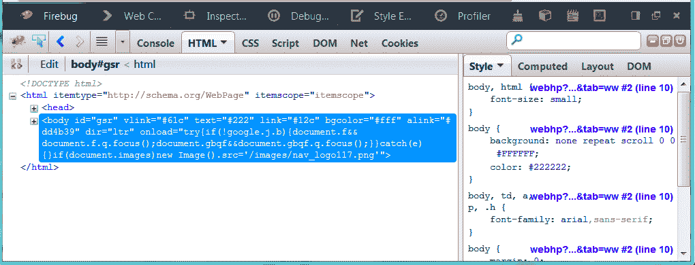

# Mozilla 计划通过浏览器内编辑、更好的 Firebug 集成、网络面板等技术改进 Firefox 开发工具

> 原文：<https://web.archive.org/web/https://techcrunch.com/2013/03/18/mozilla-promises-to-improve-firefox-developer-tools/>

# Mozilla 计划用浏览器内编辑、更好的 Firebug 集成、网络面板等等来改进 Firefox 开发者工具

上周，Mozilla 技术传道者 Paul Rouget 询问 web 开发人员，他们希望看到 Firefox 的开发工具有哪些改进。基于团队在 [HackerNews](https://web.archive.org/web/20221205165325/https://news.ycombinator.com/item?id=5325445) 和 Twitter 上获得的反馈， [Firefox DevTools 团队](https://web.archive.org/web/20221205165325/https://wiki.mozilla.org/DevTools/Team)花了一周时间破解和原型开发了大量[新的和改进的开发者特性](https://web.archive.org/web/20221205165325/http://paulrouget.com/e/devtoolsnext/)，它们很可能会在未来成为 Firefox 的稳定版本。

Rouget [写道](https://web.archive.org/web/20221205165325/http://paulrouget.com/e/devtoolsnext/)第一个[要求是让开发者更容易在浏览器中编码，并从编辑器和集成开发环境(ide)中控制浏览器。该团队目前正在探索两种方法。DevTools 团队构建了一个概念验证，使用流行的](https://web.archive.org/web/20221205165325/https://news.ycombinator.com/item?id=5325794) [Sublime Text](https://web.archive.org/web/20221205165325/http://www.sublimetext.com/) 编辑器和 Firefox 内置的远程功能显示实时编辑。此外，Mozilla 也在考虑在 Firefox 中加入一个编辑器。

这不是 Mozilla 第一次研究基于浏览器的编辑器。[早在 2009 年](https://web.archive.org/web/20221205165325/https://beta.techcrunch.com/2009/05/20/strap-in-mozillas-jetpack-may-be-the-next-step-in-browser-extensions/)，Mozilla 就开始致力于 [Bespin](https://web.archive.org/web/20221205165325/http://arstechnica.com/information-technology/2009/02/ide-in-the-cloud-mozilla-labs-browser-based-ide-prototype/) ，后来成为 [Skywriter](https://web.archive.org/web/20221205165325/https://mozillalabs.com/en-US/skywriter/) ，但是这个项目现在已经停止了。然而，随着 CSS 和 HTML 编辑器[顶针](https://web.archive.org/web/20221205165325/http://churchm.ag/mozilla-thimble/)的出现，Mozilla 最近再次拾起了这个想法，尽管 Rouget 写道，该组织仍在试图弄清楚 DevTools 中的新编辑器会是什么样子，但显然 Mozilla 有一些如何构建基于浏览器的文本编辑器的专业知识。

【YouTube http://www.youtube.com/watch?v=UrnB8lZnx4I？feature = player _ 嵌入式]

开发者要求的另一个特性是类似 Chrome 和 Firebug 的网络面板和时间线；该团队已经开发了一个原型，可以更容易地看到 web 应用程序如何使用网络。

Firefox 团队也在努力提高浏览器的兼容性。目前，Rouget 写道，“如果你是一个 Firebug 用户，Firefox 开发工具可能会妨碍你。”为了确保不会发生这种情况，Mozilla 将添加一个选项来禁用上下文菜单中的“inspect”菜单，该团队也在寻找将 Firebug 集成到 DevTools 框中的方法。

该团队正在进行的其他改进包括将工具停靠在浏览器右侧的能力(已经在 Firefox Nightly 中工作)，支持 CoffeeScript 和调试最小化的 CSS 和 JavaScript 文件，以及查看页面上重新绘制的内容的能力(目前也在 Firefox Nightly 中可用)。

Rouget 指出，该团队还在开发许多其他功能(可视化事件绑定、离线存储工具和伪元素检查)。

这些改进中的大多数不会马上实现，其中一些可能需要几个月的时间才能完成原型阶段。然而，对于开发者来说，这仍然是一个受欢迎的消息，因为 Mozilla 显然致力于改进其开发工具，并使它们与竞争对手保持一致。