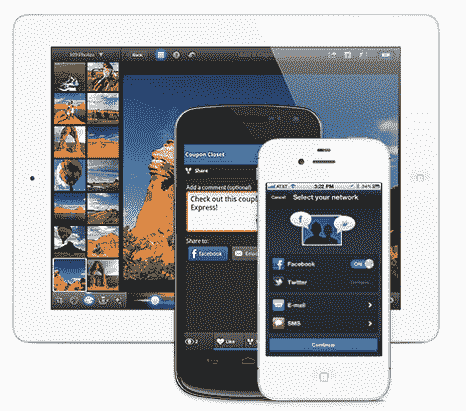

# ShareThis 以移动为目标，由 T-Venture 领投 2300 万美元的 C 轮融资，收购社交应用平台 Socialize TechCrunch

> 原文：<https://web.archive.org/web/https://techcrunch.com/2013/03/20/sharethis-aims-for-mobile-with-23m-series-c-led-by-t-venture-acquisition-of-social-app-platform-socialize/>

总部位于帕洛阿尔托的出版商平台 [ShareThis](https://web.archive.org/web/20221204092648/http://www.sharethis.com/) 是散布在网络上的“社交分享”按钮的制造商，今天宣布完成了 2300 万美元的 C 轮融资，由德国电信的风险投资部门 T-Venture 牵头。此外，ShareThis 还收购了 [Socialize](https://web.archive.org/web/20221204092648/http://www.getsocialize.com/) ，这是一家初创公司，其开发者工具包[有助于使任何应用程序社交化](https://web.archive.org/web/20221204092648/https://beta.techcrunch.com/2012/04/06/socialize-makes-any-app-social-already-reaches-10m-end-users/)，此举表明了其统一网络和移动平台的意图。

新一轮融资包括以 West Capital investors 为代表的新投资者 Harbourton 和企业基金，以及现有投资者、蓝筹风险投资公司、DFJ、伊利诺伊风险投资公司、Matthew Pritzker 公司、水星基金和 RPM 风险投资公司的参与。作为新一轮的一部分，T-Venture 的 Bernhard Gold 将加入 ShareThis 的董事会。到目前为止，ShareThis 总共筹集了 5400 万美元。

今天，ShareThis 提供了[发布者](https://web.archive.org/web/20221204092648/http://sharethis.com/publishers)分享小工具、开发者工具和一个分析仪表板，详细说明了跨网站的社交分享趋势，以及更多，还为广告商[提供了工具](https://web.archive.org/web/20221204092648/http://sharethis.com/advertisers)，允许他们在 ShareThis 网络上开展有针对性的活动。虽然 ShareThis 平台确实提供了一些移动分享工具，但 share this 首席执行官库尔特·亚伯拉罕森表示，他们的重点主要是移动网络，而不是应用程序。

“我们有相当大的工具分布，所以社交部分是关于应用程序空间的分布，但它主要是关于找到一个真正强大的团队，在它的 DNA 中有一点点移动，”他解释说。“他们是一支伟大的球队；他们的总部在旧金山，从文化上来说，一切都是百分之百的。”

亚伯拉罕森说，虽然 ShareThis 有一个应用程序解决方案，但它没有推动它，现在在这次收购后，Socialize 的应用程序解决方案将成为新的默认。

 社交，对于那些不熟悉的人来说，[从这家初创公司早期的努力](https://web.archive.org/web/20221204092648/https://beta.techcrunch.com/2011/07/20/socialize-launches-social-sdk-to-let-developers-unleash-communities-hiding-in-mobile-apps/)中剥离出来，推出了一项名为 [AppMakr](https://web.archive.org/web/20221204092648/http://www.appmakr.com/) (现在也归 ShareThis 所有)的服务，帮助个人和企业构建自己的原生 iPhone 应用。在社交方面，该公司推出了“社交 SDK”(软件开发工具包)，允许应用程序开发人员快速为他们的移动应用程序添加社交功能，如喜欢、评论、分享、显示其他用户应用内活动的“活动窗格”等。这个想法是，它可以为任何应用程序添加一个社交层，不仅增加了用户相互联系的能力，还增加了品牌与其应用内用户群联系的方式。

截至去年春天，该公司平台上有 150 个实时应用，另有 500 个左右在测试中，覆盖了大约 1000 万终端用户。如今，社交已经发展到 800 个应用，覆盖 6700 万个不同的设备，并且刚刚在本月与华纳兄弟公司签订了第一份企业合同，该公司现在将社交整合到其各种移动应用中，首先是其“Ellen”应用(日间脱口秀)。

收购 ShareThis 后，社交平台将继续运行，尽管最终可能会更名。目前社交团队的所有六名成员都将在 ShareThis 的旧金山办公室工作。ShareThis 前社交网站首席执行官、现战略合作伙伴 SVP 丹尼尔·奥迪奥表示，这项服务不会因当前用户而改变——事实上，他补充道，它现在将作为 ShareThis 的一部分得到积极改进。

亚伯拉罕森还表示，社交将有助于 ShareThis 在移动领域获得更好的地位。“最大的挑战是网络和移动领域没有一致的指标。他说:“我们要关注的事情之一是找出一个解决方案，让出版商能够在多个平台上分享他们的内容，而不只是在一个平台和另一个平台之间切换。”“在我们发展的世界中，出版商需要为所有设备优化内容，我认为他们会看到不同的社交分享模式，这取决于平台。”

他补充道，如今，许多网络出版商发现，来自手机的用户比例比他们预期的要高。因此，通过收购，ShareThis 希望能够分析这些流量，并将其呈现给出版商，让他们看到移动设备的价值。

将 Socialize 整合到 ShareThis 的平台将需要大约两个季度的时间来完成，最初的努力集中在开发一个版本的用于移动的 [ShareThis 的 SQI 测量](https://web.archive.org/web/20221204092648/https://beta.techcrunch.com/2012/06/06/sharethis-sqi-dashboard/)(社交质量指数)，这是一个专有的排名指标，允许出版商将自己与同一领域的竞争对手进行比较。

新的 T-Venture 投资也反映了其对移动的日益关注，该投资为 ShareThis 带来了移动视角。但更重要的是，也许，它带来了国际视角。尽管美国以外有许多出版商使用 ShareThis，但该公司并没有真正关注全球市场。这种情况现在将会改变，ShareThis 计划在 2013 年进行国际扩张，包括建立欧洲办事处，可能在德国或英国，同时将员工人数增加 20 到 30 人。

ShareThis 目前拥有 230 万发行商。该公司表示，其工具每月被 95%的美国互联网用户看到——超过 2 亿个 uniques。2012 年，它的收入增长了 155%，员工从 50 人增加到 95 人。在广告方面，它与许多主要品牌合作，包括微软、三星、百思买、迪士尼、美国运通等。