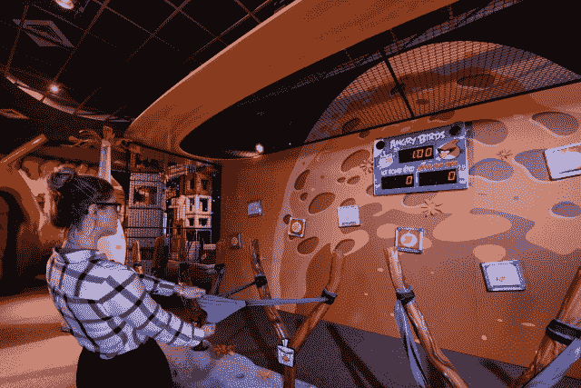
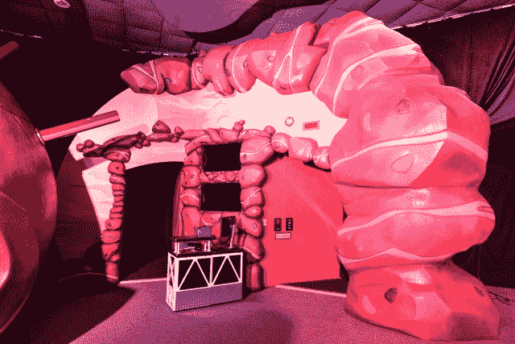
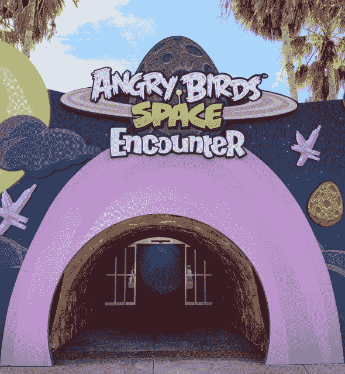
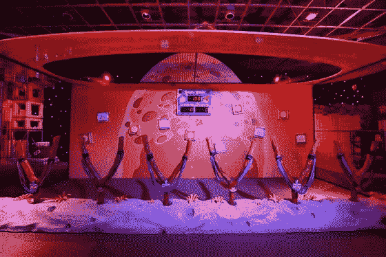

# Rovio 在宣布全球主题公园计划后开放愤怒的小鸟太空遭遇展览

> 原文：<https://web.archive.org/web/https://techcrunch.com/2013/03/22/rovio-opens-angry-birds-space-encounter-exhibit-after-announcing-global-theme-park-plans/>

# Rovio 在宣布全球主题公园计划后，开放愤怒的小鸟太空相遇展览

随着第一个“愤怒的小鸟”互动景点的推出，Rovio 再次进军新业务，肯尼迪航天中心游客中心将举办“愤怒的小鸟”太空相遇展览。

整个建筑高达 4500 平方英尺，是纯粹的愤怒的小鸟。设立了六个站点，让游客与愤怒的小鸟太空相关活动和游戏互动。这是 Rovio 缓慢建立以愤怒的小鸟为主题的消费吸引力的一部分，Rovio 已经从一个手机游戏制造商变成了一个商品现象级人物，[新发布的动画系列](https://web.archive.org/web/20230306151326/https://techcrunch.com/2013/02/06/angry-birds-cartoons-will-launch-in-spring-but-probably-not-on-tv/)正通过游戏本身发行。

据《华尔街日报》报道，这家芬兰公司在芬兰埃斯波的一块 12.9 英亩土地的竞标中击败了宜家，计划在那里建造新的办公室和一个家庭娱乐主题公园。

Rovio 还提到，它计划为这种类型的“家庭娱乐中心”开发一个概念，可用于愤怒的小鸟主题公园的全球网络。

“我们正在为家庭娱乐中心开发一个可以在世界各地复制的概念，”公司发展副总裁 Mikko Setala [告诉 WSJ](https://web.archive.org/web/20230306151326/http://blogs.wsj.com/corporate-intelligence/2013/03/07/angry-birds-trump-ikea-in-land-contest/) 。“概念开发应该会在今年春天完成。”

唉，春天来了，愤怒的小鸟太空相遇在佛罗里达州的肯尼迪空间站开始了。这是即将到来的愤怒的小鸟主题公园的太空相关分支的早期概念吗？在 Rovio 开始演出之前还不知道，但这个时机肯定与 Setala 的言论非常吻合。

展览的客人可以制作定制的愤怒的小鸟，并打印带回家。还有像“鸡蛋类固醇”弹弓比赛和“冷切瓷砖拼图”这样的游戏，让用户在拼图块中滑动，找到他们最喜欢的愤怒的小鸟角色。

展览现在在佛罗里达州的肯尼迪航天中心向公众开放。

图片来源:乔·卡斯西欧，特拉华州北部