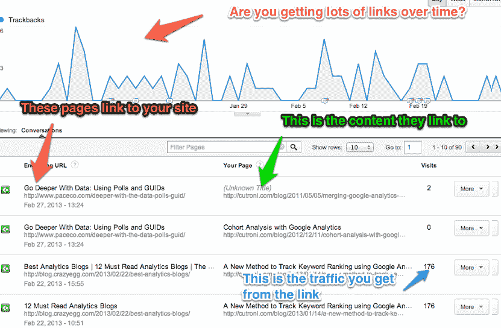

# 谷歌分析让人们更容易看到来自社交中心合作伙伴的引用通告和统计数据

> 原文：<https://web.archive.org/web/https://techcrunch.com/2013/03/26/google-analytics-now-makes-it-easier-to-track-inbound-links-and-stats-from-its-social-hub-partners/?utm_source=feedburner&utm_medium=feed&utm_campaign=Feed%3A+Techcrunch+%28TechCrunch%29>

# Google Analytics 现在可以更容易地跟踪社交中心合作伙伴的入站链接和统计数据

Google today [宣布](https://web.archive.org/web/20221206154218/http://analytics.blogspot.com/2013/03/improving-activity-stream-in-social.html)已经重新设计了一些 [Google Analytics](https://web.archive.org/web/20221206154218/http://analytics.google.com/) 的社交报告，让发布者更容易看到他们从其他网站获得的链接。此次更新还使得通过新的数据中心活动报告来跟踪人们如何参与出版商的内容变得更加容易。谷歌分析的社交数据中心通过 Disqus、Echo 和 Livefyre 等评论系统以及[等许多其他服务](https://web.archive.org/web/20221206154218/https://developers.google.com/analytics/devguides/socialdata/)从 Reddit 和 Digg 等合作网站获得这些数据。

独立的数据中心活动报告为发布者提供了“社交数据中心中已发生的活动数量的时间表以及下面列表中的原始活动。”数据也可以通过特定的网络进行过滤。

这个社交中心的数据以前就已经有了，但是大部分都被埋没在谷歌分析的社交报告中。现在这种数据更加明显，与分析社交数据中心的集成肯定会对运营社交网络和平台的公司变得更加有趣，因为更多的分析用户现在会意识到这一点，并要求这种集成，以便他们可以在一个地方跟踪他们的社交参与数据。

关于引用通告的统计数据[也已经在 Google Analytics](https://web.archive.org/web/20221206154218/http://analytics.blogspot.com/2012/05/expanding-google-analytics-social.html)中可用，但现在它们在一份独立的报告中可用。然而，以前很难看出某个入站链接到底有多重要。谷歌表示，新的报告现在提供了更多的背景信息，“通过显示在报告期间每个推荐 URL 驱动的访问量，来说明这些引用的重要性。”

【T2