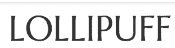
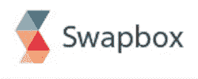

# Y Combinator 年冬季演示日，第二批:认识 Lollipuff、Goldbely 等 TechCrunch

> 原文：<https://web.archive.org/web/https://techcrunch.com/2013/03/26/y-combinator-winter-2013-batch-2/>

Y Combinator 演示日，47 家初创公司登台向投资者和媒体推介，继续进行。以下是对第二组展示公司的简短描述(标题中的描述来自公司本身)。

正如我们之前提到的，[这一次是在](https://web.archive.org/web/20221224183904/https://techcrunch.com/2013/03/26/y-combinator-winter-2013-demo-day-batch-1/)前后的小批创业公司，因为他们中的许多人都是在非正式的基础上介绍的，这是我们今天能够写的最后一组。你也可以看看我们从演示日、挑选的[前七名创业公司，以及我们在](https://web.archive.org/web/20221224183904/https://techcrunch.com/2013/03/26/top-y-combinator-startups/)[一个更精简、更强大、更谦虚的 Y 组合](https://web.archive.org/web/20221224183904/https://techcrunch.com/2013/03/26/a-leaner-stronger-more-modest-y-combinator/)上的想法。

Screenhero 是一个屏幕共享工具，它不仅仅是在一个屏幕上显示正在发生的事情，而是让人们实时协作。使用 Screenhero，两个人可以一起在同一个屏幕上积极地工作，用独特颜色的鼠标指针区分彼此。Screenhero 表示，自该应用于 12 月推出以来，其月增长率为 76%，仅在 3 月份，其用户数量就增加了两倍，来自脸书、GitHub 和 Salesforce 的员工每天都在工作中使用该工具。Screenhero 的第一个目标是挑战 WebEx，它称 WebEx 为演示和协作领域的“恐龙”。

该公司将自己的产品与 YC alum Dropbox 联系起来，因为它是“很多人想要的产品之一，但你必须做好很多小事”，才能让它真正有用。点击这里阅读更多关于 Screenhero 的信息。

#### [PayTango](https://web.archive.org/web/20221224183904/http://www.paytango.com/) :生物识别身份即服务

用塑料板付账是一种过时的做法。PayTango 想让你用指纹购物。其技术将生物特征数据转换为传统的卡数据，因此可以与现有的服务点硬件集成。这意味着只需一个额外的指纹识别器，任何商店都可以快速安装 PayTango。在不久的将来，这家初创公司计划与健身房、餐馆和便利店合作。但它的创始人说“我们可以取代会员卡、会员卡，甚至身份证。这只是一个开始。”

虽然支付卡可能会被淘汰，但 PayTango 将不得不与一系列基于手机的移动钱包竞争。PayTango 可能需要依靠其在安全方面的优势，并专注于身份验证至关重要的业务。那可能不是你当地的速食超市。[在这里阅读更多关于 PayTango 的信息](https://web.archive.org/web/20221224183904/https://techcrunch.com/2013/03/25/paytango/)。

#### [引人注目的](https://web.archive.org/web/20221224183904/http://www.strikingly.com/):移动优化网站建设者

 移动优化引人注目的是移动时代的网站建设者。自 7 个月前推出以来，已有超过 25，000 个网站使用其工具建立，该初创公司的收入增长了 40%。Strikingly 的平台允许很少或没有开发背景的用户在大约 30 分钟内创建一个全球优化的网站。

创始人的目标是做网站建设，就像 Twitter 做博客一样——简化它；他们举了一个盲人的例子，这个盲人很容易就创建了自己的网站。这位创始人断言，“移动已经重新打开了整个网站建设市场，”他认为他们的市场是 75%的美国小企业，如活动策划公司，他们仍然没有一个独特的网站。[点击此处阅读更多关于惊人的](https://web.archive.org/web/20221224183904/https://techcrunch.com/2013/02/13/strikingly/)。

#### [Prizeo](https://web.archive.org/web/20221224183904/http://www.prizeo.com/) :名人莱佛士

 Prizeo 是一家初创公司，经营莱佛士，让品牌和名人的粉丝向慈善事业捐款，并因其社交媒体影响力转化为慈善事业的实际资金而获奖。该公司已经将男子组合单向乐队、奥运会游泳运动员迈克尔·菲尔普斯和歌手艾丽西亚·凯斯列为其平台的用户；在演示日，该公司宣布与超级人才机构 William Morris Endeavor 合作，后者选择 Prizeo 作为其所有客户的首选数字合作伙伴。

根据 Prizeo 的说法，受益于名人和品牌导向型慈善事业的不仅仅是慈善机构:莱佛士是收集丰富消费者数据的一种很好的方式，使 Prizeo 成为一种独特的货币化和扩大影响力的方式。该公司表示，这里的潜力很大——有数万名“有影响力的人”,在世界各地拥有数亿粉丝，品牌已经告诉该公司，他们愿意为每场活动花费约 5 万美元。[点击此处阅读 Prizeo 的更多报道](https://web.archive.org/web/20221224183904/https://techcrunch.com/2013/03/24/prizeo-launch/)。

#### [StyleUp](https://web.archive.org/web/20221224183904/http://thestyleuyp.com/) :每日时尚邮件

 旨在取代时尚杂志，StyleUp 每天向女性发送个性化的时尚建议邮件。这些邮件展示了一套适合收件人口味和当天天气的服装，它们获得了惊人的 70%的打开率。这比 14%的行业平均水平要好得多。时尚杂志市场价值 20 亿美元，但它正在消失。一些顶级杂志去年的报摊销售额下降了 15%到 20%。与此同时，Style Up 正以每月 20%的速度增长。品牌可能会愿意付费，以站在 StyleUp 的用户面前。虽然这可能不是革命性的，但将一个重要的线下市场转移到网络上，并增加个性化，可能是一条简单的成功之路。[点击这里阅读更多关于 StyleUp 的报道](https://web.archive.org/web/20221224183904/https://techcrunch.com/2013/03/18/yc-backed-styleup-recommends-daily-personalized-outfits-tailored-to-your-style-and-location/)。

#### [棒棒糖](https://web.archive.org/web/20221224183904/http://lollipuff.com/):正品拍卖

Ebay of designer goods lolli puff 试图通过为顾客提供香奈儿、鲁布托和赫夫莱杰的奢侈品认证层来规避在线购买设计师商品的风险。

自 1 月份试运行以来，该平台已经完成了超过 45，000 美元的订单，三个月内增长了 10 倍。在同样长的时间内，这家初创公司的用户周环比增长了 13%。

创始人费德乐在作为设计师认证者开设了一个成功的博客后产生了这个想法。在一项统计中，Deyle 提出了在线购买设计师商品问题的症结所在:在易贝上出售的 Herve Leger 中有 75%是假货:“你会花 3000 美元买‘香奈儿’吗？”最终，她希望通过软件和人类专业知识的结合来扩展这一认证过程。

“我们一半以上的用户以前从未使用过易贝，”她说，估计真正的设计师零售市场价值 300 亿美元。[点击](https://web.archive.org/web/20221224183904/https://techcrunch.com/2013/03/17/yc-backed-lollipuff-is-an-ebay-like-marketplace-for-authenticated-designer-clothing-and-accessories/)阅读更多关于棒棒糖的报道。

#### [唰](https://web.archive.org/web/20221224183904/http://swish.com/):预购平台

 宣称自己是“Kickstarter，但只针对预购”，Swish 表示，它填补了 Kickstarter 故意留下的一个空白，Kickstarter 在其官网上强调，这是一个众筹平台，“而不是一个商店”Swish 表示，如今，个人硬件创作者正在创建自己的销售和预订软件，因为到目前为止还没有好的解决方案。

Swish 已经建立了一个提供全面服务的预购平台，可以处理列表、支付、托管和交易。这似乎触到了痛处:自上个月推出以来，Swish 已经开始盈利。展望未来，Swish 表示，它的目标是成为新一代硬件销售的市场。[点击这里](https://web.archive.org/web/20221224183904/https://techcrunch.com/2013/02/01/yc-backed-swish-makes-selling-simpler-for-inventors-and-creators/)阅读更多报道。

 电商店铺如何知道卖哪些产品，卖多少钱？Semantics3 希望利用大数据来回答这些问题。它的大胆目标是在一个集中的位置索引网上所有的产品和价格。然后，它向电子商务商家出售数据许可证或 API 访问权。这可以让他们看到还有谁在卖他们正在卖的产品，他们要价多少，他们的价格如何变化，以及哪些产品卖得好。除了传统的电子商务，Semantics3 还希望帮助应用开发者和其他垂直行业。

如果它能向 200 万美国电子商务商家中最顶尖的 1%出售每年 12，000 美元的许可证，它可以开始每年赚 2.4 亿美元，并帮助新一波商业企业家取得成功。[点击](https://web.archive.org/web/20221224183904/https://techcrunch.com/2013/02/25/yc-backed-semantics3-is-a-massive-consumer-products-database-to-rule-them-all/)阅读更多关于语义的报道。

#### [医疗服务](https://web.archive.org/web/20221224183904/http://medisas.com/):转移病人信息

 Medisas 是一家软件即服务的初创公司，它希望取代那张纸(！)医生用来在轮班之间相互传递信息。

Medias 的创始人高塔姆·西瓦库玛(Gautam Sivakumar)提出了一个可怕的统计数字，即 66%的严重医疗错误源于这些记录的错误，导致每个月都有 10K 人死亡。

Shanharam 声称，他们的 SAAS 为更好的医生轮班提供动力，是一个 10 亿美元的市场，“当人们濒临死亡时，企业销售会很快发生，”他说。他认为这个机会不仅仅是交接记录，他称之为“医疗记录市场的脊梁”“我们最终可以拯救成千上万人的生命，”他说。

#### [Swapbox](https://web.archive.org/web/20221224183904/http://swapbox.com/) :包裹收纳箱

 Swapbox 是一个自动售货亭系统，人们可以在方便的时候通过输入发送到移动设备的 pin 码来提取包裹。这里的目标是让人们不再“错过一次递送”，Swapbox 的人说他们对这种痛苦太了解了:在他们演示日的一个巧妙部分，Swapbox 的联合创始人说，由于错过了 UPS 递送，他的团队没有穿公司标志的 t 恤。

Swapbox 目前在三藩市有 18 个售货亭，并且已经在休斯顿签署了 15 个售货亭试点的协议，声称他们在亚马逊储物柜上有优势(大概还有 [YC 校友转谷歌收购 Bufferbox](https://web.archive.org/web/20221224183904/https://techcrunch.com/2012/11/30/google-acquires-waterloo-based-e-commerce-startup-amazon-locker-competitor-and-yc-graduate-bufferbox/) )，因为它是一家独立的公司。“简单地说，亚马逊储物柜只适用于亚马逊，”Swapbox 说。"每个人都可以使用交换盒."Swapbox 表示，每包收费 2 美元，它可以在 10，000 个地点迅速扩大到 1.5 亿美元的年收入——而这只是潜在市场的 10%。[点击这里](https://web.archive.org/web/20221224183904/https://techcrunch.com/2013/03/15/y-combinator-company-swapbox-launches-and-aims-to-pick-up-where-bufferbox-left-off/)阅读我们之前对 Swapbox 的报道。

#### we under:普通人的创业投资

Wefunder 的联合创始人说:“我们不是简单地给创业公司愚蠢的钱。他的公司是一个股权众筹平台，为初创公司创建丰富的档案，并让任何人投资，以换取拥有梦想的一部分。或者至少在就业法案实施后会是这样。

投资者可以在他们的创业公司上市、被收购或在二级市场出售股票时套现。Wefunder 将不得不与上一届 Y Combinator 班的 FundersClub 和其他股权众筹者竞争。但是，如果就业法案如预期的那样生效，它可能会使底层风险资本家过时。这是因为像顶级风投一样，Wefunder 认为大众可以随着他们的现金增值。随着 60 名投资者而不是 6 名投资者的加入，一大批传道者、招聘人员、营销人员和测试人员可能会给他们的初创公司带来优势。[点击](https://web.archive.org/web/20221224183904/https://techcrunch.com/2013/03/19/wefunder-launch/)阅读更多 Wefunder 报道。

#### [Zenefits](https://web.archive.org/web/20221224183904/http://zenefits.com/) :自动化员工福利

 Zenefits 希望消除为小公司提供员工福利和医疗保险所带来的痛苦。在经历了作为两届创始人的这一艰难过程后，Zenefits 创始人帕克·康拉德(Parker Conrad)知道有一种更简单的方法。

“通常建立健康福利需要几个星期和十几次使用传真机，”康拉德说，“Zenefits 是‘设置它，然后忘记它’，”将一个迄今为止使用人和纸张完成的过程机械化。

有了 Zenefits，所有小企业需要做的就是输入新员工的 401K 信息，如姓名、电子邮件、工资、股票期权和雇用日期，然后初创公司会生成一封聘书和一个获得保险会员资格的流程。

这项服务免费向客户提供，但作为保险公司的一种潜在客户创造形式，每家公司每年可获得 5 万美元的佣金。康拉德说:“为客户提供免费服务并获得如此可观的经常性收入是很罕见的。”。[点击](https://web.archive.org/web/20221224183904/https://techcrunch.com/2013/02/18/y-combinator-backed-zenefits-gives-small-businesses-a-one-stop-shop-for-finding-and-managing-employee-benefits/)阅读更多关于 Zenefits 的报道。

#### [Terascore](https://web.archive.org/web/20221224183904/http://terascore.com/) :学校考试软件

老师们花了令人难以置信的时间给考试评分。Terascore 正在开发一个工具，让这些教育工作者在线创建和管理考试。这意味着花更少的时间去查看是否每个人都知道爱达荷州的首府。Terascore 顺应了每个人都携带智能手机和平板电脑的趋势，因此教师不需要预订计算机实验室时间来进行测试。他们还能够给学生实时反馈，以提高学习效果。

令人惊讶的是，Terascore 的商业模式是让教师而不是学区为其平台付费。这些学区的进展太慢了，但这家初创公司相信，教师们将每月支付 9 美元，并改变他们的行为，以获得更多宝贵的业余时间。[点击](https://web.archive.org/web/20221224183904/https://techcrunch.com/2013/03/19/y-combinator-backed-terascore-launches-to-help-teachers-bring-testing-online/)阅读更多关于 Terascore 的报道。

#### [Lawdingo](https://web.archive.org/web/20221224183904/http://lawdingo.com/) :律师市场

Lawdingo 据称创造了最有效的法律服务方式，律师和客户可以通过一个在线平台进行联系、咨询，甚至交换支付。据该公司称，随着其不断增长的消费者流量水平和 600 多名律师加入其服务，Lawdingo 今天在范围和规模上可与世界上一些最大的律师事务所相媲美。该网站允许人们使用自然语言寻求帮助——例如，键入“我讨厌我的妻子”，你会得到离婚律师的结果(不是开玩笑)。

这是一个巨大的市场:在美国，法律服务是一个每年 2500 亿美元的市场，律师事务所广告是一个 45 亿美元的市场。这家初创公司旨在“优雅地”解决双方的问题。[点击](https://web.archive.org/web/20221224183904/https://techcrunch.com/2013/03/15/lawdingo-y-combinator/)阅读更多关于 Lawdingo 的信息。

#### [Meldium](https://web.archive.org/web/20221224183904/http://meldium.com/) :公司密码管理器

Meldium 是一个团队单点登录层，是一个帐户和密码管理器，可以替代大多数公司目前使用的效率极低且不安全的电子表格。

通过 Meldium，一个特定的团队注册一个 Meldium 帐户，成员可以以浏览器扩展的形式使用它，可以登录大约 400 个独立的应用程序，包括 Box、GitHub、Salesforce、Box 和 Google Apps。

“当你解雇某人时，你知道他们出局了，”创始人 Boris Jabes 说，这是关于 Meldium 相对于 Google Docs 等保存敏感登录信息的好处。这家初创公司目前有 2000 名用户，公司似乎正在自下而上地采用 Meldium，因为它解决的问题是，“我的办公室经理可以使用它！”

创始人估计市场规模为每年 13 亿美元，有 5500 万知识工作者，其中 2%为高级版本付费。“现在是 2013 年，我们用电子表格管理这些令人惊叹的云服务，”Jabes 重申。[点击此处](https://web.archive.org/web/20221224183904/https://techcrunch.com/2013/02/25/meldium/)了解更多关于 Meldium 的信息。

 Goldbely 将其“食物探索者”的客户群与来自全国各地标志性餐厅的最有趣的食物联系起来，在几个小时内将芝加哥深盘披萨、德克萨斯烧烤、布法罗鸡翅等送到美国的任何地方。Goldbely 引以为豪的是以一流的状态运送这些物品，以确保它们的味道与现场完全一样。

它似乎正在起飞。Goldbely 今天宣布与脸书礼品公司合作，称其总销售额刚刚突破 10 万美元，自 2012 年底推出以来，每月增长 100%，其中 50%的客户是回头客。Goldbely 表示，它的目标是一个价值 110 亿美元的市场，这个市场非常分散，由黯淡的品牌主导——食品礼品领域的前三名是奥马哈牛排、1-800 Flowers 和 Harry & David，不完全是美食供应商。[点击这里](https://web.archive.org/web/20221224183904/https://techcrunch.com/2013/02/07/goldbely/)阅读我们之前对 Goldbely 的报道。

