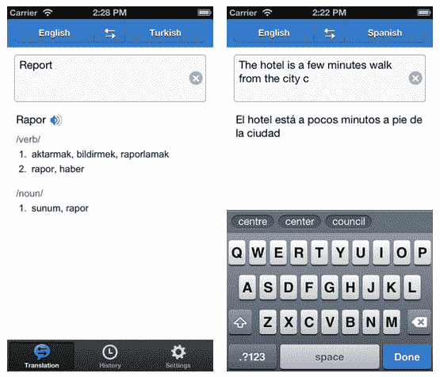

# Yandex 在其翻译应用程序中增加了英文用户界面，以扩大其国际吸引力

> 原文：<https://web.archive.org/web/https://techcrunch.com/2013/03/26/yandex-translate-app-english-ui/>

俄罗斯“本土谷歌”Yandex 正在为其 [Yandex 增加一个英文界面。为 iOS 翻译](https://web.archive.org/web/20230326023037/https://itunes.apple.com/us/app/andeks.perevod/id584291439)应用程序，同时支持更多语言翻译对，以扩大应用程序的吸引力，并开始建立国际用户群。最初的应用程序于 12 月推出，具有俄语界面，提供俄语和八种语言之间的翻译，包括英语、乌克兰语、土耳其语、捷克语、保加利亚语、罗马尼亚语和塞尔维亚语。

除了增加英语版本的应用程序，Yandex 还将支持的英语翻译对从之前的三个选项(英语俄语、英语乌克兰语、英语土耳其语)增加到八个，增加了英语西班牙语、英语德语、英语法语、英语意大利语和英语捷克语。

据 Yandex 称，该应用目前的大部分翻译(超过 85%)都是俄语和英语之间的翻译。所有下载量的 98%来自俄罗斯和乌克兰。但该公司声称，美国、中国、法国、英国和以色列的移动用户对此“相当感兴趣”，并希望随着该公司增加英文用户界面，这一兴趣将会增长。与此同时，它还发布了一个带有乌克兰语用户界面的应用版本。

Yandex 的原始在线翻译服务于两年前推出，该应用程序采用了相同的机器翻译技术。它自动检测语言的来源，而不是用户必须从列表中指定。其他功能包括用户输入时的实时翻译，以及减少打字错误的专有预测文本技术。有一个文本到语音的组件，由 [Acapela](https://web.archive.org/web/20230326023037/http://www.acapela-group.com/acapela-tts-for-iphone-26-speech-solutions.html) 提供支持，以及读出翻译单词的能力。虽然该应用程序需要互联网连接才能运行，但翻译历史存储在本地设备上，可以在离线时访问。

(免费)Yandex。据该公司称，自 2012 年 12 月推出以来，翻译应用程序的下载量已超过 15 万次。它表示，平均每月有近 40，000 次下载，为超过 15，000 名用户提供服务，每天产生超过 100，000 份翻译。

Yandex 一直在慢慢加大努力，向俄罗斯及其邻国以外的传统据点扩张，同时巩固其在国内市场的地位。

例如，去年，谷歌扩大了其数字地图服务 maps.yandex 的覆盖范围，推出了欧洲和 T4 的国际地图。在国内市场**,该公司推出了自己的互联网浏览器和安卓应用商店,以抵御谷歌。**