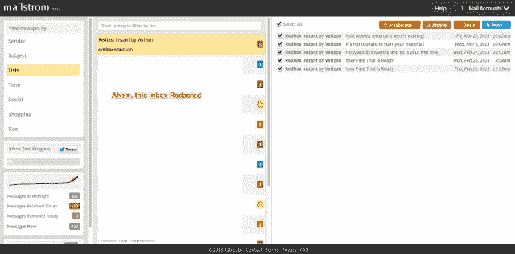

# Mailstrom 是一款针对超负荷收件箱的大砍刀，它首次正式亮相，已经存储了 4 亿多封电子邮件

> 原文：<https://web.archive.org/web/https://techcrunch.com/2013/03/27/mailstrom-a-machete-for-overloaded-inboxes-makes-its-official-debut-with-400m-emails-already-under-storage/>

410 实验室是像 [Shortmail](https://web.archive.org/web/20230324010907/https://shortmail.com/) 和 [Replyz](https://web.archive.org/web/20230324010907/http://replyz.com/) 这样的产品的所在地，当它首次推出 [Mailstrom](https://web.archive.org/web/20230324010907/https://mailstrom.co/) 时，它试图避开雷达，这是一种新的电子邮件服务，旨在帮助那些每天不断收到大量电子邮件的人实现“收件箱零”，可以这么说。但是这些计划很快就被挫败了，当该公司被不请自来的博客评论所震惊，随后是突然的快速增长。

在过去的 30 天里，该服务增长了 525 %,现在存储了超过 4 . 12 亿封电子邮件。它已经帮助其大约 35，000 名用户(请注意，在它正式亮相之前)从他们的集体收件箱中删除了大约 1.15 亿封邮件。每周有超过 2000 万封新邮件从用户的收件箱中被清除。

410 Labs 的首席执行官 David Troy 解释说，经过一年的积极开发，该公司已经将 Mailstrom 产品公之于众，但在他们继续进行用户调查、一般测试和对产品进行调整时，他们特意避免正式宣布。但是[的](https://web.archive.org/web/20230324010907/http://www.christopherspenn.com/2012/08/unsolicited-review-mailstrom) [博客](https://web.archive.org/web/20230324010907/http://lifehacker.com/5984417/how-i-went-from-1000-emails-to-inbox-zero-and-stayed-there-with-mailstrom) [帖子](https://web.archive.org/web/20230324010907/http://lifehacker.com/5983474/mailstrom-clears-out-thousands-of-messages-from-your-inbox-in-about-an-hour)虽然积极，却迫使公司比预期的时间提前上线。

Troy 解释说:“在过去的四到五周时间里，我们增加了额外的服务器容量，并创建了更好的排队机制，这与邮箱人员在规模增长过程中经历的情况类似。“在我们准备好之前，我们不希望出现大的交通高峰，”他说，“但它来的时候就来了，而且是有机的……所以这很好。”

是的，[现在 Mailstrom 似乎认为它已经准备好更多的](https://web.archive.org/web/20230324010907/https://mailstrom.co/)。

那么这里最吸引人的是什么呢？该公司承诺帮助用户清理杂乱的电子邮件收件箱，以达到“零收件箱”的神秘状态在某些方面，它与最近收购的邮箱应用类似，因为两家公司都希望帮助用户更快地获得重要邮件。但是 [Mailbox 被设计为](https://web.archive.org/web/20230324010907/https://techcrunch.com/2013/02/07/mailbox-goes-live-you-still-have-to-wait/)一个移动优先的公司，Mailstrom 是一个网络应用。此外——这一点很重要——Mailstrom 不是试图通过充当另一个电子邮件客户端来取代用户的收件箱。

Troy 说:“我们不想说‘这是您必须使用的新电子邮件环境’。“这是一个电动工具。它更像是一把弯刀，你可以用它来劈开阻碍你看清真正重要的东西。然后你就可以随心所欲地使用你的普通工具了，”他解释道。

这项服务目前支持 Gmail/Google Apps、雅虎、苹果、微软 Outlook.com/Hotmail, Aol(披露:TechCrunch parent)和其他支持 IMAP 的电子邮件服务，相反，它提供了一个不同的收件箱视图，让你以各种方式对邮件进行分类和筛选。

您可以按发件人或大小查看邮件，按主题或时间分组；例如，你可以点击查看来自脸书和 Twitter 等社交服务的消息和通知，或者来自零售商的消息和通知。您可以过滤时事通讯、广告，并且可以快速取消订阅邮件列表。你也可以快速设置规则来处理上述所有问题，以便将来你的收件箱更加干净。 *(LifeHacker 有非常详细的“**”来了解更多关于这一切的内容，所以我们会避开实质细节)。*

当然，Mailstrom 今天做的一些事情已经可以由 Gmail 或其他人自己的内置功能集来处理，但使用的工具集可能不太直观。

Troy 说:“我们所做的是公开并简化一套流程，许多人可能*可以*做，但他们并没有真正想过去做，或者做这件事的工具有点笨拙或有点困难。”他指出，即使在 Mailstrom 的核心用户群中，人们会收到大量的电子邮件，但并不是每个人都知道 Gmail“存档”按钮的基本功能，更不用说如何挖掘和使用 Gmail 的过滤功能了。

遗憾的是，我们现在需要第三方来帮助我们更好地处理收件箱，这说明了如今一些大型电子邮件服务中的创新停滞不前。为什么电子邮件弯刀现在不应该成为我们首选电子邮件程序的一个特征呢？(微软的 Outlook.com 有“扫一扫”功能，值得称赞，因为它理解点击一下鼠标就能快速将电子邮件从收件箱中移出是什么感觉。但是，即使这样，也无法达到 Mailstrom 承诺的功能。)

## 对于那些收到大量电子邮件的人

也就是说，这项服务并不适合所有人。

“我们不适合收件箱里有 17 封邮件的人。这不是给谁的。特洛伊说:“它是为那些每天例行公事地收到 50 多封需要关注的电子邮件的人准备的。他的意思是，50 封私人邮件——去掉所有垃圾后剩下的东西。像许多企业家一样，Troy 从个人需求出发开发产品，他自己每天收到数百封电子邮件。

该公司计划未来对这项服务收费，但目前是免费的。据我们所知，价格将是合理的。然而，要真正扩大规模，410 实验室需要的不仅仅是订阅收入。这就是为什么这家初创公司的下一轮融资接近尾声，严格来说是 b 轮融资。这家初创公司曾在 2011 年[筹集了 A 轮融资](https://web.archive.org/web/20230324010907/http://www.crunchbase.com/company/410-labs)，这实际上更像是种子轮融资。[之前的投资者](https://web.archive.org/web/20230324010907/http://socialmatchbox.com/wp/2011/07/11/shortmail-raises-750000-series-a-round/)包括 True Ventures、500 Startups、Fortify.vc 等。

总部位于巴尔的摩的 410 实验室现在有一个 5 人全职团队，包括连续创业者特洛伊和早期搜索先驱、联合创始人马特科尔。下一轮将帮助该公司招聘和扩大规模，但特洛伊声称，该计划不是要以某种“收购-招聘”交易的方式快速翻转公司。“我们不想去为谷歌或 Dropbox 或其他公司工作，”他说。“我们认为这是一个重要的问题，没有一个人对今天有足够的想象力。”

Mailstrom 现在正在这里注册，目前没有人排队。(这篇文章发表后，随着读者点击量的增加，这种情况可能会改变。)